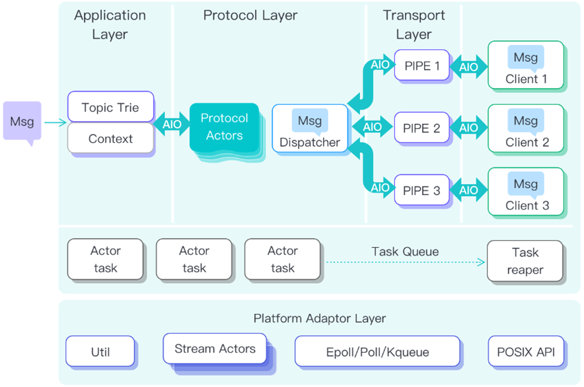
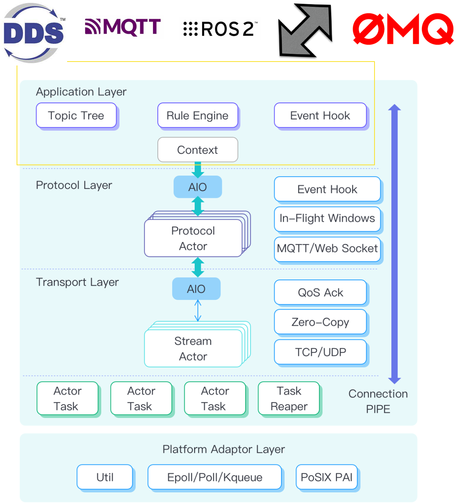

# MQTT broker 介绍

数据总线功能内置有一个完整的 MQTT 消息服务器，其原型是已经被广泛应用在 IoT 和 IIoT 领域的LF旗下开源项目 NanoMQ，其与 EMQX/Mosquitto 具备类似的功能，主要提供基于 PUB/SUB 模式的消息收发，数据共享和访问控制。其具备以下主要功能

## 功能介绍

1. 轻量化的高吞吐低延时边缘消息服务
超轻量MQTT服务支持MQTT3.1/3.1.1/5.0 + TLS/SSL，启动仅需极低资源占用，POSIX原生实现。内置Actor模型和全异步IO，对现代SMP系统有良好支持，在边缘端提供高吞吐和低延时。

2. 多协议桥接 + 转换
动态桥接功能可以与EMQX Cloud，AWS IoT Core 等多种云端服务桥接，支持自动断网续传。 搭配多协议网关支持WebSocket/ZeroMQ/nanomsg/DDS 和 SOME/IP 等协议转换，搭建broker+brokerless 灵活的网络拓扑。

3. 嵌入式规则引擎 + 数据持久化
内置轻量级规则引擎，支持通过SQL进行数据的重定向和持久化。也可以与流存储和流处理引起集成形成边缘流处理消息引擎。

4. 拓展接口 + 云边协同
提供事件驱动的高性能全异步WebHook拓展接口，方便与第三方系统集成。也提供丰富管理和监控用HTTP API，方便远程运维。
 
## 核心优势

超轻量：MQTT 服务可以低至 200Kb 的内存占用启动。

全异步 I/O：针对物联网和 MQTT 内建 Actor 编程模型并行化计算负载。

多线程并行：优秀的可拓展性，具有良好的多核 SMP（对称多处理）支持和多线程性能。

高性能：边缘百万级消息处理能力。

跨平台：可无缝移植到任何基于 POSIX 的系统平台。

互操作性：数据透明，拓展接口丰富，易于和各类边缘计算框架集成。

## 架构介绍
本章节简要介绍 MQTT 消息服务器内部架构和 Actor 线程模型。此部分内容与消息队列和协议转换功能息息相关。
为了满足海量跨域数据的高吞吐低延时需求，EMQ 结合了丰富的 IoT 行业经验，基于 Actor 模型打造了一款安全，轻量，高效的车载消息服务器，可以作为车端的统一数据空间使用。通过尽量减少共享状态和序列化串行代码，带来了高性能的消息吞吐，为 SOA 架构提供了前所未有的互操作性便利。

海量数据在车端各个传感器上不断生成，实时计算是保留数据价值的关键。汽车芯片正在从单核发展到多核，现在正向着异构 SoC的方向演进。M核和A核，Linux、Android、QNS还有RTOS 各自负责不同功能安全要求的功能并彼此交互，而其中一些域处理器和ECU往往资源有限，叠加复杂的网络拓扑和碎片化的传输协议在边缘，造成了跨域融合障碍，数据同步困难等问题，所以基于现有的硬件条件，我们采用Actor模型，通过最大化利用现代处理器的 SMP 能力，将繁重的I/O 密集任务合理的切割给多个Actor Task线程并行处理，从而在车端嵌入式硬件上实现高并发低延时的消息吞吐能力，能够支持高精度的信号接入。从而实现将优先搬运计算而不是搬运数据，让重计算量的任务发生在数据接入的内存中，而不是先写盘再读取，这降低了车端存储介质的损耗，并且结合流式处理引擎可以实现存算一体型架构。

应用层 Application layer
应用层用于隔离有状态的外部协议和业务逻辑，通过虚拟化的逻辑线程（Context）来保存业务的上下文状态，并负责跟踪不同消息的生命周期，确保完成用户配置的功能和消息投递。让消息在钩子函数，规则引擎，MQTT 主题树，消息队列还有协议转换等功能之间无复制的共享。
协议转换模块输入的 DDS/MQTT/ROS2/Nanomsg/ZeroMQ/SOME/IP 数据都会在应用层由一个 Conetext 接管并负责管理其声明周期和业务逻辑，以内存共享的方式在内部屏蔽了不同协议的区别，在协议层进行不同协议的转换和互操作。

协议层 Protocol layer
当逻辑线程完成了业务判断，确定了计算任务，则将消息传递给下一层：协议层，进行具体的协议解码，如 MQTT/DDS/SOME-IP 等协议解码，并且是由多个协议解析 Actor 共同完成，可以同时处理多个消息的协议编解码。同时这部分还负责MQTT协议内的飞行窗口管理和消息事件生成。

传输层 Transport layer
这部分直接操作 POSIX 系统 Socket 。完成不同协议的帧读写，完整判断。每一个协议传输层都有复数个 Actor 同时工作，称为 Stream Actor，它们源源不断的接收系统事件，确保第一时间处理 Socket 的新字节流的序列化，并为上层隐藏 Socket 操作的细节，把字节流反序列化成具体的消息供上层处理。同时传输层也实现了 Zero-Copy 零拷贝的高性能数据传输，并且负责 MQTT/DDS 的 QoS 操作。

任务层 Task Layer
这部分单独独立运行，负责调度和运行异步 I/O 和各个 Actor 模型，把系统的线程资源映射给每一层的 Actor，并确保他们之间能最高效的协同，保证有时间顺序的任务能够有序执行，无先后顺序要求的任务则并行乱序执行。此部分基于 POSIX 的 pthread 开发。

平台兼容层 Platform layer
负责隔离操作系统和硬件平台的独特性，方便兼容和移植。提供 Actor 和异步 I/O 在不同平台的统一实现，目前支持 POSIX PSE54 标准的系统，如 QNX/ANDROID/Linux等，RTOS 暂不支持.
