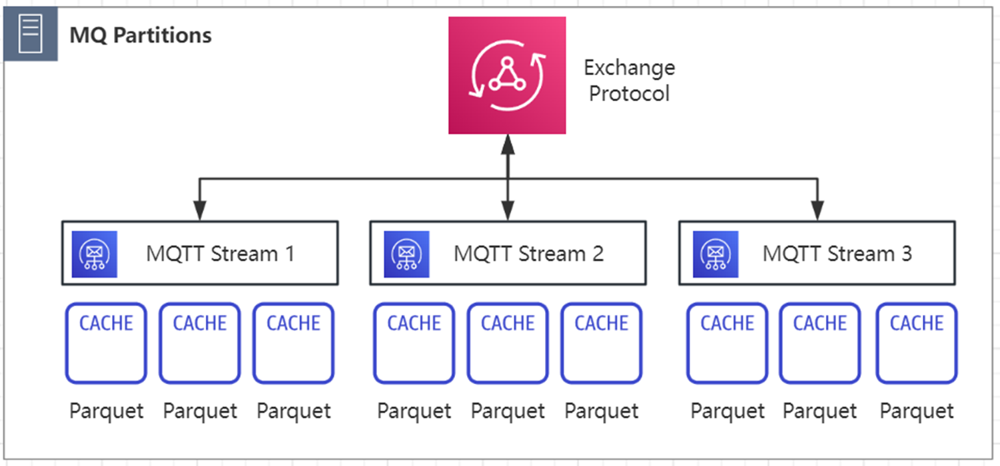

# mqtt stream

MQTT Stream 即消息总线里的消息队列功能，其与 MQTT 消息服务器功能相辅相成，主要负责消息的有序落盘和查询回溯。

## 1. 背景和功能介绍

数字座舱，智能辅助驾驶等功能都依赖于车内跨域和多传感器的数据融合，需要在车辆不同 SoC 之间传输大量数据。车内不同域控和传感器使用不同的碎片化协议导致互相缺乏互操作性，难以有效协同利用车内的算力资源，这阻碍了 SDV 和 SOA 架构产品的落地。

现代汽车电子电器架构每个域控制器下都会各自挂载若干个传感器，包括但不限于摄像头，雷达(Radar)和激光雷达(Lidar),GPS以及新加入的UWB和超声波传感器等设备。这些传感器都在极高的频率不间断的产生不同制式的数据供给给不同的高算力 SoC 来完成诸如 ACC/AEB 和座舱HUD，仪表盘，驾驶模式等功能安全要求各异的增值服务。这些数据形态各异，有视频流，点云，灰度图，图像等等，加上原来就存在的 CAN/LIN/FlexRay 总线的结构化信号数据，甚至还有 SoA 服务产生的中间数据需要通过 RPC/IPC 等方式将计算卸载至加速计算芯片来进行进一步处理。如图所示，不同数据源和不同形态的多模数据以不同的频率产生，使得车内的需要一种多模态的数据存储和回溯方式，方便 SOA 架构内的不同服务调用和对齐。

采集到数据并非最终的目的，从数据中提取有价值的信息，完善产品迭代，解决故障并分析获得商业洞察才是最终目的。所以车端的消息队列需要能够在云端被快速低成本的进行处理。SDV-Flow 在产品设计的阶段就结合了 EMQ 之前深厚的数据基础设施研发经验，选用了开放包容的新数据处理标准： Apache Parquet，这一列存标准拥有强大的开源社社区生态支持，在大数据。人工智能和自动驾驶等领域都有广泛的应用。且可以灵活设计 Row/Group 来适配多模态的数据。正如软件定义汽车和面向服务的架构是借鉴了 IT 技术这三十年以来的结晶，EMQ SDV-Flow & Platform 提供了车云一体化的数据基础设施，统一数据传输传输标准，并且向各大数据仓/湖方案开放底层标准。通过一站到底的 Schema 动态匹配，在数据源头解决了碎片化问题，避免了大量数据积压后难以管理，再分析时需要投入大量人工时间进行预处理的麻烦，降低了数据挖掘和标注的成本。

### Apache Parquet 介绍

## 消息队列存储

对于同一topic的MQTT消息，可以看做一条数据流，并且这个数据流是可以进行落盘存储以及查询操作的，对于一些网络较差的环境下，为数据的完整性和可靠性提供了解决方案.

## 2. 内部数据通路

数据流入
1. 当消息进入MQTT 消息服务器的时候，会先将消息打上一个时间戳作为msg的key。
2. 然后消息会进入exchange_client。
3. 然后exchange_client把消息传入exchange中。
4. exchange如果发现消息是指定topic时，会将消息放入ringbus中。
5. 如果ringbus满了则会执行ringbus对应的fullOp，比如将消息落盘。

数据流出
1. MQTT 消息队列收到触发搜索上传的请求
2. MQTT 消息队列去ringbus中检索数据，将搜索到的数据上传到MQfile topic
3. MQTT 消息队列检索parquet，将范围内命中的parquet文件上传到ParquetFile topic

## 3. mqtt-stream与文件上传
mqtt-stream中会对外提供一个数据查询/上传接口，可以通过这个接口触发搜索mqtt-stream中的数据
- Ringbus中的数据：由于Ringbus中的数据还未进行落盘成为文件，所以MQTT 消息队列搜索出来后自行组装成mqtt消息发送到本地MQTT 消息服务器的1883端口
- Parquet文件：MQTT 消息服务器将命中的parquet组装成文件传输请求发送给文件传输客户端

Ringbus中的数据会直接上传至MQTT 消息服务器的1883端口，parquet文件则会先发送文件传输请求给文件传输客户端，文件传输客户端收到请求后会上传文件到MQTT 消息服务器的1883端口

Apache Parquet 是一种开源列式存储格式，旨在实现高效的数据存储和检索。Parquet 作为 Apache Hadoop 生态系统的一部分开发，由于其高性能和高效率，它已成为数据仓库和大数据分析的标准。

通过将 Parquet 与 MQTT Streaming 相结合，我们可以轻松地在边缘构建统一的命名空间，从而实现以下功能：
locale streaming storage 作为实时业务的快照。
以经济高效的方式滚动更新 Edge 持久性数据。
根据客户的数据形式进行细粒度优化，实现更好的压缩。
支持数据查询和拉取作为轻量级数据库。
面向主题的流式处理，利用磁盘空间改进车端数据采集和处理的内存资源占用
