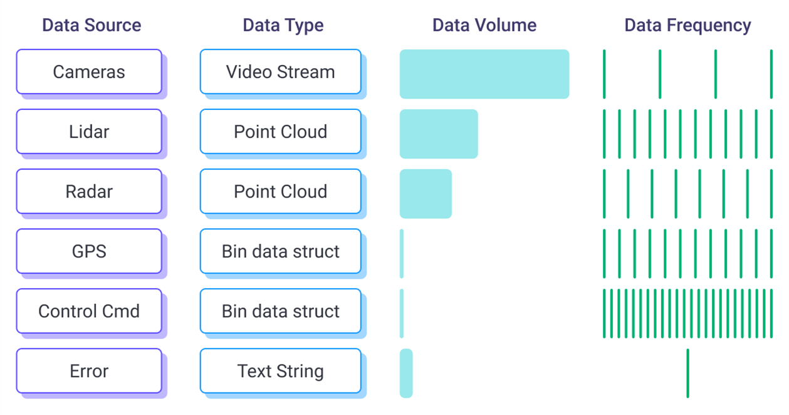
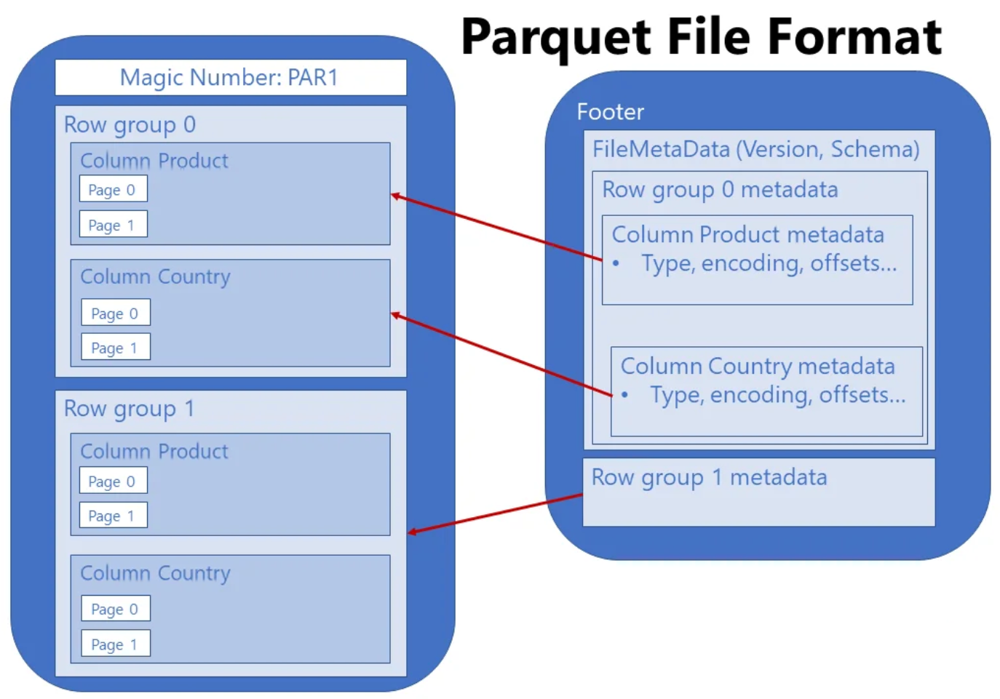
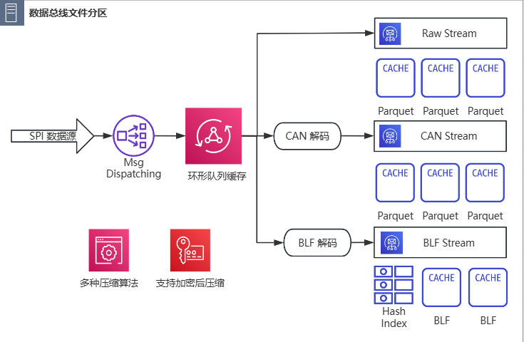
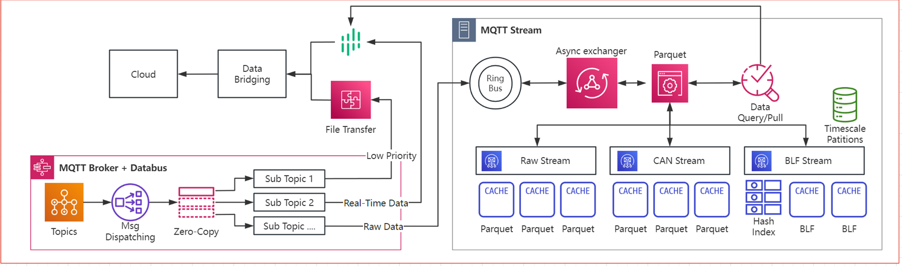

# MQTT stream 车载消息队列

MQTT Stream 即消息总线里的消息队列功能，其与 MQTT 消息服务器功能相辅相成，主要负责消息的有序落盘和查询回溯。

## 1. 背景和功能介绍

数字座舱，智能辅助驾驶等功能都依赖于车内跨域和多传感器的数据融合，需要在车辆不同 SoC 之间传输大量数据。车内不同域控和传感器使用不同的碎片化协议导致互相缺乏互操作性，难以有效协同利用车内的算力资源，这阻碍了 SDV 和 SOA 架构产品的落地。


现代汽车电子电器架构每个域控制器下都会各自挂载若干个传感器，包括但不限于摄像头，雷达(Radar)和激光雷达(Lidar),GPS以及新加入的UWB和超声波传感器等设备。这些传感器都在极高的频率不间断的产生不同制式的数据供给给不同的高算力 SoC 来完成诸如 ACC/AEB 和座舱HUD，仪表盘，驾驶模式等功能安全要求各异的增值服务。这些数据形态各异，有视频流，点云，灰度图，图像等等，加上原来就存在的 CAN/LIN/FlexRay 总线的结构化信号数据，甚至还有 SoA 服务产生的中间数据需要通过 RPC/IPC 等方式将计算卸载至加速计算芯片来进行进一步处理。如图所示，不同数据源和不同形态的多模数据以不同的频率产生，使得车内的需要一种多模态的数据存储和回溯方式，方便 SOA 架构内的不同服务调用和对齐。

采集到数据并非最终的目的，从数据中提取有价值的信息，完善产品迭代，解决故障并分析获得商业洞察才是最终目的。所以车端的消息队列需要能够在云端被快速低成本的进行处理。SDV-Flow 在产品设计的阶段就结合了 EMQ 之前深厚的数据基础设施研发经验，选用了开放包容的新数据处理标准： Apache Parquet，这一列存标准拥有强大的开源社社区生态支持，在大数据。人工智能和自动驾驶等领域都有广泛的应用。且可以灵活设计 Row/Group 来适配多模态的数据。正如软件定义汽车和面向服务的架构是借鉴了 IT 技术这三十年以来的结晶，EMQ SDV-Flow & Platform 提供了车云一体化的数据基础设施，统一数据传输传输标准，并且向各大数据仓/湖方案开放底层标准。通过一站到底的 Schema 动态匹配，在数据源头解决了碎片化问题，避免了大量数据积压后难以管理，再分析时需要投入大量人工时间进行预处理的麻烦，降低了数据挖掘和标注的成本。

### Apache Parquet 介绍


Parquet是一种列式存储格式，最早在 Hadoop 生态圈中流行，现在 Parquet 就是大数据时代存储格式的事实标准。最早是由 Twitter 和 Cloudera 合作开发，2015 年 5 月从 Apache 孵化器里毕业成为 Apache 顶级项目。其设计初衷是为了实现高性能的IO操作。它使用高效的压缩算法和数据编码方式，对表格型数据进行精简存储，从而减少数据IO，提高性能。Parquet支持嵌套格式数据，能够自然地描述互联网和科学计算等领域的数据，降低了大规模数据的处理成本。至今，行业研究显示数据密集型行业对 Parquet 的使用量增加了 45%，超过了 Avro 和 ORC 等格式。而且 Parquet 相比其他格式具有更高查询性能和存储效率。72% 的新数据湖数据实施使用 Parquet，这要归功于它的压缩以及与已有大数据工具的无缝集成。Apache Parquet 的应用已经日益广泛，尤其是在管理大型复杂数据集（如远程信息处理和车联网/物联网）的领域。对于车云数据闭环则尤其需要具备上文所述这些特性的强大的数据基础设施来支持车辆数字孪生，能够方便车端和云端的数据同步分析。 所以SDV-Flow & Platform 就基于 Parquet 设计，具有环形队列，滚动消息存储，Schema 匹配，文件管理和历史数据回溯等功能，通过结合 MQTT 轻量高效的订阅模型，MQTT Stream 可以被称为 Parquet on steroids，实现了可靠的车端历史时序数据管理，并且针对车端的存储介质进行了文件 I/O 优化，使其能够以低成本支撑高速、复杂的持久化数据读写需求。


#### Apache Parquet VS CSV
| 功能特性      | Parquet    | CSV             |
| ------------ | ----------- | ----------- |
| 存储类型      | 列存   |  行列式  |
| 文件大小                              | 小 （针对数据结构优化压缩后）     | 中等（压缩倍率有限） |
| 查询性能                  | 快（针对列查询尤其优秀）    | 慢 |
| Schema自由度                           | 原生 Schema 支持自由定义     | 无 Schema 支持 |
| 数据类型保真度                              | 保留原始数据类型，无需特殊编码    | 只能以文本形式存储，必须经过编码转换     |
| 可否分割文件并行处理                              | 可    | 不可    |
| 是否人类可读           | 不可，是二进制流      | 可     |
| 与大数据生态兼容度             | 原生完美支持     | 部分支持      |

### 消息队列功能介绍

SDV-Flow 的消息队列功能包含主题交换机，环形队列，Schema 编解码器和文件管理四个部分。

1. 主题交换机负责对流入MQTT 消息服务器的数据进行匹配过滤，只允许命中的消息进入消息队列中。
2. 环形队列是消息队列的内存缓冲区，会根据用户设置的大小将数据积累到一定条数后统一进行编解码和压缩。
3. Schema 编解码器是根据用户配置的落盘格式和Schema 对积累的数据源进行对应的编解码操作。
4. 文件管理部分负责对编解码后的二进制流写入 Parquet 并压缩-加密-落盘。当配置目录下的文件数量达到限制就会自动覆盖最旧的一个 Parquet 文件。

目前除了 Parquet 格式外，也支持 Vector BLF 格式存储，但如果使用 BLF 格式则必须数据源是 CAN 报文类型，否则落盘失败。对于 Parquet 格式用户可以选择不同的 Schema，也可以联系我们进行 Schema 定制以配合云端大数据需求。
当前产品中针对 Parquet 提供了两种预置的 Schema，分别是针对CAN 优化的 CAN Schema 和保留原始数据报文的 Raw Schema。若数据源是CAN 总线报文，那么采用 CAN Schema 可以获得1倍以上的压缩率提升。

消息队列模块也支持对数据压缩，可以选择 gzip | brotli | zstd | lz4 四种压缩算法。也支持用户自定义存储文件的路径和最大滚动存储文件数量，会自行滚动覆盖旧数据。针对有高数据安全要求的场景，也支持在压缩后使用 AES 加密保证车端数据不泄露。

## 2. 内部数据通路

1. 当消息进入MQTT 消息服务器的时候，会先经过 exchange 主题交换机的过滤，如果发现消息是指定topic时，会将消息放入ringbus中。
2. 在 Ringbus 中命中的消息会被打上一个系统时间戳作为当前消息在消息队列中的唯一key标识，这个 Key 也支持从外部获取。
3. 之后根据配置中指定的消息流格式进行编解码。
4. 然后该消息会缓存于 Ringbus 中，等待Ringbus满后 执行ringbus对应的 fullOp，比如将消息落盘或返回给订阅者。

数据流出
1. MQTT 消息队列收到触发搜索/上传的请求
2. MQTT 消息队列去 ringbus 中检索数据，将搜索到的数据返回给查询方或直接上传云端对应的 MQTT 主题。
3. MQTT 消息队列检索落盘的所有 parquet，将范围内命中的parquet文件上传到云端对应的 Parquet File topic。



## 3. mqtt-stream与文件上传

mqtt-stream中会对外提供一个数据查询/上传接口，可以通过这个接口触发搜索mqtt-stream中的数据
- Ringbus中的数据：由于Ringbus中的数据还未进行落盘成为文件，所以MQTT 消息队列搜索出来后自行组装成mqtt消息发送到本地MQTT 消息服务器的1883端口
- Parquet文件：MQTT 消息服务器将命中的parquet组装成文件传输请求发送给文件传输客户端

Ringbus中的数据会直接上传至MQTT 消息服务器的1883端口，parquet文件则会先发送文件传输请求给文件传输客户端，文件传输客户端收到请求后会上传文件到MQTT 消息服务器的1883端口

Apache Parquet 是一种开源列式存储格式，旨在实现高效的数据存储和检索。Parquet 作为 Apache Hadoop 生态系统的一部分开发，由于其高性能和高效率，它已成为数据仓库和大数据分析的标准。

通过将 Parquet 与 MQTT Streaming 相结合，我们可以轻松地在边缘构建统一的命名空间，从而实现以下功能：
1. 本地流式数据存储作为实时业务的快照。
2. 以经济高效的方式滚动更新车端的持久性数据。
3. 根据客户的数据形式进行 Schema 细粒度优化，实现更好的压缩。
4. 支持数据查询和拉取作为轻量级数据库。
5. 面向主题的流式处理，利用磁盘空间改进车端数据采集和处理的内存资源占用

## 4. 配置文件介绍

### 通过配置文件开启MQTT STREAM
此处介绍如何通过配置nanomq.conf配置文件来开启MQTT STREAM

### 配置选项
以下是一个简单的 MQTT STREAM 配置样例
```
exchange_client.mq1 {
    # # 交换机对外暴露的查询服务接口
	exchange_url = "tcp://127.0.0.1:10000" 
    # # 允许同一时间进行最大 5 次的查询
	limit_frequency = 5
	exchange {
		# # MQTT Topic for filtering messages and saving to queue
		topic = "canspi",
		# # MQ name
		name = "canspi",
		streamType = 0,
		# # MQ category. Only support Ringbus for now
		ringbus = {
			# # ring buffer name
			name = "ringbus",
			# # max length of ring buffer (msg count)
			cap = 1200,
			# #  0: RB_FULL_NONE: When the ringbus is full, no action is taken and the message enqueue fail
			# #  1: RB_FULL_DROP: When the ringbus is full, the data in the ringbus is discarded
			# #  2: RB_FULL_RETURN: When the ringbus is full, the data in the ringbus is taken out and returned to the aio
			# #  3: RB_FULL_FILE: When the ringbus is full, the data in the ringbus is written to the file
			#
			# # Value: 0-4
			# # Default: 0
			# # Note: Sdv flow is only applicable to RB_FULL_RETURN(2)
			fullOp = 2
		}
	}
}
```

也可以配置多个流存储，例如：
```
exchange_client.mq2 {
	# # Currently NanoMQ only support one MQ object. URL shall be exactly same.
	exchange_url = "tcp://127.0.0.1:10001"
	# # exchanges contains multiple MQ exchanger
	limit_frequency = 5
	exchange {
		# # MQTT Topic for filtering messages and saving to queue
		topic = "signal",
		# # MQ name
		name = "signal",
		streamType = 0,
		# # MQ category. Only support Ringbus for now
		ringbus = {
			# # ring buffer name
			name = "ringbus2",
			# # max length of ring buffer (msg count)
			cap = 100,
			# #  0: RB_FULL_NONE: When the ringbus is full, no action is taken and the message enqueue fail
			# #  1: RB_FULL_DROP: When the ringbus is full, the data in the ringbus is discarded
			# #  2: RB_FULL_RETURN: When the ringbus is full, the data in the ringbus is taken out and returned to the aio
			# #  3: RB_FULL_FILE: When the ringbus is full, the data in the ringbus is written to the file
			#
			# # Value: 0-4
			# # Default: 0
			# # Note: Sdv flow is only applicable to RB_FULL_RETURN(2)
			fullOp = 2
		}
	}
}
```

- exchange_client: 承载exchange的客户端
- exchange: 用于接收特定topic消息的交换机，并将消息数据放入ringbus中
- exchange_url = "tcp://127.0.0.1:10000"     交换机对外暴露的查询服务接口
- ringbus: 用于存放mqtt消息，其大小是可以进行设置，同时还提供了fullOp，也就是当ringbus满的时候的行为
  - cap: ringbus容量大小
  - fullOp: 目前提供了四种当ringbus满的时候的行为
    ```
        0: RB_FULL_NONE: 当ringbus满时，不执行额外动作，入队失败
        1: RB_FULL_DROP: 当ringbus满时，将该消息丢弃，清空所有在ringbus中的数据并执行入队动作
        2: RB_FULL_RETURN: 当ringbus满时，ringbus中的数据会放入aio进行返回
        3: RB_FULL_FILE（依赖parquet）: 当ringbus满时，ringbus中的数据会写入文件中进行持久化存储
    ```
    注意： 如果fullOp=3则需要开启PARQUET编译选项，并在nanomq.conf中配置parquet

    ```
    # 在nanomq.conf中配置 parquet 文件管理器的配置：

    parquet {
        # # Parquet compress type. 压缩算法选择
        # #
        # # Value: uncompressed | snappy | gzip | brotli | zstd | lz4
        compress = zstd
        # # The dir for parquet files. 存储文件路径
        # #
        # # Value: Folder
        dir = "/bigdata/data/nanomq/parquet"
        # # The prefix of parquet files written. 存储文件的前缀名
        # #
        # # Value: string
        file_name_prefix = "nanomq"
        # # Maximum rotation count of parquet files. 最大滚动文件数量
        # #
        # # Value: Number
        # # Default: 5
        file_count = 3000
        # # The max size of parquet file written. 单个文件允许的最大大小
        # #
        # # Default: 10M
        # # Value: Number
        # # Supported Unit: KB | MB | GB
        file_size = 100MB
        # # The max number of searches per second.
        # #
        # # Default: 5
        # # Value: Number
        limit_frequency = 5
    }
    ```

从 SDV-Flow 1.3.0 版本开始可以针对每个 MQTT Stream 单独配置 Parquet 文件管理器。只需在交换机配置中增加即可：

```

# #====================================================================
# # Exchange configuration for Embedded Messaging Queue
# #====================================================================
# # Initalize multiple MQ exchanger by giving them different name (mq1)
exchange_client.mq1 {
	# # Currently NanoMQ only support one MQ object. URL shall be exactly same.
	exchange_url = "tcp://127.0.0.1:10000"
	# # The rate limit parameter, which controls the number of queries issued within 5 seconds
	limit_frequency = 5
	# # exchanges contains multiple MQ exchanger
	exchange {
		# # MQTT Topic for filtering messages and saving to queue
		topic = "exchange/topic1",
		# # Only for the case of ringbus fullop=2
		# # Stream Type 0: Raw stream
		# # Stream Type 1: Can Message type
		streamType = 0,
		# # MQ name
		name = "exchange_no1",
		# # MQ category. Only support Ringbus for now
		ringbus = {
			# # ring buffer name
			name = "ringbus",
			# # max length of ring buffer (msg count)
			cap = 1000,
			# #  0: RB_FULL_NONE: When the ringbus is full, no action is taken and the message enqueue fail
			# #  1: RB_FULL_DROP: When the ringbus is full, the data in the ringbus is discarded
			# #  2: RB_FULL_RETURN: When the ringbus is full, the data in the ringbus is taken out and returned to the aio
			# #  3: RB_FULL_FILE: When the ringbus is full, the data in the ringbus is written to the file
			#
			# # Value: 0-4
			# # Default: 0
			fullOp = 2
		}
		# # 原先独立的文件管理器被纳入了主题交换器中，新增如下部分：
		parquet {
			# # Parquet compress type.
			# #
			# # Value: uncompressed | snappy | gzip | brotli | zstd | lz4
			compress = zstd
			# # The dir for parquet files.
			# #
			# # Value: Folder
			dir = "./parquet"
			# # The prefix of parquet files written.
			# #
			# # Value: string
			file_name_prefix = "nanomq1"
			# # Maximum rotation count of parquet files.
			# #
			# # Value: Number
			# # Default: 5
			file_count = 5
			# # The max size of parquet file written.
			# #
			# # Default: 10M
			# # Value: Number
			# # Supported Unit: KB | MB | GB
			file_size = 100MB
			# # The max number of searches per second.
			# #
			# # Default: 5
			# # Value: Number
			limit_frequency = 5
		}
	}
}

```
如此即可为每个消息流单独管理滚动落盘的文件。

### 测试MQTT STREAM

接下来是ringbus的fullOp为3为例，测试mqtt stream的落盘能力。（记得开启parquet编译选项）
1. 配置选项
```
...
exchange_client.mq1 {
	# # exchanges contains multiple MQ exchanger
	exchange {
		# # MQTT Topic for filtering messages and saving to queue
		topic = "topic1",
		# # MQ name
		name = "exchange_no1",
		# # MQ category. Only support Ringbus for now
		ringbus = {
			# # ring buffer name
			name = "ringbus",
			# # max length of ring buffer (msg count)
			cap = 10000,
			fullOp = 3
		}
	}
}
...
parquet {
    compress = gzip
    encryption {
        key_id = kf
        key = "0123456789012345"
        type = AES_GCM_CTR_V1
    }
    dir = "/tmp/nanomq-parquet"
    file_name_prefix = "nanomq-parquet-"
    file_count = 5
}
...
```

2. 启动NanoMQ
```
nanomq start --conf=/etc/nanomq.conf
```

3. 使用emqtt_bench发送消息
```
emqtt_bench pub -p 1883 -i 1 -I 1 -c 1 -s 10 -t "topic1" -V 5 -L 30005
```

4. 测试打印
```
ringbuffer_parquet_cb: ringbus: parquet write to file: /tmp/nanomq-parquet/nanomq-parquet--79060194635079892~370618470429406089.parquet success
ringbuffer_parquet_cb: ringbus: parquet write to file: /tmp/nanomq-parquet/nanomq-parquet--370618474724373386~375711962341231626.parquet success
ringbuffer_parquet_cb: ringbus: parquet write to file: /tmp/nanomq-parquet/nanomq-parquet--375711966636198923~380805454253057163.parquet success
```
有以上日志输出则表示消息已经成功刷盘保存。

5. 文件存储路径

然后可以观察配置的路径下出现了刷盘文件。
```
/tmp/nanomq-parquet/nanomq-parquet--370618474724373386~375711962341231626.parquet
/tmp/nanomq-parquet/nanomq-parquet--375711966636198923~380805454253057163.parquet
/tmp/nanomq-parquet/nanomq-parquet--79060194635079892~370618470429406089.parquet
```
