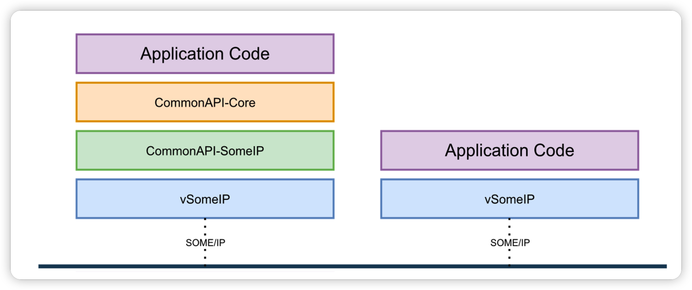
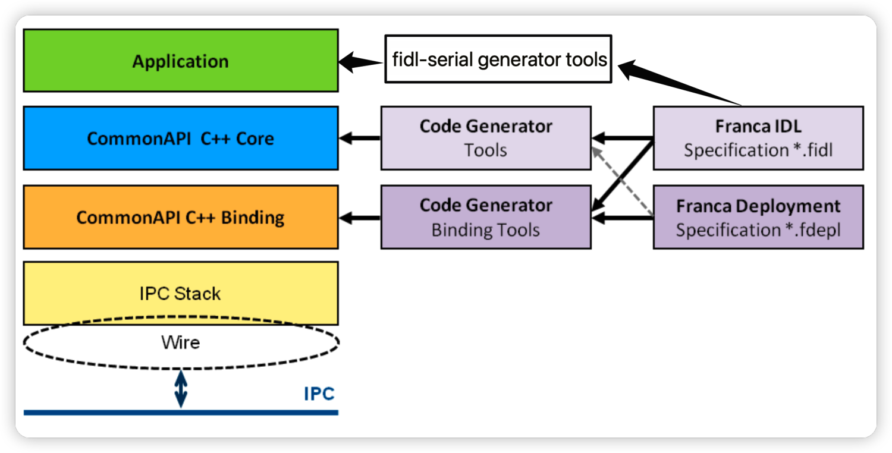
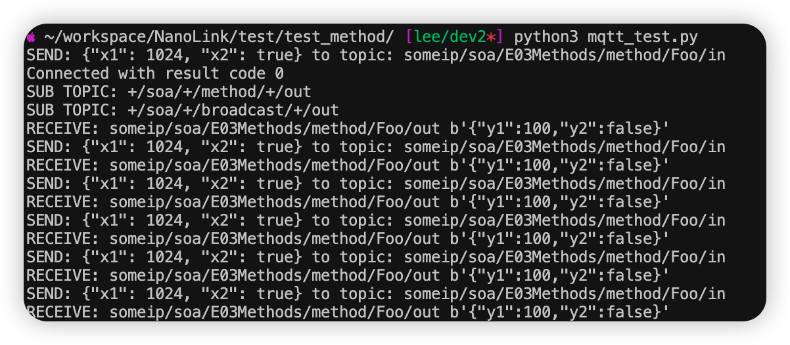
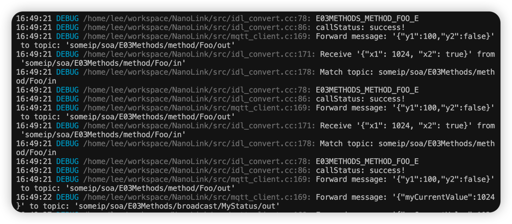
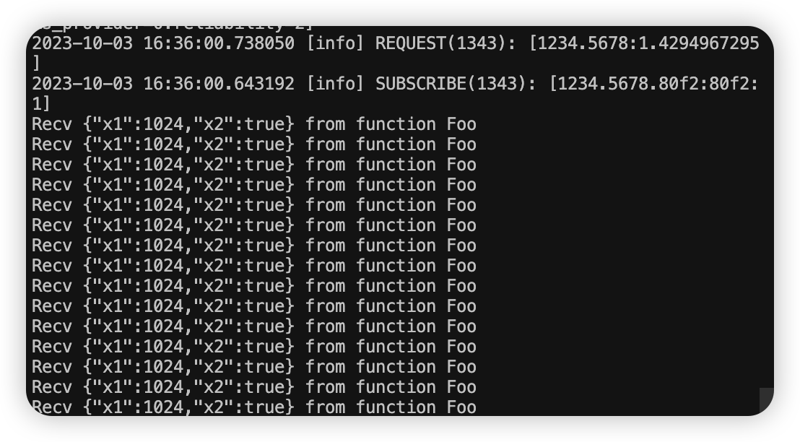

# SOME/IP
NanoLink 的实现底层依赖 CommonAPI 和 NanoSDK （link），NanoSDK 负责 MQTT 消息的通信， CommonAPI 负责 SOME/IP 消息的通信。相比于纯粹的基于 vsomeip 开发， CommonAPI 在低代码的层面上做了很多的工作，如下图所示。在开发工程中我们只需要定义好 fidl/fdepl 相关文件，调用对应的代码生成工具，就可以生成 SOME/IP 通信和序列换相关的接口以及实现代码。所以我们在实现功能的过程中可以更加专注业务。


同时，也可以单独提供裸 SOME/IP-MQTT 的消息桥接服务。

当我们的功能涉及到云边互通时，多协议之间的相互转换使得很多工作依然需要手动完成。我们需要对序列化、反序列化手动进行转换，设计通信主题，考虑消息的吞吐，线程间的同步工作等问题。NanoLink 与 fidl-serial 的结合可以帮助我们轻松解决上述问题。如下图所示，在生成 CommonAPI Code 和 CommonAPI Binding 的代码以后，fidl-serial 工具会自动为 NanoLink 生成 Application 的代码：这部分生成的代码包括：JSON 序列化，反序列化代码， 动态的订阅、发布主题，以及根据服务的数量，生成多个单独的服务线程，还有测试的 service 等。

Fidl-serial 是基于 CommonAPI 的代码生成工具。自动生成 SOME/IP 与 MQTT 相互转换的代码。如下可以看到各个生成器所负责的部分，fidl-serial 负责生成 Application 部分的代码。 


快速的代码生成，使我们无痛打通车云链路，可以实现快速的开发和部署。相比于从头做架构的设计，项目的开发与测试，这极大的节约了我们的时间成本，尤其对于电动汽车百家争鸣的今天。

## 配置和使用
### 安装
-  安装依赖，1~6 是 CommonAPI 和 vsomeip 所需要的，fidl-serial 是我们开发的代码生成工具。
    1. boost
    2. vsomeip
    3. core runtime
    4. someip runtime
    5. core generator
    6. someip generator
    7. fidl-serial
- 安装 NanoLink。

### 生成与编译
- 用户需要首先提前写好 fidl 和 fdepl 文件。以下面这个简单的 fidl 示例为例：
fidl 文件:
```fidl
package commonapi.examples
interface E03Methods {
    version { major 1 minor 2 }
    method Foo {
        in {
            Int32 x1
            Boolean x2
        }
        out {
            Int32 y1
            Boolean y2
        }
    }
    broadcast MyStatus {
        out {
            Int32 myCurrentValue
        }
    }
}
```

fdepl 文件:
```fdepl
import "platform:/plugin/org.genivi.commonapi.someip/deployment/CommonAPI-4-SOMEIP_deployment_spec.fdepl"
import "E03Methods.fidl"
define org.genivi.commonapi.someip.deployment for interface commonapi.examples.E03Methods {
    SomeIpServiceID = 4660
    method Foo {
        SomeIpMethodID = 30000
        SomeIpReliable = false
        in {
        }
        out {
        }
    }
    broadcast MyStatus {
        SomeIpEventID = 33010        
        SomeIpEventGroups = { 33010 }
        out {
        }
    }
}
define org.genivi.commonapi.someip.deployment for provider as Service {
    instance commonapi.examples.E03Methods {
        InstanceId = "E03Methods"
        SomeIpInstanceID = 22136
    }
}

```
将 fidl/fdepl 文件放入 nanolink 的 fidl 目录下
```bash
$ mkdir build
$ cd build
$ cmake  -DCORE_GENERATE_PATH=/your/commonapi_core_generator/path \
         -DSOMEIP_GENERATE_PATH=/your/commonapi_someip_generator/path \
         -DFIDL_SERIAL_GENERATE=/your/fidl-serial/path ..
$ make -j8
```
commonapi 的两个 generator 生成的代码将放在 src-gen 目录中。
```bash
$ ~/workspace/NanoLink/ tree -L 1
.
├── build
├── cmake
├── CMakeLists.txt
├── deploy
├── etc
├── fidl
├── include
├── nng
├── README.md
├── src
├── src-gen
├── test
└── third-party
```
fidl-serial 生成的代码将放在 src/idl_convert.cc 文件里。
整个项目的依赖关系如下：


编译的过程中通过 `-DTEST_SERVER=ON/OFF` 选择指定使用的是 NanoLink 的测试 server ，还是 proxy。

### 运行与测试
当我们编译好 server 和 proxy 后，我们可以模拟 SOME/IP 和 MQTT 的通信。
- 启动 mqtt broker，可以选择 NanoMQ 或 EMQX。
- 启动生成的 someip 测试 server
```bash
export COMMONAPI_CONFIG=../etc/commonapi4someip.ini && \
export LD_LIBRARY_PATH=path/to/libNanoLink-someip:$LD_LIBRARY_PATH && \
export VSOMEIP_CONFIGURATION=../etc/vsomeip-local.json && \
export VSOMEIP_APPLICATION_NAME=nanolink && \
./nanolink --conf ../etc/server.conf
```
用户只需要根据 fidl 文件修改 server.conf 即可，server 会根据读到的接口的数据，对客户端的 request 和 subscribe 进行响应。下面是 server.conf 的示例:

```json
{
    // Interface name, method/event name, out paramters name
    // method CellSts out
    E03Methods {
        Foo {
            y1 : 100
            y2 : true
        }
        MyStatus {
            myCurrentValue : 1024
        }
    }
}
```
当客户端有请求到 Foo 方法，Foo 方法会 y1 = 100, y2 = true 进行相应。MyStatus 会以 myCurrentValue = 1024 周期性发送给订阅的客户端。

service 运行成功后可以看到日志输出：

```bash
2023-10-03 16:35:57.903149 [info] Parsed vsomeip configuration in 0ms
2023-10-03 16:35:57.903440 [info] Using configuration file: "../etc/vsomeip-local.json".
2023-10-03 16:35:57.903514 [info] Configuration module loaded.
2023-10-03 16:35:57.903556 [info] Initializing vsomeip application "service-sample".
2023-10-03 16:35:57.903671 [info] Instantiating routing manager [Host].
2023-10-03 16:35:57.904222 [info] create_local_server Routing endpoint at /tmp/vsomeip-0
2023-10-03 16:35:57.904624 [info] Service Discovery enabled. Trying to load module.
2023-10-03 16:35:57.906199 [info] Service Discovery module loaded.
2023-10-03 16:35:57.906462 [info] Application(service-sample, 1277) is initialized (11, 100).
2023-10-03 16:35:57.907596 [info] Starting vsomeip application "service-sample" (1277) using 2 threads I/O nice 255
2023-10-03 16:35:57.908741 [info] REGISTER EVENT(1277): [1234.5678.80f2:is_provider=true]
2023-10-03 16:35:57.909211 [info] OFFER(1277): [1234.5678:1.0] (true)
2023-10-03 16:35:57.909261 [info] shutdown thread id from application: 1277 (service-sample) is: 7fb2771fc640 TID: 353026
2023-10-03 16:35:57.909879 [info] Listening at /tmp/vsomeip-1277
Successfully Registered E03MethodsService!
```
- 运行 NanoLink proxy：
```bash
export COMMONAPI_CONFIG=../etc/commonapi4someip.ini && \
export LD_LIBRARY_PATH=/home/lee/workspace/NanoLink/build:$LD_LIBRARY_PATH && \
export VSOMEIP_CONFIGURATION=../gab/vsomeip-local.json && \
./nanolink --conf ../nanolink.conf
```
下面是 nanolink.conf 的示例：
```conf
nanolink.mqtt {
    # # Bridge address: host:port .
    # #
    # # Value: String
    # # Example: mqtt-tcp://127.0.0.1:1883
    address = "mqtt-tcp://127.0.0.1:1883"
    # # The ClientId of a remote bridge.
    # # Default random string.
    # #
    # # Value: String
    clientid= clientid
    # # Ping: interval of a downward bridge.
    # #
    # # Value: Duration
    # # Default: 10 seconds
    keepalive = 60s
    # # The Clean start flag of a remote bridge.
    # #
    # # Value: boolean
    # # Default: false
    # #
    # # NOTE: Some IoT platforms require clean_start
    # #       must be set to 'true'
    clean_start = true
    # # The username for a remote bridge.
    # #
    # # Value: String
    username = username
    # # The password for a remote bridge.
    # #
    # # Value: String
    password = passwd
}
nanolink.someip {
    ## enable someip
    ## 
    ## Value: true | false
    enable = true
    # # Mqtt topic prefix
    # # Example {prefix}/soa/DataColl/method/DataUp/in;
    # # This will replace {prefix} part
    # #
    # # value String
    prefix = "someip"
    # # Commonapi config file
    # #
    # # value String
    commonapi_config = "../commonapi4someip.ini"
}
log {
    ## enable log
    ## 
    ## Value: true | false
    enable = true
    ## log level
    ## 
    ## support TRACE, DEBUG, INFO, WARN, ERROR, FATAL
    level = DEBUG
}
```

运行成功后可以看到日志输出：

```bash
16:44:51 INFO  /home/lee/workspace/NanoLink/src/conf.c:415: mqtt server address:      mqtt-tcp://127.0.0.1:1883
16:44:51 INFO  /home/lee/workspace/NanoLink/src/conf.c:416: mqtt clientid:            bridge_client
16:44:51 INFO  /home/lee/workspace/NanoLink/src/conf.c:417: mqtt username:            username
16:44:51 INFO  /home/lee/workspace/NanoLink/src/conf.c:418: mqtt password:            passwd
16:44:51 INFO  /home/lee/workspace/NanoLink/src/conf.c:419: mqtt keepalive:           60
16:44:51 INFO  /home/lee/workspace/NanoLink/src/conf.c:420: mqtt clean_start:         1
16:44:51 INFO  /home/lee/workspace/NanoLink/src/conf.c:421: mqtt forwards:
16:44:51 INFO  /home/lee/workspace/NanoLink/src/conf.c:422:     avtp to mqtt topic:   (null)
16:44:51 INFO  /home/lee/workspace/NanoLink/src/conf.c:423:     avtp to mqtt qos:     0
16:44:51 INFO  /home/lee/workspace/NanoLink/src/conf.c:424:     udp to mqtt topic:    (null)
16:44:51 INFO  /home/lee/workspace/NanoLink/src/conf.c:425:     udp to mqtt qos:      0
16:44:51 INFO  /home/lee/workspace/NanoLink/src/conf.c:429: avtp enable:              false
16:44:51 INFO  /home/lee/workspace/NanoLink/src/conf.c:430: avtp ifname:              
16:44:51 INFO  /home/lee/workspace/NanoLink/src/conf.c:435: avtp macaddr:             0:0:0:0:0:0
16:44:51 INFO  /home/lee/workspace/NanoLink/src/conf.c:439: udp enable:               false
16:44:51 INFO  /home/lee/workspace/NanoLink/src/conf.c:440: udp addr:                 (null)
16:44:51 INFO  /home/lee/workspace/NanoLink/src/conf.c:441: udp port:                 0
16:44:51 INFO  /home/lee/workspace/NanoLink/src/conf.c:445: someip enable:            true
16:44:51 INFO  /home/lee/workspace/NanoLink/src/conf.c:446: someip prefix:            someip
16:44:51 INFO  /home/lee/workspace/NanoLink/src/conf.c:447: someip commonapi_config:  ../etc/commonapi4someip.ini
16:44:51 INFO  /home/lee/workspace/NanoLink/src/conf.c:450: log_level:                DEBUG
16:44:51 INFO  /home/lee/workspace/NanoLink/src/mqtt_client.c:128: connect to mqtt-tcp://127.0.0.1:1883
16:44:51 INFO  /home/lee/workspace/NanoLink/src/mqtt_client.c:71: mqtt client connected! RC [0]
16:44:51 INFO  /home/lee/workspace/NanoLink/src/mqtt_client.c:190: Subscribe topic: `someip/soa/E03Methods/method/Foo/in` with qos 1
```

- 编写一个简单的测试客户端：

```python
#!/usr/bin/python3
import paho.mqtt.client as mqtt
import time
import json
prefix ="someip"
pub_infos = [
    {
        "topic": prefix + "/soa/E03Methods/method/Foo/in",          
        "payload": 
        {
            "x1": 1024,
            "x2": True
        }
    },
]
sub_topics = [
    "+/soa/+/method/+/out",
    "+/soa/+/broadcast/+/out",
]
# The callback for when the client receives a CONNACK response from the server.
def on_connect(client, userdata, flags, rc):
    print("Connected with result code "+str(rc))
    # Subscribing in on_connect() means that if we lose the connection and
    # reconnect then subscriptions will be renewed.
    for sub_topic in sub_topics:
        print("SUB TOPIC: " + sub_topic)
        client.subscribe(sub_topic)
# The callback for when a PUBLISH message is received from the server.
def on_message(client, userdata, msg):
    print("RECEIVE: " + msg.topic+" "+ str(msg.payload))
client = mqtt.Client()
client.on_connect = on_connect
client.on_message = on_message
client.connect("localhost", 1883, 60)
client.loop_start()
while True:
    for pub_info in pub_infos:
        print("SEND: " + json.dumps(pub_info["payload"]) + " to topic: " + pub_info["topic"])
        client.publish(pub_info["topic"], json.dumps(pub_info["payload"]))
        time.sleep(0.2)
```

运行该测试程序就可以 SOME/IP 和 MQTT 的双向通信了。可以看到如下图所示：

- 客户端发送请求接收响应的日志


- NanoLink 双向转发的日志


- service 收到请求的日志

