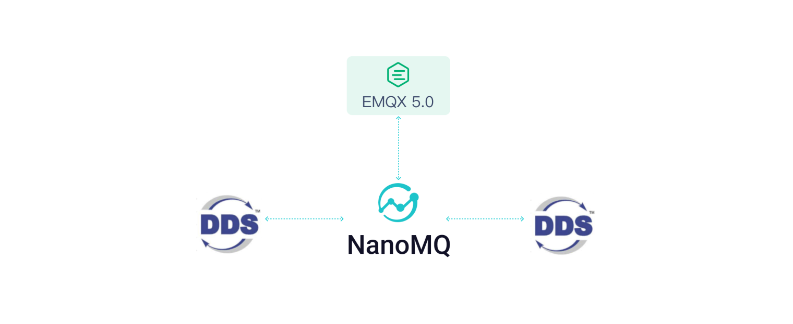

# DDS + ROS2

## DDS Proxy 简介

先从标准 DDS 协议桥接功能开始介绍。
DDS 中间件是一个软件层，它将应用程序从操作系统、网络传输和低级数据格式的详细信息中抽象出来。以不同的编程语言提供了相同的概念和 API，从而允许应用程序跨操作系统、语言和处理器体系结构交换信息。底层细节如数据线格式、发现、连接、可靠性、协议、传输选择、QoS、安全性等都由中间件管理。

DDS 协议本身的设计是通用的，但当前的现实情况却是，不同 DDS 中间件的实现之间的兼容性参差不齐，主要有以下这些方面：

1. 版本不兼容：DDS 标准不断发展演进，不同版本或者不同实现之间均可能存在不兼容的情况。如果两个实现使用不同的 DDS 版本，可能会导致通信协议、API 或功能方面的不兼容性。

2. QoS 参数不兼容：DDS 规范定义了一组 QoS 参数，但不同的实现可能支持不同的 QoS 参数或参数取值。这可能导致在使用特定 QoS 参数时，不同 DDS 实现之间无法进行交互。

3. 数据类型不兼容：DDS 支持用户自定义的数据类型，不同实现可能对数据类型的定义和解析方式存在差异。如果数据类型在不同实现之间不一致，可能导致数据无法正确解析或传输。

4. 传输协议不兼容：DDS 可以使用不同的传输协议进行数据传输，如 TCP/IP、UDP 或共享内存等。不同实现可能使用不同的传输协议，导致无法直接进行数据交换。

5. 序列化格式不兼容：DDS 实现可能使用不同的序列化格式来编码和解码数据。如果不同实现使用不同的序列化格式，可能导致数据无法正确解析和传输。

6. 安全机制不兼容：DDS 支持数据传输的安全机制，如加密和身份验证。不同实现可能使用不同的安全机制或规范，导致无法进行安全的数据交换。

DDS 目前主流有 CycloneDDS，OpenDDS， FastDDS 等实现。国产也有不少原生实现。但他们除了在 DDS-RTSP 层保持一致外，在协议层和 QoS 和服务定义都不尽兼容。作为一款标准的协议转换产品，我们只进行了数据桥接和基础的 MQTT-DDS 的 QoS 映射，并不完全嫁接 DDS 的 QOS 到 MQTT 和云端，因为 DDS 这些设计并无法完成车云传输，不适合应用和传输解耦。

而在车内 E/E 架构中，往往会遇到跨域场景。以及车云传输都是一种跨域需求。虽然DDS 本身的设计是支持跨域的，但是实际上会遇到以下这些常见问题：


DDS 跨域的性能不佳：DDS 在同一个域下的性能相对比较出色，但是在跨域方面，性能远不如 HTTP、MQTT 等协议。

不同 DDS 实现的跨域方式不同：例如 fastDDS 常用的是多域配置来实现，而 CycloneDDS 则更加倾向于以来 Zenoh 来实现。

同一个 DDS 实现不同的版本之间的跨域方式不同。

DDS 的发现协议复杂度在网络内节点数增加时，复杂度成指数的几何倍数增加： O(t*r*w*p^2) (Topics,Readers,Writers,Participants)。而且保活方式比较繁琐。且每个网络节点都需要知道整个网络状态，导致路由同步成本极高。这些导致其在跨域时的性能和可拓展性极差。

但 DDS 也固有其优势：
DDS 是其他行业协议或者系统框架标准的基础，包括 OpenFMB、自适应 AUTOSAR、MD PnP、GVA、NGVA 和 ROS2 等。

丰富的 QoS 策略
DDS 有着非常丰富且复杂的 QoS 策略，用于控制数据传输和通信的质量，例如及时性、流量的优先级、可靠性以及资源受限时的策略调整等，能够适应多种场合下的数据传输。DDS 的 QoS 大致分为以下几类：

Reliability（可靠性）：用于确保数据的可靠传输。

Durability（持久性）：用于控制数据在系统重新启动后的存储和恢复。

Deadline（截止时间）：用于指定数据的有效期限。

Lifespan（生命周期）：用于指定数据的生命周期。

Ownership（所有权）：用于控制数据的所有权转移。

Time-Based Filter（基于时间的过滤）：用于根据时间条件过滤数据。

Resource Limits（资源限制）：用于限制系统在处理数据时使用的资源量，如内存、带宽或处理器等。

这些 QoS 参数可以根据应用程序的需求进行配置，以满足数据传输和通信的特定要求。

在安全性上，DDS 提供标准化的身份验证、加密、访问控制和日志记录功能，以实现 IoT 系统中端对端的安全数据连接。而在可扩展性上，DDS 可以在横向和纵向分别进行拓展，容纳大量设备。同时 DDS 可以实现低至 30μs 的点到点延迟，以及每秒数百万条消息的吞吐量。在面对大型系统时，DDS 提供了自动发现功能，即插即用，简化系统部署。

所以，集成 MQTT + DDS，博采众家之长才能打造成功的 SDV 产品。

## 用 MQTT-DDS 网关解决跨域问题
MQTT 与 DDS 的不同体现在多个方面，例如通信模式、是否去中心化等，而对跨域通信的主要区别如下：

 


可以从上表中看出，DDS 的优势主要在与域内，而 MQTT 由于其轻量的特点在跨域通信方面则更有优势，有更低的带宽占用和延迟。

DDS 可以使用 MQTT 通过以下方式进行跨域：


引入 MQTT-DDS Proxy，作为一个 DDS 的节点同时也作为一个 MQTT 节点。将 DDS 域中的所需的数据通过 MQTT-DDS Proxy 将数据发送到 MQTT Broker 中，再转发到对应的 DDS 域中，从而实现 DDS 跨域通信。这个过程中，需要考虑两个问题：

DDS 消息与 MQTT 消息相互转换的复杂程度。

额外的 MQTT-DDS Proxy 是否会引入额外的性能损失。

对于问题 1，DDS 消息与 MQTT 消息相互转换，这个过程实际上只是增加了一次序列化的开销，在性能上的损耗基本可以忽略；对于问题 2，在 DDS 网络中，单个节点的引入并不会引入过多的性能损失，反而是由于DDS 全局数据空间的设计，与直接将 DDS 两个域中节点的数据合并在一起对全局数据进行管理这一方式的开销相比较，MQTT-DDS Proxy 只是将部分所需数据传到另一个域中，这样的方式开销显然会更小。


而且 MQTT 协议相较于 DDS 更加轻量，并且在 IoT 领域有着更加广泛的使用。目前已有许多支持在 MCU 上运行的实现，包括 poho-c、Adafruit MQTT、MQTT-SN 等。所以在 AutoSAR CP 有着许多广泛和成熟的实现，可以完成 MCU - SOC 的数据交互。可以通过以下方式将 MCU 上的数据通过 MQTT 传入 DDS 网络中，从而达到更好的兼容性。


在局域网 LAN 中部署 MQTT Broker，通过 MCU 上的 MQTT Client 将数据发送到 MQTT-DDS Proxy，可以减小 DDS 节点的数量，缩小 DDS 网络的规模，提高性能。同时也可以在 MQTT-DDS Proxy 中设置规则，仅把需要的数据传入到 DDS 域中。

## NanoMQ DDSProxy：轻松实现 MQTT 与 DDS 间的数据共享
NanoMQ DDSProxy 是一个 MQTT-DDS Proxy，其既是一个 DDS 节点，同时也是一个 MQTT 节点。通过NanoMQ DDSProxy 可以将 MQTT 网络中的数据和 DDS 网络中的数据按照 Topic 进行过滤后共享。其主要特性包括：

1. 支持 MQTT 3.1、MQTT 3.1.1、MQTT 5

2. 支持解析绝大部分 IDL 语法

3. 支持 DDS 到 MQTT 与 MQTT 到 DDS 双向的转发规则

4. 支持通过共享内存的方式来分享 DDS 数据

5. 支持 TCP、TLS 和 QUIC 发送到 MQTT 网络

6. 支持 RESTAPI,可观测

NanoMQ DDSProxy 的大致工作原理如下：


由于 DDS 消息的序列化与反序列化是在 DDS 内部实现的，对于上层的应用来说，只能得到反序列化后的结构体，故 DDS Proxy 需要得到 IDL 文件，并生成对应的序列化与反序列化代码，方能够将 DDS 结构体与 MQTT 消息相互转化。NanoMQ DDSProxy 内部同时集成了 MQTT 节点和 DDS 节点，两个节点需要分别进行初始化。初始化后分别接收 DDS 网络和 MQTT 网络的消息，当任意一个网络中收到消息后，对其进行序列化或者反序列化，再按照配置文件中的规定进行转发，从而实现 MQTT 和 DDS 网络间数据的共享。

## MQTT-DDS Proxy 使用教程

 DDS 网关基于 Cyclone DDS 实现，这是一款基于 OMG (Object Management Group) DDS 规范的开源 DDS 实现，用于发布/订阅消息的实时系统。NanoMQ 自 v0.16 版本引入了基于 Cyclone DDS 开发的 DDS Proxy 插件，此插件能够完成将 DDS 消息转换为 MQTT 消息并桥接上云，支持用户将 DDS 的数据通过 NanoMQ 来完成跨域传输并通过 MQTT 和云端互通。

结合 MQTT + DDS 两种协议，DDS 网关可以完美融合 broker + brokerless 两种消息模式，有效实现云边一体化的消息场景。



### 启用 NanoMQ DDS Proxy

#### 编译安装 IDL 代码生成器

为方便用户快速上手 DDS Proxy，NanoMQ 提供了 IDL 代码生成器：`idl-serial-code-gen`，用于根据用户的 DDS IDL 文件来自动生成 JSON 序列化和反序列化代码。

编译完成生成可执行文件 `idl-serial-code-gen`。

#### 结合自定义 IDL 编译 DDS Proxy

1. 通过 cmake 参数 `IDL_FILE_PATH` 指定 `idl` 文件路径 (不指定则默认为工程路径下的 `etc/idl/dds_type.idl`)

   ```bash
   $ cmake -G Ninja -DIDL_FILE_PATH={IDL_PATH} -DCMAKE_PREFIX_PATH={DDS_LIBRARY_PATH} -DBUILD_DDS_PROXY=ON ..
   $ ninja
   $ sudo ninja install
   ```

3. 执行以下命令查看是否已编译  `dds`

   ```
   $ ./nanomq_cli/nanomq_cli
   nanomq_cli { pub | sub | conn | nngproxy | nngcat | dds } [--help]

   available tools:
      * pub
      * sub
      * conn
      * nngproxy
      * nngcat
      * dds
   Copyright 2022 EMQ Edge Computing Team
   ```

#### 配置 DDS Proxy

开始使用前，首先通过 `/etc/nanomq_dds_gateway.conf` 配置文件来设置需要桥接和转发的 MQTT 和 DDS 主题。

```bash
## 转发规则配置
forward_rules = {
	  ## DDS to MQTT
    dds_to_mqtt = {
        from_dds = "MQTTCMD/topic1"
        to_mqtt = "DDS/topic1"
        struct_name = "remote_control_result_t"
    }
    ## MQTT to DDS
    mqtt_to_dds = {
        from_mqtt = "DDSCMD/topic1"
        to_dds = "MQTT/topic1"
        struct_name = "remote_control_req_t"
    }
}

## DDS 配置参数
dds {
    domain_id = 0
    
    shared_memory = {
        enable = false
        log_level = info
    }
}

## MQTT 配置参数
mqtt {
	connector {
        server = "mqtt-tcp://127.0.0.1:1883"
        proto_ver = 4
        keepalive = 60s
        clean_start = false
        username = username
        password = passwd
        
        ssl {
            enable = false
            key_password = "yourpass"
            keyfile = "/etc/certs/key.pem"
            certfile = "/etc/certs/cert.pem"
            cacertfile = "/etc/certs/cacert.pem"
        }
    }
}
```

其中的重点配置项包括：

**DDS 订阅与 MQTT 发布**

- DDS 订阅 Topic：`forward_rules.dds_to_mqtt.from_dds = "MQTTCMD/topic1"`
- MQTT 发布 Topic：`forward_rules.dds_to_mqtt.to_mqtt = "DDS/topic1"`
- 指定接收的 DDS 结构体名称：`forward_rules.dds_to_mqtt.struct_name = "remote_control_result_t"`

**MQTT 订阅与 DDS 发布**

- MQTT 订阅 Topic：`forward_rules.dds_to_mqtt.from_dds = "DDSCMD/topic1"`
- DDS 发布 Topic：`forward_rules.dds_to_mqtt.to_mqtt = "MQTT/topic1"`
- 指定发布的 DDS 结构体名称：`forward_rules.dds_to_mqtt.struct_name = "remote_control_req_t"`

**注意：`struct_name` 应包含在 `IDL` 文件中。**


如果你希望通过 HTTP API 动态更新配置或者控制网关的重启或停止，可以通过将以下配置加入到 `nanomq_dds_gateway.conf` 中，启动 HTTP 服务：

```bash
# #============================================================
# # Http server
# #============================================================
http_server {
	# # http server port
	# #
	# # Value: 0 - 65535
	port = 8082
	# # parallel for http server
	# # Handle a specified maximum number of outstanding requests
	# #
	# # Value: 1-infinity
	parallel = 2
	# # username
	# #
    # # Basic authorization 
    # #
	# # Value: String
	username = admin
	# # password
	# #
    # # Basic authorization
    # #
	# # Value: String
	password = public
}
```
#### HTTP API
HTTP API 提供了如下几个接口：
- 获取配置文件：
```shell
$ curl --basic -u admin:public 'http://127.0.0.1:8082/api/v4/proxy/configuration/dds' --output nanomq_dds_gateway.conf
```
- 更新配置文件：
```shell
$ curl --basic -u admin:public 'http://127.0.0.1:8082/api/v4/proxy/configuration/dds' --header 'Content-Type: text/plain'  --data-binary '@nanomq_dds_gateway.conf'
```
- 停止网关：
```shell
$ curl --basic -u admin:public 'http://127.0.0.1:8082/api/v4/proxy/ctrl/stop' \
--header 'Content-Type: application/json' \
--data '{
    "req": 10,
    "action": "stop",
    "seq": 1234
}'
```
- 重启网关：
```shell
$ curl --basic -u admin:public 'http://127.0.0.1:8082/api/v4/proxy/ctrl/restart' \
--header 'Content-Type: application/json' \
--data '{
    "req": 10,
    "action": "restart",
    "seq": 1234
}'
```

#### 测试  DDS Proxy

1. 启动 MQTT 消息服务器

   ```bash
   $ nanomq start
   ```

2. 启动 DDS Proxy

   ```bash
   $ ./nanomq_cli dds proxy --conf PATH/TO/nanomq_dds_gateway.conf
   ```

3. 启动 MQTT 客户端订阅主题 `DDS/topic1`

   ```bash
   $ ./nanomq_cli sub -h "127.0.0.1" -p 1883 -t "DDS/topic1"
   ```

4. 启动 DDS 客户端, 指定结构体名称 `remote_control_result_t` 并发布消息(*命令行参数为 JSON 格式*)到 DDS 主题 `MQTTCMD/topic1`

   ```bash
   $ ./nanomq_cli dds pub -t "MQTTCMD/topic1" --struct "remote_control_result_t"  -m '{
    "req_result_code": 1,
    "req_token": [1,2,3,4,5,6],
    "req_result_msg": [7,8,9,10,11],
    "req_id": [12,13,14],
    "req_token_len": 6,
    "req_id_len": 3
   }'
   ```

5. 启动 DDS 客户端订阅 DDS 主题 `MQTT/topic1` 并指定接收的结构体名称 `remote_control_req_t`

   ```bash
   $ ./nanomq_cli dds sub -t "MQTT/topic1" --struct "remote_control_req_t"
   ```

6. 启动 MQTT 客户端发布消息(*JSON*)到 MQTT 主题 `DDSCMD/topic1`

   ```bash
   $ ./nanomq_cli pub -h "127.0.0.1" -p 1883 -t "DDSCMD/topic1" -m '{
    "req": 1,         
    "req_id": [15,16],
    "req_id_len": 2
    }'
   ```

## ROS2DDS RawProxy 简介

ROS2DDS RawProxy 是一个ROS2的应用，能够将ROS2网络与DDS网络进行连接，将DDS消息转发到ROS2网络或者将ROS2消息转发到DDS网络中。

## ROS2DDS RawProxy与DDS Proxy的区别

| Project           | ROS2DDS RawProxy       | DDS Proxy                 |
| ----------------- | ---------------------- | ------------------------- |
| 功能              | 连接DDS与ROS2网络      | 连接DDS (ROS2) 与MQTT网络 |
| 配置复杂程度      | 简单                   | 较为复杂                  |
| 多条转发规则      | 暂不支持               | 支持                      |
| 兼容性            | 支持Iron/Humble/Foxy等 | 通过验证的包括Iron/Humble |
| 支持ROS（非ROS2） | 不支持                 | 不支持                    |

## ROS2DDS RawProxy 的使用

## 编写ROS2 Ddstype.msg格式文件并生成IDL

首先进入ros2的workspace，并创建`tutorial_interfaces`

```
cd /path/to/ros2_ws/src
ros2 pkg create --build-type ament_cmake tutorial_interfaces
```

编写你的Ddstype.msg

```
cd tutorial_interfaces
mkdir -p msg
echo "bool      bool_test
int8      int8_test
uint8     uint8_test
int16     int16_test
uint16    uint16_test
int32     int32_test
uint32    uint32_test
int64     int64_test
uint64    uint64_test
float32   float32_test
float64   float64_test

# array example
uint8[256] message" > msg/Ddstype.msg
```

编写对应的CMakeLists.txt和Package.xml。

CMakeLists.txt

```
cmake_minimum_required(VERSION 3.8)
project(tutorial_interfaces)

if(CMAKE_COMPILER_IS_GNUCXX OR CMAKE_CXX_COMPILER_ID MATCHES "Clang")
  add_compile_options(-Wall -Wextra -Wpedantic)
endif()

# find dependencies
find_package(ament_cmake REQUIRED)

if(BUILD_TESTING)
  find_package(ament_lint_auto REQUIRED)
  set(ament_cmake_copyright_FOUND TRUE)
  set(ament_cmake_cpplint_FOUND TRUE)
  ament_lint_auto_find_test_dependencies()
endif()

find_package(rosidl_default_generators REQUIRED)

rosidl_generate_interfaces(${PROJECT_NAME}
  "msg/Ddstype.msg"
)

ament_package()
```

Package.xml

```
<?xml version="1.0"?>
<?xml-model href="http://download.ros.org/schema/package_format3.xsd" schematypens="http://www.w3.org/2001/XMLSchema"?>
<package format="3">
  <name>tutorial_interfaces</name>
  <version>0.0.0</version>
  <description>Test msg from NanoMQ</description>
  <maintainer email="wanghamax@gmail.com">wangha</maintainer>
  <license>MIT</license>

  <buildtool_depend>ament_cmake</buildtool_depend>

  <test_depend>ament_lint_auto</test_depend>
  <test_depend>ament_lint_common</test_depend>

  <export>
    <build_type>ament_cmake</build_type>
  </export>

<buildtool_depend>rosidl_default_generators</buildtool_depend>
<exec_depend>rosidl_default_runtime</exec_depend>
<member_of_group>rosidl_interface_packages</member_of_group>

</package>
```

编译msg生成对应的IDL。

```
cd /path/to/ros2_ws/src
colcon build --packages-select tutorial_interfaces
source install/setup.bash
ros2 interface show tutorial_interfaces/msg/Ddstype
```

如果显示的interface与之前编写的Ddstype.msg相同，则编译成功。

找到对应的idl文件。

```
cd /path/to/ros2_ws/src
find . -iname "Ddstype.idl"
```

例如

```
./install/tutorial_interfaces/share/tutorial_interfaces/msg/Ddstype.idl
./build/tutorial_interfaces/rosidl_adapter/tutorial_interfaces/msg/Ddstype.idl
```

### 创建并编译ROS2DDS RawProxy

在ROS2 workspace中创建ROS2 DDS RawProxy。

```
cd /path/to/ros2_ws/src
ros2 pkg create --build-type ament_cmake ros2-ddsrawproxy
```

将前面`git clone https://github.com/nanomq/ros2-ddsrawproxy`得到的`ros2-ddsrawproxy`中的所有文件复制到当前work space中的项目ros2-ddsrawproxy中。

```
cp -r /path/to/ros2-ddsrawproxy/* /path/to/ros2_ws/src/ros2-ddsrawproxy/
```

将此前找到的idl文件复制到当前项目中。

```
cp ./install/tutorial_interfaces/share/tutorial_interfaces/msg/Ddstype.idl /path/to/ros2_ws/src/ros2-ddsrawproxy/Ddstype.idl
```

编译ROS2DDS RawProxy

```
cd /path/to/ros2_ws/src
colcon build --packages-select ros2-ddsrawproxy
```

编译成功后，启动ROS2DDS RawProxy

```
source ./install/setup.bash
ros2 run rawproxy rawproxy
```

### 测试ROS2DDS RawProxy

启动ROS2DDS RawProxy

```
source ./install/setup.bash
ros2 run rawproxy rawproxy
```

ROS2 to DDS （**注意：此处的nanomq cli与ros2 talker的编译与生成可以参考教程（ROS2 TO MQTT Via DDS)**

```
# dds sub
./nanomq_cli/nanomq_cli dds sub -t topic1 -n Ddstype -p testpart

# ros2 pub
ros2 run cpp_pubsub talker
```

DDS to ROS2

```
# dds pub
./nanomq_cli/nanomq_cli dds pub -t "/MQTT/topic1" -p "partition" --struct "Ddstype" -m '{\
"bool_test": true\
}'

# ros2 sub
ros2 run cpp_pubsub listener
```

### 附录：
 [ROS2 自带MQTT 客户端和 ROS2DDS 桥接工具对比 ](/zh_CN/communication-databus/multi-protocol-proxy/ROS2_comparison.md)
