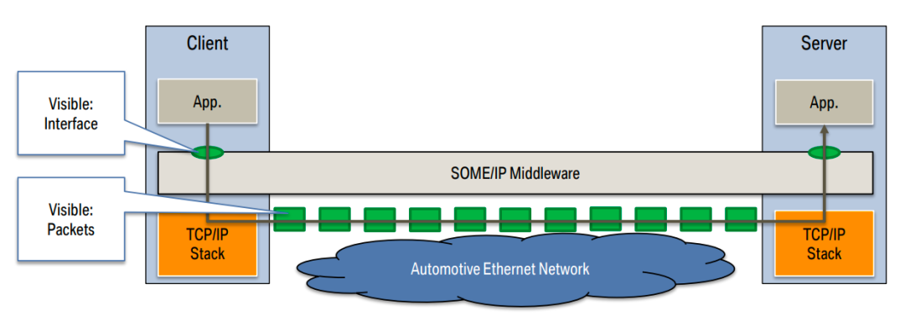
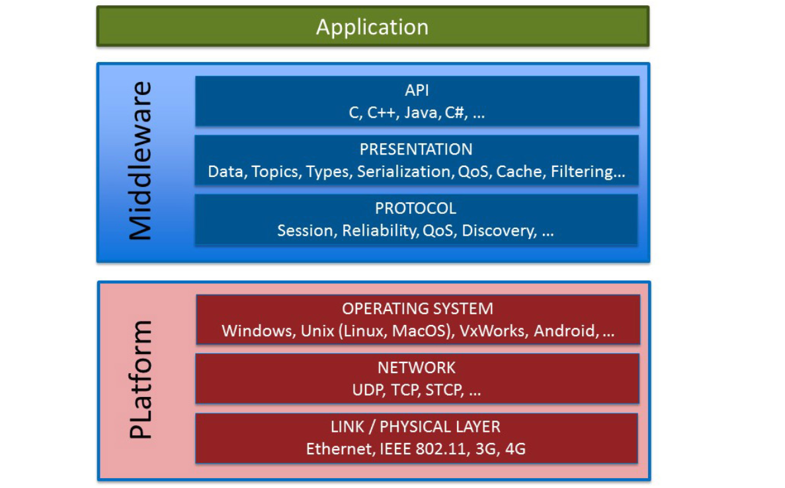

# 多协议网关 NanoLink

SDV-FLOW 组件 NanoLink 是一个多种车端协议与 MQTT 协议交互的数据网关。底层与 MQTT 的通信是基于 NanoSDK。 包含以下几种协议的支持:
- AVTP-ACF 协议单向传输（透传）到 MQTT 协议。 
- UDP 协议单向传输（透传）到 MQTT 协议。 
- 基于 CommonAPI 实现的 SOME/IP 协议数据与 MQTT 双向传输（包括负载的 JSON 序列化）。 
- DDS-MQTT 协议的转换，兼容了 DDS-RTSP 层。
- ROS2-MQTT 协议转换，兼容了 ROS2 独特的 DDS msgtype。

## Introduction

随着科技的快速发展和人们对便利性的不断追求，汽车不再仅仅是交通工具，而是成为了一个智能化的移动终端。车云协同技术将车端与云端连接在一起，实现了车辆与车辆、车辆与基础设施、车辆与用户之间的无缝交互。通过车云协同技术，驾驶者可以享受到诸如导航指引、实时交通信息、远程控制等智能化的功能，提升了驾驶的安全性、便利性和舒适性。实现这些期望属性的一个构建模块是基于 Internet Protocol（IP）的通信；IP为新的设计模式打开了大门，因为它使得使用更高层协议成为可能。因此，将更多的通信转移到以太网技术，并广泛利用其优势，是合理的做法。
为此，汽车行业引入了一种新的物理层（"汽车以太网"或100BASE-T1）和第一个汽车中间件协议：SOME/IP（基于IP的可扩展面向服务的中间件）。一段时间以来，人们还对来自IT界和物联网（IoT）领域的协议进行了更多讨论。它们的主要特点是以数据为中心的方法。最受到关注的协议是DDS（数据分发服务）和MQTT（消息队列遥测传输协议）。在某些个别应用中，HTTP RESTful（表征状态转移）也被应用来实现了用户交互中相关的同步状态拉取方法。然而，REST缺乏一项对于工程控制系统非常重要的特性：它无法以事件触发的方式发送数据（Edge-Driven）。在没有这种推送方法的情况下，该协议尚未在车内通信中被广泛使用。

SOME/IP 协议在汽车领域中已被广泛应用，提供了实时数据传输和服务发现的能力。它适用于车辆内部的高效通信，例如传感器数据的实时传输和车辆控制命令的交互。

MQTT 协议则是一种轻量级的物联网通信协议，具有低带宽消耗和异步通信的特点。它适用于大规模设备连接和消息发布/订阅模式，常用于物联网平台与设备之间的通信。如今，MQTT已经是事实上的TSP平台协议标准，并在车内数据传输中也有所应用。

## SOME/IP
在传统汽车通信协议的局限性背景下，车载以太网的普及以及 SOA 架构在车端的发展，宝马集团在2011年引入了一种用于各种异构ECU之间数据通信的中间件协议，即基于 IP 的可扩展面向服务的中间件（Scalable service-Oriented MiddlewarE over IP，简称SOME/IP）。于2013年发布。SOME/IP是专门为汽车使用而开发的唯一协议，在这里，服务的提供者和消费者直接相互关联，没有中央代理。数据和功能根据面向服务的通信范式封装为服务。在服务接口的描述中使用方法、事件和字段。SOME/IP与DDS类似，利用单播和组播通信，并通常基于UDP。正如其名称所示，该协议具有以下特点：

可扩展性：该协议设计用于不同硬件平台、不同操作系统或嵌入式固件以及不同应用软件之间的可扩展性和互操作性。

面向服务：这是一个面向服务的协议。因此，数据仅在客户端请求或服务器通知特定订阅者时以客户端-服务器配置进行交换。这确保带宽不会被浪费，数据仅在需要的时间和位置进行通信/交换。

中间件：这是一种中间件协议，即它位于应用层，并具有自己的通用协议层，以处理更具体的操作和应用。

基于IP：这是一种基于以太网的协议。它使用类似的硬件接口，确保带宽高达100Mbps（CAN 一般是 512kb/s，CAN FD 能到 1MB/s）。数据通过中间件，即应用层，通过网络电缆使用 TCP/IP 或 UDP 协议进行通信。当客户端需要从服务器获取数据时，客户端使用TCP协议发起请求。如果服务器必须将数据传输给所有活动订阅者，它将使用 UDP 协议进行传输。通过UDP协议进行的数据通信可以是单播、组播或广播。

高效通信：SOME/IP协议使用二进制数据格式，具有较小的数据包大小和较低的带宽消耗。

实时性：SOME/IP协议支持实时数据传输，能够满足汽车领域对实时性的要求。

服务发现：SOME/IP协议支持服务发现和注册，使得系统中的服务可以被动态地发现和访问。

SOME/IP 最初是作为另一种 RPC 机制开发的，以确保与 AUTOSAR 设备的兼容性，并提供汽车使用案例所需的最大功能。它是专为 ECU 间客户端-服务器序列化而设计的网络层协议。目前，该协议可以在多个不同的操作系统上实现，包括 AUTOSAR、OSEK 和GENIVI。它还可以在没有操作系统运行的嵌入式固件上实现。相机、车载娱乐系统、遥测设备、AUTOSAR 设备甚至大型设备如信息娱乐系统等，都可以使用 SOME/IP 协议高效地交换 ECU 间的消息。自 Wireshark 3.2 SOME/IP 发布以来，SOME/IP 的支持已经公开，并可在Wireshark上访问。

## DDS + ROS2

因为 ROS2 中其实也使用了 DDS-RTSP 兼容层，只是在 QOS 和数据格式做了独特的定义，形成了rosbag，故这2部分放在一起介绍。
DDS 已经被 AutoSAR AP 标准接纳作为与 SOME/IP 并列的选择。而 ROS2 是开源的机器人领域的中间件，对于自动驾驶技术来说，把车当作一个大号机器人，就能借用很多机器人领域的成熟经验。所以 ROS2 常被用于开发自动驾驶的原型系统。但是ROS一方面过于庞杂，一方面机器人应用毕竟是低速场景，用于自动驾驶的高速场景，也需要做很多改进。所以有中间件产品基于ROS进行改进，希望用于量产。 基于ROS演进的产品也具备了很多SOA的风格特性，但是与Adaptive AutoSAR不能直接互操作性，需要开发定制的应用层网关。

DDS（数据分发服务）是一个由 OMG 组织发布的、以数据为中心的中间件协议和 API 标准。DDS 集成了系统中的各个组件，提供低延迟数据连接、高可靠性以及高可扩展体系结构，以适应一些商业级物联网应用程序的需求。

DDS 是一种发布-订阅（pub-sub）消息传递协议，可实现实时、可靠、可扩展的数据分发。DDS 最开始应用于工业自动化领域，该领域需要实时采集和传输大量数据，以实现高性能和可靠的控制。DDS 凭借其实时性能、可靠性和可扩展性等优势，迅速成为工业自动化领域的标准协议。经过多年发展，DDS 目前还广泛用于航空航天、汽车、医疗等领域。

### DDS 的特性
DDS 的核心是数据，某种程度上，可以将其理解为在数据的基础上展开出了各种功能，包括传输、存储、处理等。将这些功能总结后，大致可以将 DDS 特性归为以下：

1. 数据中心（Data Centricity）：这一特性的本质是，DDS 知道存储哪些数据并控制如何共享这些数据。比如，使用以消息为中心的传统中间件的程序员必须编写发送消息的代码，该代码需要指定如何以及何时共享数据。而在 DDS 网络中则无需管理这些代码，而是在内部实现直接对这些数据进行存储。

2. 全局数据空间（Global Data Space）：从概念上讲，这一特性是指所有的 DDS 节点都仿佛是在同一个空间内，访问相同的数据源。实际上，DDS 不同的节点之间通过相互分享数据的方式，发送消息到其他节点，以更新远程节点上的数据。从而实现整个 DDS 网络中所有节点数据的统一，让各个节点访问数据时都能够得到相同的最新数据。

3. 服务质量（Quality of service）：这一特性将各种数据通过各种 QoS 进行了筛选，包括可靠性、系统运行状况（活动性）以及安全性。在实际系统中，并非每个节点都需要数据中心的每个数据。DDS 节点在共享数据时通过 QoS 的筛选，仅共享所需信息。如果数据没法总是到达预期的目的地，则 DDS 节点可以通过可靠性来保证数据到达。同样地，当系统发生变化时，DDS 节点也会动态找出将哪些数据发送到何处，并正确发送。如果总数据量巨大，QoS 则会智能过滤并仅发送每个节点真正需要的数据。当需要快速更新时，DDS 发送多播消息以立即更新许多远程应用程序。对于安全性至关重要的应用程序，DDS 可控制访问，强制执行数据流路径并实时加密数据。

4. 动态发现（Dynamic Discovery）：DDS 提供了发布者和订阅者的动态发现。这意味着 DDS 节点之间不必事先知道或配置用于通信的端口，而可以在运行时完成发现对方，从而实现 DDS 应用的“即插即用”。

可拓展结构（Scalable Architecture）：DDS 不仅可以横向拓展到多个节点，同时也可以拓展到不同的控制域中。

### DDS 与汽车
相较于工业自动化，汽车对数据的实时性和可靠性更加敏感。DDS 可保证数据在实时条件下传输，同时其多种 QoS 机制可确保车内数据传输的可靠性。DDS 与汽车的结合应用主要有以下几个方面：

车辆感知：在车辆安全系统中，DDS 可以用于采集雷达、摄像头、激光雷达等各种车辆传感器的数据，并将这些数据传输到车辆安全控制器，用于检测和预防碰撞。

车辆控制： 在自动驾驶系统中，DDS 可以用于采集车辆传感器的数据，并将这些数据传输到自动驾驶控制器，通过计算来确定转向、制动、加速等行为，从而控制车辆的运动。

车辆通信： 车辆网中，DDS 可用于车辆与车辆 (V2V) 、车辆与基础设施 (V2I) 等通信，以实现车辆协同驾驶。

车辆诊断： 在车辆维护系统中，DDS 可以采集车辆传感器的数据，并将这些数据传输到车辆诊断系统，用于诊断车辆的故障。

NanoLink 的数据流图如下所示： 

NanoLink 多协议网关组件由一下几部分组成：
- [SOME/IP mqtt 网关](./SOME-IP.md)
- [DDS/ROS2 - MQTT 网关](./dds.md)
