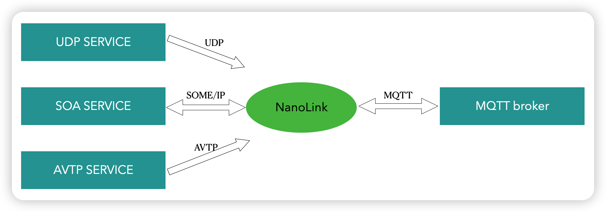

# 多协议网关 NanoLink
SDV-FLOW 组件 NanoLink 是一个多种车端协议与 MQTT 协议交互的数据网关。底层与 MQTT 的通信是基于 NanoSDK。 包含一下几种协议的支持:
- AVTP-ACF 协议单向传输（透传）到 MQTT 协议。 
- UDP 协议单向传输（透传）到 MQTT 协议。 
- 基于 CommonAPI 实现的 SOME/IP 协议数据与 MQTT 双向传输（包括负载的 JSON 序列化）。 

NanoLink 的数据流图如下所示： 

NanoLink 多协议网关组件由一下几部分组成：
- [SOME/IP mqtt 网关](./SOME-IP.md)
- [DDS mqtt 网关](./dds.md)
