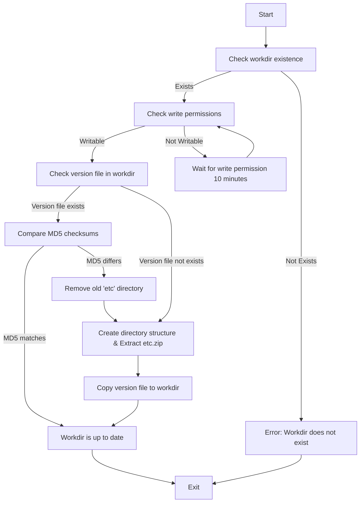

# Android 路径管理
sdv-flow 提供了文件管理、目录操作、版本一致性检查以及数据解压相关的工功能。主要功能包括权限检查、文件校验和操作、目录结构管理等。
用户可以通过修改配置项中 `execPath`来指定可执行程序的目录， `dataPath` 来指定数据文件以及子模块的配置文件的根目录，`ldPath` 来指定动态库路径:

```yaml
moduleOptions:
  onFailure: restartModule # "terminateAll", "restartModule"
  execPath: "/vendor" # common executable path
  dataPath: "/bigdata" # common data path
  ldPath: "/system/lib64"
```


## 流程说明：

1. 开始：进入 ManageWorkdir 方法。
2. 检查工作目录：判断工作目录是否存在。如果不存在，返回错误。
3. 检查写权限：如果目录不可写，等待 10 分钟后重试。
4. 检查版本文件：判断 workdir 中是否存在版本文件。
5. 如果版本文件不存在，创建必要的目录结构，并提取 etc.zip。
6. 比较 MD5 校验：对比当前版本文件与新版本文件的 MD5 值。
7. 如果匹配，工作目录已是最新。
8. 如果不同，删除旧的 etc 目录并提取新内容。