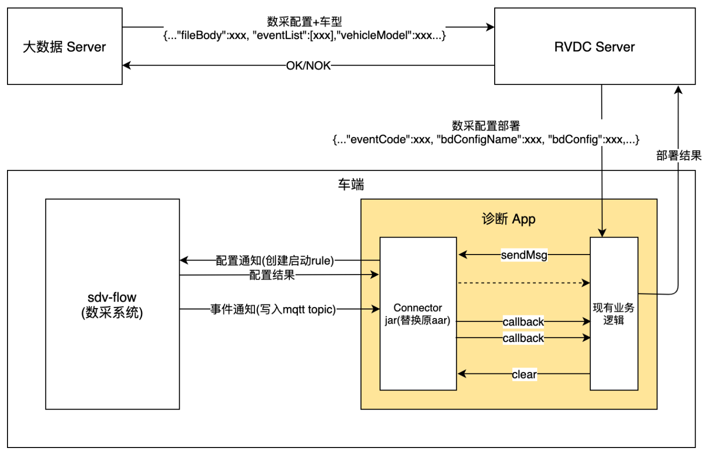

# RVDC

## 诊断

### **一、车端大数据灵活数采系统与诊断 APP 间交互**



诊断系统提供 Web 操作页面，业务部门可以借此执行诊断逻辑配置，诊断系统使用其车云链路部署配置至车端诊断 APP。

下发配置，一路透传 ：⼤数据 Server → RVDC Server  → 诊断 App → jar

sendMsg 参数为base64加密数据

- status为true， 表示发送创建的诊断规则,格式

```json
{
    "events": [
        {
            "eventId": "10001",
            "rule": {
                "id": "diag_10001",
                "sql": "SELECT PSCMSteeringAngle.SteeringWheelRate,PSCMSteeringAngle.SteeringWheelAngle FROM candata WHERE PSCMSteeringAngle.SteeringWheelRate >= 10",
                "actions": [
                    {
                        "mqtt": {
                            "sendSingle": true,
                            "server": "tcp://127.0.0.1:1883",
                            "topic": "diag/10001"
                        }
                    }
                ]
            }
        }
    ],
    "status": true
}
```

- status为false， 表示删除指定的诊断规则

```
{
    "events": [
        {
            "eventId": "10001"
        },
        {
            "eventId": "10002"
        }
    ],
    "status": false
}
```

当创建好规则后，如果触发诊断事件，ekuiper 会将诊断数据发到规则中指定的topic中，jar 包将这些数据回传给诊断app。

### 二、Jar 包使用

1. 在项目目录下创建lib 文件夹，将jar 包放在lib下

2. gradle 项目引入依赖

   ```
   dependencies {
       implementation fileTree(dir: 'lib', includes: ['emq-connector-0.9.jar'])
       //为了防止依赖冲突，这两个包没有打进去，使用时，需要额外引入
       implementation group: 'com.google.code.gson', name: 'gson', version: '2.8.5'
       implementation group: 'commons-logging', name: 'commons-logging', version: '1.2'
   }
   ```

3. 刷新依赖