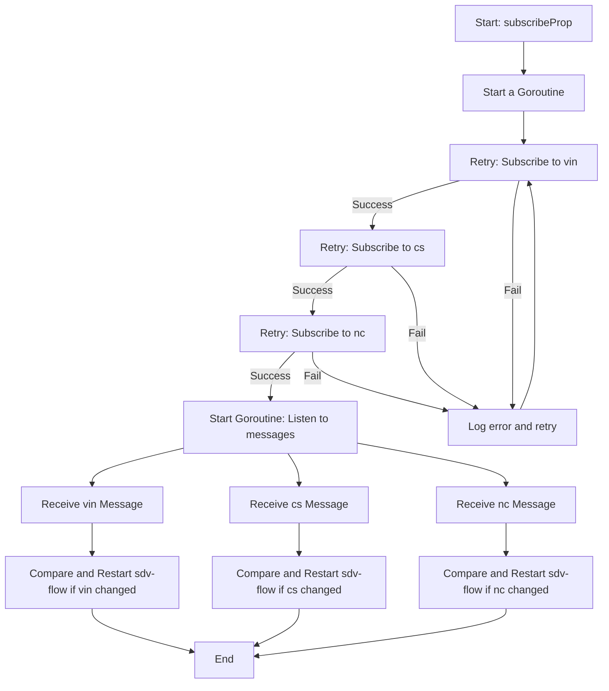

# Car property
Car property 内容包括对车辆属性的读取，变化的检测以及重启机制。

## 车辆属性变化检测

### 逻辑描述：
- 使用 concurrency.GoSafe 启动协程，确保在运行时不会因错误导致崩溃。
- 使用 backoff.Retry 函数，支持带重试机制的订阅操作。
- 按顺序尝试订阅以下主题：
    - vin
    - cs
    - nc
- 如果任意主题订阅失败，记录错误日志并重试。
- 成功订阅主题后，启动一个协程监听这些主题的消息，分别执行以下操作：
  - 对收到的 vin 消息进行检查，如果值发生变化，则重启流程。
  - 对收到的 cs 消息进行检查，如果值发生变化，则重启流程。
  - 对收到的 nc 消息进行检查，如果值发生变化，则重启流程。
- 日志记录：成功订阅主题后，记录订阅成功的信息。
