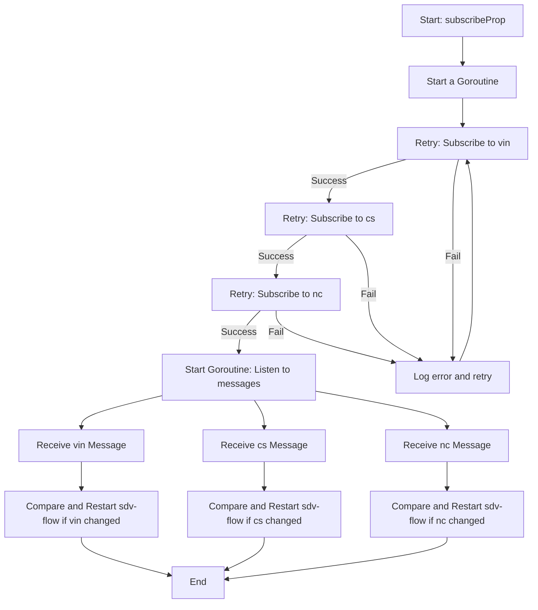
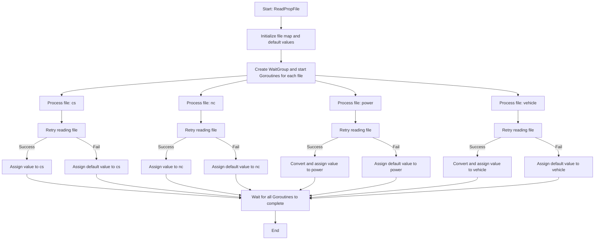

# Car property
Car property 内容包括对车辆属性的读取，变化的检测以及重启机制。

## 车辆属性变化检测

### 逻辑描述：
- 使用 concurrency.GoSafe 启动协程，确保在运行时不会因错误导致崩溃。
- 使用 backoff.Retry 函数，支持带重试机制的订阅操作。
- 按顺序尝试订阅以下主题：
    - vin
    - cs
    - nc
- 如果任意主题订阅失败，记录错误日志并重试。
- 成功订阅主题后，启动一个协程监听这些主题的消息，分别执行以下操作：
  - 对收到的 vin 消息进行检查，如果值发生变化，则重启流程。
  - 对收到的 cs 消息进行检查，如果值发生变化，则重启流程。
  - 对收到的 nc 消息进行检查，如果值发生变化，则重启流程。
- 日志记录：成功订阅主题后，记录订阅成功的信息。

## 属性读取


### 流程描述
- 启动流程
    - 开始时通过 ReadPropFile 读取属性文件。
    - 初始化文件映射和默认值。
- 启动 Goroutines
    - 创建 WaitGroup，并为每个文件（cs、nc、power、vehicle）启动单独的 Goroutine 处理。
- 文件处理
  - 每个文件按照以下步骤进行处理：
    - 尝试读取文件：如果读取失败，则进行重试。
    - 根据读取结果处理值：
      - 成功：将值赋予对应的变量。
      - 失败：为变量分配默认值。
- 具体文件处理逻辑
  - 文件 cs：
    - 成功：赋值给变量 cs。
    - 失败：分配默认值。
  - 文件 nc：
    - 成功：赋值给变量 nc。
    - 失败：分配默认值。
  - 文件 power：
    - 成功：转换并赋值给变量 power。
    - 失败：分配默认值。
  - 文件 vehicle：
    - 成功：转换并赋值给变量 vehicle。
    - 失败：分配默认值。
- 等待所有 Goroutines 完成
  - 所有文件处理完毕后，主线程等待所有 Goroutine 执行完成。
- 结束流程
  - 当所有 Goroutines 完成后，流程结束。

上面提到的默认值可在 sdv-flow 的配置文件 sdv-flow.yaml 中设置，如下：

```conf
vehicleProperty:
  cs: E4                         # 车型配置 1
  nc: A6                         # 车型配置 746
  vehicle: 0                     # 默认车辆模式
  power: 13                      # 特定动力模式
```