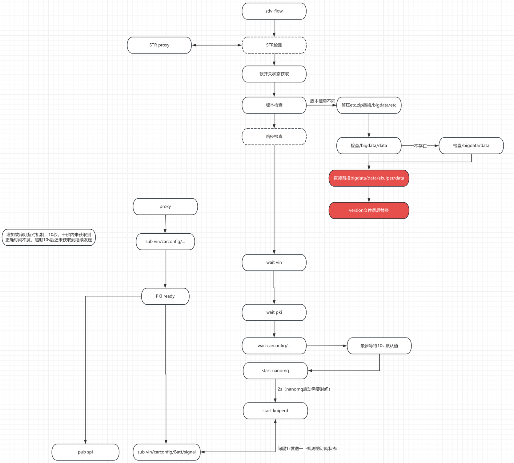

# Geely_API 定制功能
此部分文档只适用于  E245/E545/E245-J1 车型。 

geely_api 服务主要用于完成SPI和轮转帧+故障灯数据源的接入，证书获取和业务逻辑适配，其内置启动顺序如下图

## 证书获取
第一个启动的模块是证书读取模块，通过 ECARX 提供的证书读取接口来获取车上的证书链。启动时如果读取证书失败则等待一秒再重试，会重试10次，如果10秒内证书还没有加载成功，返回失败并且不启动后续进程。获取成功则会在bigdata/data/sdv-flow/目录下生成对应的3个证书文件。
由于 ECARX 提供的证书 API 获取到的证书是离散的证书链，此处也完成了将证书链拼接组装为客户端证书的工作。

## libtransfer 库相关
这部分接入了故障灯和轮转帧数据，并且也负责读取配置字和VIN。
Vin码是每辆车的唯一标识码，许多数据业务逻辑都依赖此字段，故必须等待该字段准备完成后才可以进行下一步的启动。配置字会产生 cs,nc,power,vehicle四个文件。

轮转帧和故障灯数据通过回调机制获取，并透传给数据总线供分发给流处理模块分析。

1. 启动后会等待libtransfer库初始化完毕，再注册所需信号。有概率库内部会推送VIN更新，如果VIN 回调触发则会将获取到的 VIN 码直接覆盖原有的 VIN 文件。其他信号如轮转帧等则会保留在缓存中等待数据总线启动后发送。
2. 然后判断是否已有保留的 VIN 码在文件中。无论文件是否存在都主动再获取一次避免 VIN 码改变。
3. 判断 VIN 码是否获取成功以及是否有效。如果成功则从存入的文件里读取VIN号。若未获得VIN码成功，则主动调用 doGetVinValue 获取VIN，每2s 重复一次，重试10s。成功后将VIN号写入文件，并记录日志表明这次的VIN号与上次的是否相同。如果失败会尝试最多5次，5次都失败则使用默认的 17位 全0 VIN 码。

## 代理订阅和流处理模块订阅同步
在第一次启动阶段，为避免因为不同模块启动时序问题造成的初始报文丢失，故定制了订阅事件同步和代理订阅功能。geely_api 会等待流处理模块在数据总线上订阅相应数据主题的事件发生后再将缓存的故障灯和轮转帧消息发送，避免因为流处理模块未准备好而造成的首帧报文丢失。
对于诊断 RVDC 模块交互部分，因为 SDV-FLOW 启动先于 RVDC APP，所以在geely_api中实现了代理订阅帮助 RVDC 完成数据主题的订阅，并通过 MQTT 消息服务器的会话保持功能来将诊断 APP 所需要的消息都保证送达。

## 文件传输客户端
之后启动一个 MQTT 客户端用于相应文件传输命令后读取文件再发送给桥接模块。详细功能介绍请参考：

## SPI 代理
最后启动的就是 SPI 代理服务，从 SPI 驱动中请求 CAN 总线数据后发送给MQTT 消息服务器。

•打开设备/设置参数等，异常会记录日志并返回失败。

•打开失败会隔100毫秒后重试，直到打开成功。

•打开成功后，每次循环取4包，处理完一包后等5毫秒取下一包，200ms内只取四包

•每包4KB，并在收到的时候 在尾部打上一个收到的时间戳

•每次接收前需要判断当前STR状态，当打开STR时需要关闭SPI，当STR退出时，需要重新打开SPI

SPI源数据获取会打印错误数据的日志，如发现CRC校验失败计数后丢弃；Length为0计数，丢弃；包数不连续只计数不丢弃； 