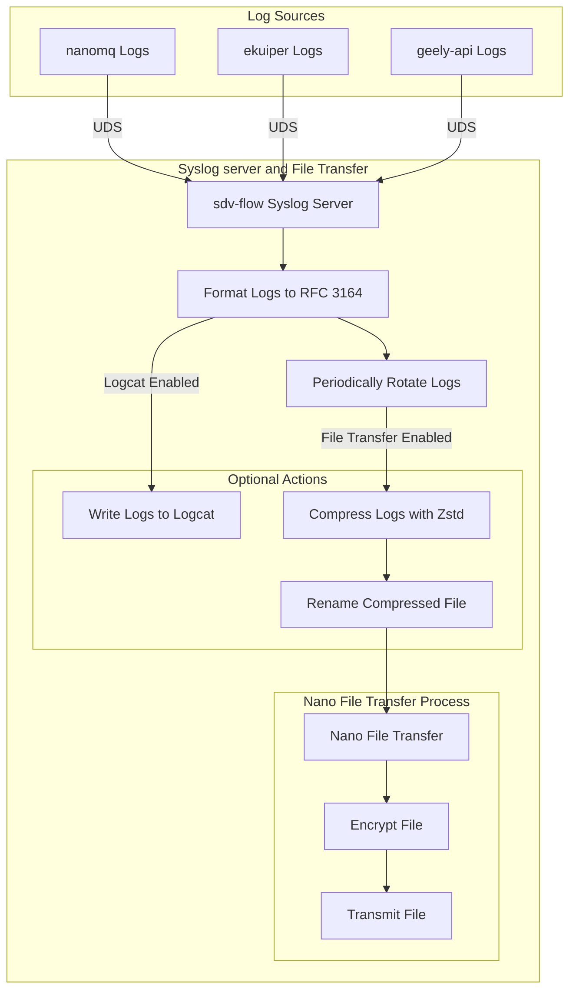
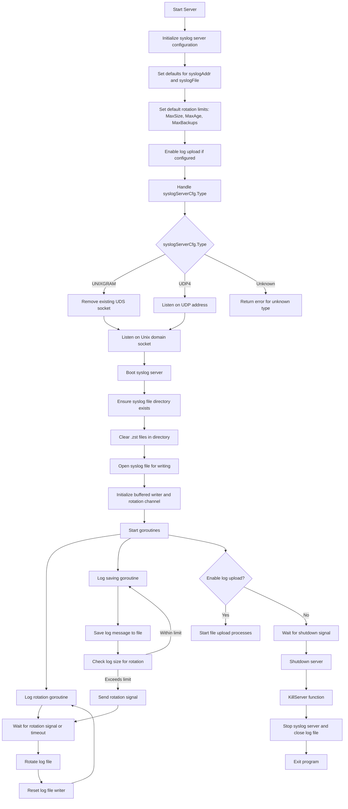
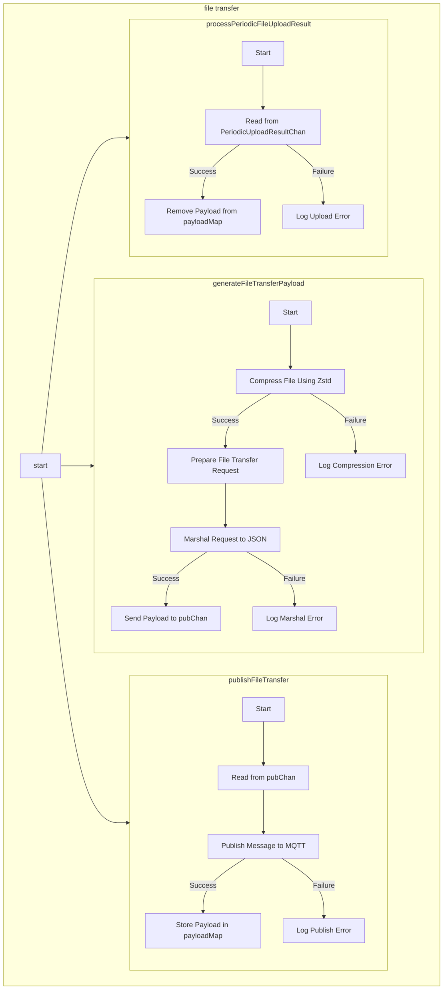

# syslog server

## syslog server 整体架构

Syslog 服务器的主要功能包括：通过 UDS 按照 [RFC 3164](https://www.rfc-editor.org/rfc/rfc3164.html) 格式收集组件日志，处理日志格式，支持日志的周期性轮转，并可选将日志写入 logcat 或周期性上传。下面是流程图以及说明：

### 流程说明：
1. **日志源**: 
    - nanomq、ekuiper、geely-api 和 sdv-flow 模块通过 UDS 将日志发送到 sdv-flow 的 Syslog 服务器。
2. **Syslog 处理**:
    - 在服务器端，日志格式化为 RFC 3164 格式。
    - 日志进行周期性轮转保存。
3. **可选处理**:
    - 如果开启了 logcat，日志被写入 logcat。
    - 如果开启了文件传输，日志被压缩为 Zstd 格式。
4. **文件压缩和传输**:
    - 压缩的日志文件被重命名。
    - 调用 Nano File Transfer 功能：
        - 对文件进行加密。
        - 通过加密通道传输文件。
5. **成功与失败处理**:
    - 传输处理可参考 [mqtt 消息/文件传输功能](../../communication-databus/file-transfer.md) 。

## syslog server 代码流程

### 流程说明:
1. **配置初始化**：设置默认的 syslog 地址、日志文件路径和日志旋转参数。
2. **服务器类型处理**：根据 syslogServerCfg.Type 配置监听 Unix 域套接字或 UDP 地址。
3. **服务器启动**：确保日志目录存在，清除旧的 .zst 文件并打开日志文件。
4. **日志写入和旋转**：
    - 启动两个 goroutine：一个处理日志写入，另一个处理日志文件的旋转。
    - 当日志大小超出限制或时间间隔到达时触发旋转。
5. **日志上传（如果启用）**：启动异步日志上传处理。
6. **优雅关闭**：处理关闭信号，确保资源释放。

## file transfer
下面是 file transfer 的代码流程图，file transfer 启动过程中会启动三个 goroutine 并行执行下面的工作流：

### 流程说明
1. generateFileTransferPayload:
    - 接收文件路径并调用 compressFileZstd 对文件进行压缩。
    - 如果压缩成功，构造文件传输请求消息并将其序列化为 JSON。
    - 成功后，将消息和文件名作为 Pair 对象发送到 pubChan。
    - 如果失败，记录错误日志。
2. publishFileTransfer:
    - 异步从 pubChan 读取 Pair 数据。
    - 使用 MQTT 将文件传输请求消息发布到指定主题。
    - 发布成功后，将文件名和请求数据存储到 payloadMap 中。
    - 如果发布失败，记录错误日志。
3. processPeriodicFileUploadResult:
    - 异步处理 PeriodicUploadResultChan 中的上传结果。
    - 如果上传成功，从 payloadMap 中移除对应的文件名。
    - 如果上传失败，记录上传错误信息。