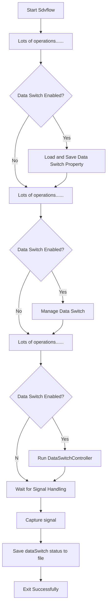

# 软开关

在整个 sdv-flow 的生命周期内关于软开关的操作如下：
## 软开关主流程

### 流程描述
- 启动 Sdvflow
    - 启动程序并执行初始设置和预处理步骤。
- 执行大量初始化操作
    - 包括日志系统配置、插件管理器加载、全局环境变量设置、HTTP 服务启动等。
- 检查数据开关是否启用
    - 如果启用：
        - 加载并保存数据开关属性。
    - 如果未启用：
        - 跳过数据开关相关的操作。
- 继续执行剩余初始化操作
        - 包括插件的初始化逻辑、子进程（如 eKuiper、NanoMQ）的触发和启动。
- 再次检查数据开关是否启用
    - 如果启用：
        - 管理数据开关状态。
    - 如果未启用：
        - 跳过数据开关管理。
- 处理数据开关控制逻辑
    - 再次检查数据开关是否启用：
        - 如果启用，运行 DataSwitchController 以处理数据开关的动态控制。
        - 如果未启用，跳过该步骤。
- 等待信号处理
    - 主线程进入等待状态，监听外部信号（如 SIGTERM、SIGINT 等）。
- 捕获退出信号
    - 当收到退出信号时，执行清理操作。
- 保存数据开关状态到文件
    - 将当前数据开关的状态保存到持久化文件中，确保下次启动时状态一致。
- 成功退出
    - 记录日志并安全退出程序。
