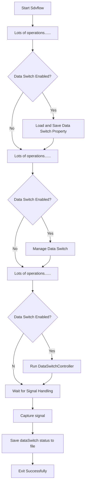
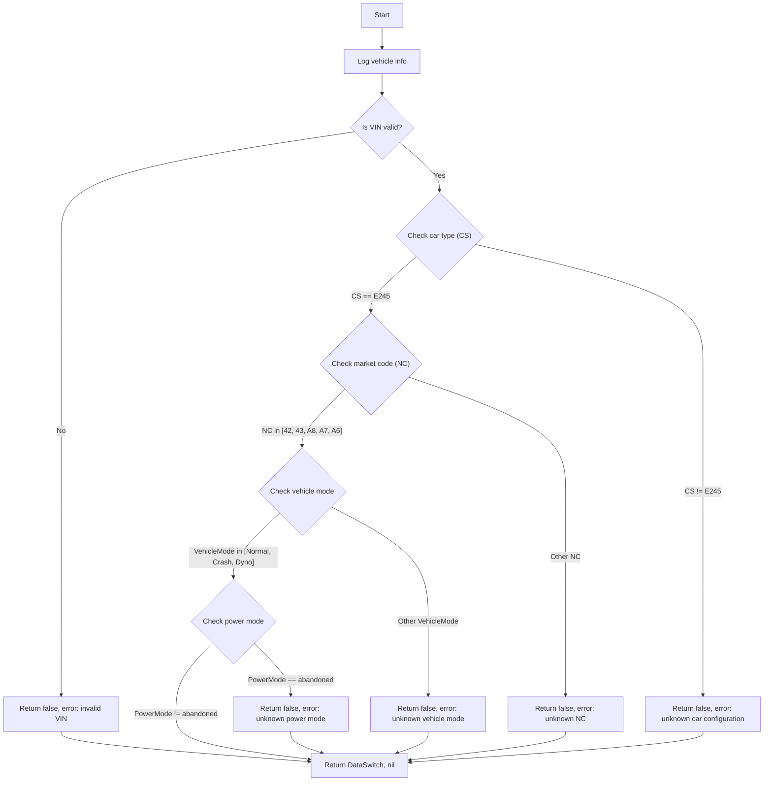

# 软开关

在整个 sdv-flow 的生命周期内关于软开关的操作如下：
## 软开关主流程

### 流程描述
- 启动 Sdvflow
    - 启动程序并执行初始设置和预处理步骤。
- 执行大量初始化操作
    - 包括日志系统配置、插件管理器加载、全局环境变量设置、HTTP 服务启动等。
- 检查数据开关是否启用
    - 如果启用：
        - 加载并保存数据开关属性。
    - 如果未启用：
        - 跳过数据开关相关的操作。
- 继续执行剩余初始化操作
        - 包括插件的初始化逻辑、子进程（如 eKuiper、NanoMQ）的触发和启动。
- 再次检查数据开关是否启用
    - 如果启用：
        - 管理数据开关状态。
    - 如果未启用：
        - 跳过数据开关管理。
- 处理数据开关控制逻辑
    - 再次检查数据开关是否启用：
        - 如果启用，运行 DataSwitchController 以处理数据开关的动态控制。
        - 如果未启用，跳过该步骤。
- 等待信号处理
    - 主线程进入等待状态，监听外部信号（如 SIGTERM、SIGINT 等）。
- 捕获退出信号
    - 当收到退出信号时，执行清理操作。
- 保存数据开关状态到文件
    - 将当前数据开关的状态保存到持久化文件中，确保下次启动时状态一致。
- 成功退出
    - 记录日志并安全退出程序。

## 软开关上传判断条件

## 流程图描述：
- 开始
    - 从函数 ShouldUploadData() 开始执行。
- 日志打印信息
    - 打印车辆相关信息：nc、cs、vehicleMode 和 powerMode。
- 检查 VIN 是否有效
    - 如果 VIN 是无效的INVALIDVIN(00000000000000000)，返回 false 和错误信息 "invalid VIN"。
    - 如果 VIN 是有效的，继续执行下一步。
- 检查车辆类型 (CS)
    - 如果 CS 是 E245(E4)，则进入下一步。
    - 如果 CS 不是 E245，返回 false 和错误信息 "unknown car configuration"。
- 检查市场代码 (NC)
    - 如果 NC 是 42、43、A8、A7 或 A6（表示特定的市场，如澳大利亚、新西兰、泰国、印度尼西亚和马来西亚），进入下一步。
    - 如果 NC 不是这几个值，返回 false 和错误信息 "unknown NC"。
- 检查车辆模式 (VehicleMode)
    - 如果 VehicleMode 是 VehModNorm（正常模式）、VehModCrash（碰撞模式）或 VehModDyno（台架模式），进入下一步。
    - 如果 process.VehicleMode 不是这些值，返回 false 和错误信息 "unknown vehicle mode"。
- 检查电源模式 (PowerMode)
    - 如果 PowerMode 不是 PowerModAbdnd（废弃模式），则返回 DataSwitch 的值和 nil（表示数据上传可用）。
    - 如果 PowerMode 是 PowerModAbdnd，返回 false 和错误信息 "unknown power mode"。
