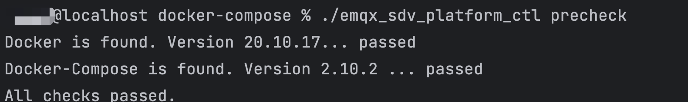
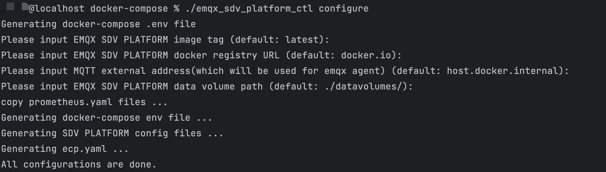
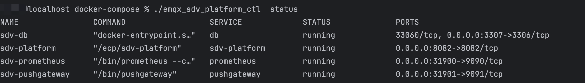
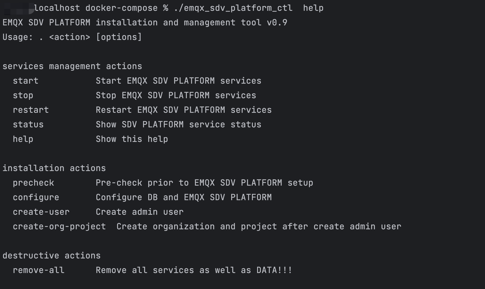
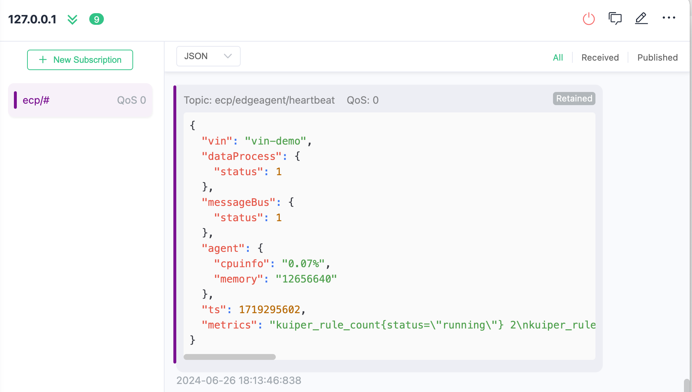

# 通过Docker部署
在本文中，我们将指导您如何在  Docker 中完成 sdv-flow 和 SDV Platform 及其所需组件的安装部署。

## 安装 SDV Platform

### 安装条件

EMQX SDV Platform 部署前，请确认您的环境满足以下要求：

| OS             | 版本要求       |
| :------------- | :------------- |
| Ubuntu         | 20.04 或 22.04 |
| CentOS         | 7.0 或以上     |
| Docker-Compose | 1.27.1 或以上  |
| Docker         | 20.10.0 或以上 |

### 获取安装包

欢迎访问 EMQ 官网获取 SDV Platform 的安装包。

1. 进入[联系我们](https://www.emqx.com/zh/contact?product=emqx-ecp)页面。
2. 输入必要的联系信息，如姓名、公司、工作邮箱，国家和地区，以及您的联系方式。
3. 您可在下方的文本框中填写您的应用场景及需求，以便我们为您提供更好的服务。
4. 填写好以上信息后，点击**立即提交**，我们的销售将会尽快与您联系。

### 安装 EMQX SDV Platform

将下载的安装包`emqx-sdv-platform-docker-compose-installer-*.tar.gz`上传到服务器上，解压缩后，进入解压缩后的目录，执行以下步骤完成 Platform 的安装。

#### 依赖检查

执行以下命令检查依赖组件及 docker 版本。

```bash
$ ./emqx_sdv_platform_ctl precheck
```

输出如下内容表示检查通过：



#### 配置环境

运行下列命令，进行安装前配置。

```bash
$ ./emqx_sdv_platform_ctl configure
```

全部回车跳过表示，使用默认的ECP版本，通过公共docker镜像仓库获取镜像，持久化数据保存路径为`[当前脚本路径]/datavolumes/`。



#### 启动服务

- 如有必要， 可以修改配置文件 `sdv_platform.conf`
- 执行以下命令，启动 Platform 服务。

```bash
$ ./emqx_sdv_platform_ctl start
```

:::tip 注意 
在初次启动 Platform 服务时，需要拉取软件镜像，可能需要等待一段时间。您也可以[联系我们](https://www.emqx.com/zh/contact?product=emqx-ecp)，获取离线安装包。 
:::

#### 检查服务状态

```
$ ./emqx_sdv_platform_ctl  status
```



#### 停止 Platform 服务

```
./emqx_sdv_platform_ctl  stop
```

#### 更多命令介绍

通过以下命令查看更多命令介绍。

```
./emqx_sdv_platform_ctl  help
```



### 创建超级管理员

使用下列命令创建**超级管理员**账号，请妥善保存您的超级管理员账号和密码。

```bash
$ ./emqx_sdv_platform_ctl create-user
Please input username:          # 请设置您的用户名，需要为email格式
Please input password:          # 请设置您的账户密码
Please input password again:    # 请重复您的账户密码
```

### 创建组织和项目

使用下列命令创建**组织和项目**，请输入超级管理员账号和密码。

```bash
$ ./emqx_sdv_platform_ctl create-org-project
Please input username:          # 请输入超级管理员用户名，需要为email格式
Please input password:          # 请输入超级管理员密码
Please input password again:    # 请再次输入超级管理员密码
```

### 访问API

现在您已经成功部署 Platform，Platform 的默认访问地址为 `http://{您的机器IP}:8082`

## 安装 sdv-flow

### 获取镜像
```bash
docker pull emqx/sdv-flow:latest
```
启动最新版本的 sdv-flow
### 启动

```bash
docker run -d --name  sdv-flow -p 1883:1883 -p 14260:14260 emqx/sdv-flow:latest
```
- tcp 14260：端口映射，用于对 sdv-flow 访问 web 和 http api 端口。
- tcp 1883：端口映射，用于访问 Mqtt 服务。
- --restart=always：可选参数，docker 进程重启时，自动重启 sdv-flow 容器。
- -v /host/path:/container/path：可选参数，用于将主机上的 /host/path 目录挂载到容器内的 /container/path 目录。（例如，/host/dir:/opt/sdv-flow/etc/，将本地目录 /host/dir 挂载到容器内的 /opt/sdv-flow/etc/）。
- --log-opt：可选参数，限制 docker 标准输出(stdout)的大小（例如，--log-opt max-size=100m）。

接下来通过 http api 修改 sdv-flow 连接云端的地址，将 bridges.mqtt.emqx1 的 server 地址修改为执行 ./emqx_sdv_platform_ctl configure 所配置的云端 emqx 的地址。如下：
```bash
$ curl -i --basic -u admin:public -X PUT 'http://localhost:14260/api/nanomq/bridges/emqx1' -d '{
"emqx1": {
    "name": "emqx1",
    "enable": true,
    "parallel": 2,
    "server": "mqtt-tcp://broker.emqx.io:1883",
    "proto_ver": 4,
    "clean_start": false,
    "username": "admin",
    "password": "public",
    "keepalive": 60,
    "forwards": [
      {
        "remote_topic": "",
        "local_topic": "ecp/#"
      }
    ],
    "subscription": [
      {
        "remote_topic": "agent/#",
        "local_topic": "",
        "qos": 1
      }
    ]
  }
}'
```
如果上述成功会收到如下返回：

```bash
{"code":0}
```

可在 log 目录下的 sdv-flow.log 文件发现有日志生成，查看日志。可以看到 `edgeagent registered successfully` 的日志，说明服务启动正常并且已注册到 sdv-platform。

```bash
time="2024-06-27T16:16:52+08:00" level=info msg="[Agent] is starting, vin: ubuntu" file="agent/init.go:18" func=sdv-flow/agent.Init
time="2024-06-27T16:16:52+08:00" level=error msg="path not exist" file="agent/clean_parquet.go:17" func=sdv-flow/agent.CleanParquetFile
time="2024-06-27T16:16:52+08:00" level=info msg="[MQTT]connected to tcp://127.0.0.1:1883" file="agent/mqtt.go:70" func=sdv-flow/agent.onMQTTConnected
time="2024-06-27T16:16:52+08:00" level=info msg="[Agent]Agent start registration to default org and project. " file="agent/init.go:47" func=sdv-flow/agent.Init
time="2024-06-27T16:16:52+08:00" level=info msg="[Agent]edgeagent registered successfully ,orgId : , projectId :" file="agent/registration.go:127" func=sdv-flow/agent.register.func1
time="2024-06-27T16:16:52+08:00" level=info msg="[Agent]heartbeat is enabled ,interval 15" file="agent/init.go:73" func=sdv-flow/agent.Init
time="2024-06-27T16:16:52+08:00" level=info msg="MQTT Tunnel Proxy Agent connected to tcp://127.0.0.1:1883" file="mqtt/proxy.go:88" func=ecp-tunnel/mqtt.SubTunnelTopic
time="2024-06-27T16:16:52+08:00" level=info msg="MQTT Tunnel Proxy Subscribed topic agent/ubuntu/proxy/request/+" file="mqtt/proxy.go:116" func=ecp-tunnel/mqtt.SubTunnelTopic.func1
```

sdv-flow 注册成功后，会不断向云端定时发送心跳信息，包括各个服务的运行状态，资源占用情况和指标信息，云端可以通过 [MQTTX](https://docs.emqx.com/zh/enterprise/latest/messaging/publish-and-subscribe.html) 订阅 topic `ecp/#` 获得车端。