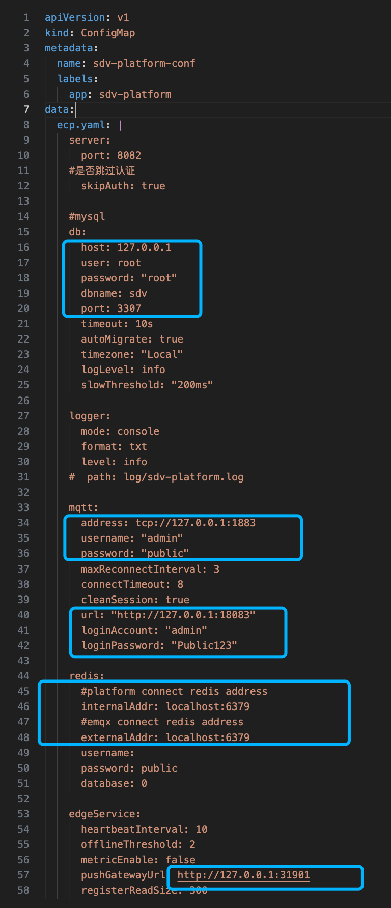

# 基于K8S 部署 sdv-platform

在本文中，我们将指导您如何在 kubernetes 环境中完成 sdv-platform安装与部署。

## 安装条件

部署 sdv-platform 前，请确认您的环境满足以下要求：

| 软件       | 版本要求      |
| :--------- | :------------ |
| Kubernetes | 1.22.0 或以上 |
| kubectl    | 1.22.0 或以上 |

## 提前准备

1.  获取sdv-platform 的 k8s 安装文件

   ```
   ├── readme.md
   ├── configmap.yaml
   └── sdv-platform-service.yaml
   ```

2. 获取 sdv-platform 镜像

   为了保证集群中任意节点都能拉取镜像成功，请将镜像推送到集群能访问到的仓库

   参考命令

   ```
   docker tag existing-image new-image[:tag]
   docker push [OPTIONS] NAME[:TAG]
   ```

3. 本次部署仅提供 sdv-platform 的k8s 安装文件，所需其他组件，请提前部署并启动,参考版本

   - emqx/emqx-enterprise：5.6.0
   - library/mysql:8.0.18
   - library/redis:6.2.6
   - prom/prometheus:v2.37.9  （未用到指标监控功能，则不需要）
   - prom/pushgateway:v1.6.2  （未用到指标监控功能，则不需要）

## 部署

1.创建命名空间，参考

```
kubectl create ns sdv
```

2.修改configmap.yaml 中的ecp.yaml 内容，用于连接其他组件



3.创建 configmap

```
kubectl  -n=sdv apply -f configmap.yaml 
```

4.创建 sdv-platfrom deployment 

```
kubectl -n=sdv apply -f sdv-platform-service.yaml
```

5.如需修改镜像版本，可以执行

```
kubectl -n sdv set image deploy sdv-platform sdv-platform=emqx/sdv-platform:1.0.1
```

6.观察pod 运行情况

```
kubectl  -n=sdv get pods
NAME                           READY   STATUS    RESTARTS   AGE
sdv-platform-6fdb799df-s2qlp   1/1     Running   0
// pod为 running ，观察日志有无报错
kubectl  -n=sdv logs sdv-platform-6fdb799df-s2qlp
```

7.测试是否运行成功，在集群节点内访问

```
curl http://sdv-platform-service:8082/api/edgeagents
```

如需API服务可在外网访问，可自行修改sdv-platform-service.yaml

8.初始化超级管理员及默认组织项目

```
kubectl  -n=sdv exec -it  sdv-platform-6fdb799df-p7b9d -- ./init.sh
```

9.部署成功