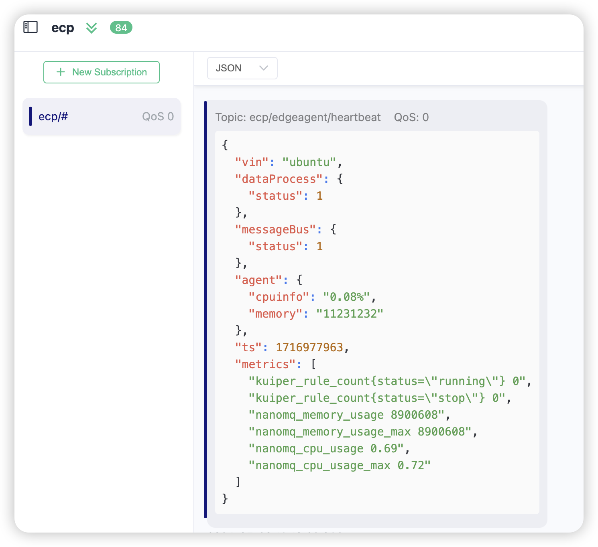

# 基于 tar 包的安装部署

在本文中，我们将指导您如何在 linux 中完成 sdv-flow 及其所需组件的安装和使用。

## 安装条件

EMQX SDV Flow 安装前，请确认您的环境满足以下要求：

| OS             | 版本要求       |
| :------------- | :-------------|
| Ubuntu         | 18.04 或以上   |
| CentOS         | 8.0 或以上     |
| Debian         | 10 或以上      |

## 获取安装包

欢迎访问 EMQ 官网获取 SDV Flow 的安装包。

1. 进入[联系我们](https://www.emqx.com/zh/contact?product=emqx-ecp)页面。
2. 输入必要的联系信息，如姓名、公司、工作邮箱，国家和地区，以及您的联系方式。
3. 您可在下方的文本框中填写您的应用场景及需求，以便我们为您提供更好的服务。
4. 填写好以上信息后，点击 **立即提交**，我们的销售将会尽快与您联系。

## 安装 EMQX SDV Flow

将下载的安装包 `sdv-flow-*-linux.tar.gz` 上传到车机设备上，解压缩后，进入解压缩后的目录，得到文件列表如下。下面的被标注出来的几部分是我们需要关注的目录。

```bash
.
├── bin
│   └── sdv-flow # sdv-flow 可执行程序
├── core
├── data
│   ├── ekuiper
│   │   ├── data
│   │   └── plugins
│   ├── nanomq
│   └── sdv-flow
│       └── support_metric.csv
├── etc
│   └── sdv-flow.yaml # sdv-flow 配置文件
├── log # sdv-flow 默认生成的配置文件
└── software
    ├── ekuiper # kuiper 工作目录
    │   ├── bin
    │   ├── data
    │   ├── etc
    │   ├── log
    │   └── plugins
    └── nanomq # nanomq 工作目录
        ├── etc
        ├── log
        ├── nanomq
        ├── parquet
        └── readme.txt
```

首先需要修改 nanomq 配置文件 `software/nanomq/etc/nanomq.conf`， 将 `bridges.mqtt.emqx1` 的 server 地址修改为执行 Sdv platform 所配置的云端 emqx 的地址。
```conf
bridges.mqtt.emqx1 {
        server = "mqtt-tcp://broker.emqx.io:1883"
        proto_ver = 4
        keepalive = 60s
        backoff_max = 60s
        clean_start = false
        username = admin
        password = public
        ......
}
```

启动 sdv-flow
```bash
./bin/sdv-flow run # 后台启动可以执行 ./bin/sdv-flow start

```
可在 log 目录发现有日志生成，查看日志，发现 sdv-flow，nanomq，kuiper 都已成功运行。
```bash
$ ./bin/sdv-flow run
time="2024-05-29T17:41:36+08:00" level=info msg="load log config:" file="run/sdv-flow.go:72" func=sdv-flow/run.Run
time="2024-05-29T17:41:36+08:00" level=info msg="load log config: {Mode:console Level:info File:log/sdv-flow.log MaxSize:20 MaxBackups:5 ListenAddr: Syslog:{Enable:false Priority: Netword: RemoteAddr: Tag:}}" file="run/sdv-flow.go:76" func=sdv-flow/run.Run
time="2024-05-29T17:41:36+08:00" level=info msg="get pid of sdv-flow: 3306071" file="run/sdv-flow.go:95" func=sdv-flow/run.Run
time="2024-05-29T17:41:36+08:00" level=info msg="Init plugin 'getvin'.\n" file="getvin/getvin.go:79" func="plugins/getvin.(*PluginGetvin).Init"
time="2024-05-29T17:41:36+08:00" level=info msg="Running plugin 'getvin'.\n" file="getvin/getvin.go:88" func="plugins/getvin.(*PluginGetvin).Run"
time="2024-05-29T17:41:36+08:00" level=info msg="Get vin:%!(EXTRA string=ubuntu)" file="getvin/getvin.go:111" func="plugins/getvin.(*PluginGetvin).Run"
time="2024-05-29T17:41:36+08:00" level=info msg="Listening on tcp://127.0.0.1:40899\n" file="getvin/getvin.go:50" func=plugins/getvin.vinServer
time="2024-05-29T17:41:36+08:00" level=info msg="trigger child process with manage: true" file="run/sdv-flow.go:110" func=sdv-flow/run.Run
time="2024-05-29T17:41:36+08:00" level=info msg="trigger eKuiper with command: GOTRACEBACK=crash KUIPER__BASIC__SYSLOG__ENABLE=true KUIPER__BASIC__SYSLOG__LEVEL=debug KUIPER__BASIC__SYSLOG__NETWORK=udp4 KUIPER__BASIC__SYSLOG__address=localhost:10514  KUIPER__BASIC__RESTIP=127.0.0.1 KUIPER__BASIC__PROMETHEUS=true KUIPER__BASIC__PROMETHEUSPORT=9081 /home/ubuntu/workspace/test/sdv-flow-0.9.0-beta.3-linux-arm64/software/ekuiper/bin/kuiperd -loadFileType absolute -etc /home/ubuntu/workspace/test/sdv-flow-0.9.0-beta.3-linux-arm64/software/ekuiper/etc -data /home/ubuntu/workspace/test/sdv-flow-0.9.0-beta.3-linux-arm64/data/ekuiper/data -log /home/ubuntu/workspace/test/sdv-flow-0.9.0-beta.3-linux-arm64/software/ekuiper/log -plugins /home/ubuntu/workspace/test/sdv-flow-0.9.0-beta.3-linux-arm64/data/ekuiper/plugins\n" file="process_control/process.go:73" func=internal/process_control.get_ekuiper_Process
time="2024-05-29T17:41:36+08:00" level=info msg="trigger nanomq with command: rm -f /tmp/nanomq/nanomq.pid && cd /home/ubuntu/workspace/test/sdv-flow-0.9.0-beta.3-linux-arm64/software/nanomq/ &&NANOMQ_VIN=ubuntu ./nanomq start --conf ./etc/nanomq.conf\n\n" file="process_control/process.go:85" func=internal/process_control.get_nanomq_Process
time="2024-05-29T17:41:38+08:00" level=info msg="[Agent] is starting, vin: ubuntu" file="agent/init.go:18" func=sdv-flow/agent.Init
time="2024-05-29T17:41:38+08:00" level=error msg="path not exist" file="agent/clean_parquet.go:17" func=sdv-flow/agent.CleanParquetFile
time="2024-05-29T17:41:38+08:00" level=info msg="[MQTT]connected to tcp://127.0.0.1:1883" file="agent/mqtt.go:70" func=sdv-flow/agent.onMQTTConnected
time="2024-05-29T17:41:38+08:00" level=info msg="[Agent]heartbeat is enabled ,interval 15" file="agent/init.go:66" func=sdv-flow/agent.Init
time="2024-05-29T17:41:38+08:00" level=info msg="MQTT Tunnel Proxy Agent connected to tcp://127.0.0.1:1883" file="mqtt/proxy.go:88" func=ecp-tunnel/mqtt.SubTunnelTopic
time="2024-05-29T17:41:38+08:00" level=info msg="MQTT Tunnel Proxy Subscribed topic agent/ubuntu/proxy/request/+" file="mqtt/proxy.go:116" func=ecp-tunnel/mqtt.SubTunnelTopic.func1
```
同时可以订阅 `ecp/#` 获取边缘端状态，如图所示：