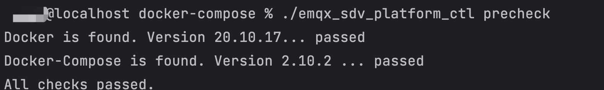
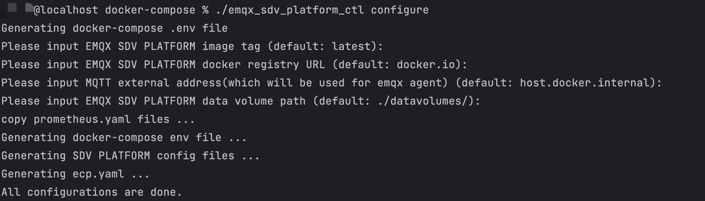
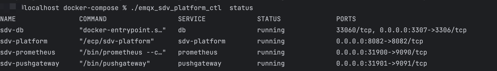
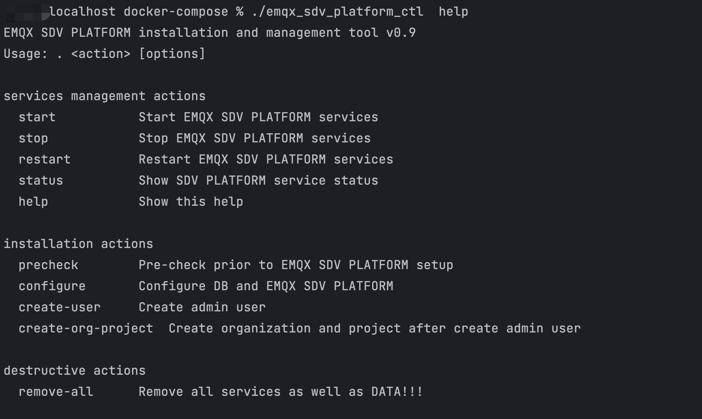

# 基于 Docker 的部署

在本文中，我们将指导您如何在  Docker 中完成 SDV Platform 及其所需组件的安装部署。

## 安装条件

EMQX SDV Platform 部署前，请确认您的环境满足以下要求：

| OS             | 版本要求       |
| :------------- | :------------- |
| Ubuntu         | 20.04 或 22.04 |
| CentOS         | 7.0 或以上     |
| Docker-Compose | 1.27.1 或以上  |
| Docker         | 20.10.0 或以上 |

## 获取安装包

欢迎访问 EMQ 官网获取 SDV Platform 的安装包。

1. 进入[联系我们](https://www.emqx.com/zh/contact?product=emqx-ecp)页面。
2. 输入必要的联系信息，如姓名、公司、工作邮箱，国家和地区，以及您的联系方式。
3. 您可在下方的文本框中填写您的应用场景及需求，以便我们为您提供更好的服务。
4. 填写好以上信息后，点击**立即提交**，我们的销售将会尽快与您联系。

## 安装 EMQX SDV Platform

将下载的安装包`emqx-sdv-platform-docker-compose-installer-*.tar.gz`上传到服务器上，解压缩后，进入解压缩后的目录，执行以下步骤完成 Platform 的安装。

### 依赖检查

执行以下命令检查依赖组件及 docker 版本。

```bash
$ ./emqx_sdv_platform_ctl precheck
```

输出如下内容表示检查通过：



### 配置环境

运行下列命令，进行安装前配置。

```bash
$ ./emqx_sdv_platform_ctl configure
```

全部回车跳过表示，使用默认的ECP版本，通过公共docker镜像仓库获取镜像，持久化数据保存路径为`[当前脚本路径]/datavolumes/`。



### 启动服务

- 如有必要， 可以修改配置文件 `sdv_platform.conf`
- 执行以下命令，启动 Platform 服务。

```bash
$ ./emqx_sdv_platform_ctl start
```

:::tip 注意 
在初次启动 Platform 服务时，需要拉取软件镜像，可能需要等待一段时间。您也可以[联系我们](https://www.emqx.com/zh/contact?product=emqx-ecp)，获取离线安装包。 
:::

### 检查服务状态

```
$ ./emqx_sdv_platform_ctl  status
```



### 停止 Platform 服务

```
./emqx_sdv_platform_ctl  stop
```

### 更多命令介绍

通过以下命令查看更多命令介绍。

```
./emqx_sdv_platform_ctl  help
```



## 创建超级管理员

使用下列命令创建**超级管理员**账号，请妥善保存您的超级管理员账号和密码。

```bash
$ ./emqx_sdv_platform_ctl create-user
Please input username:          # 请设置您的用户名，需要为email格式
Please input password:          # 请设置您的账户密码
Please input password again:    # 请重复您的账户密码
```

## 创建组织和项目

使用下列命令创建**组织和项目**，请输入超级管理员账号和密码。

```bash
$ ./emqx_sdv_platform_ctl create-org-project
Please input username:          # 请输入超级管理员用户名，需要为email格式
Please input password:          # 请输入超级管理员密码
Please input password again:    # 请再次输入超级管理员密码
```

## 访问API

现在您已经成功部署 Platform，Platform 的默认访问地址为 `http://{您的机器IP}:8082`