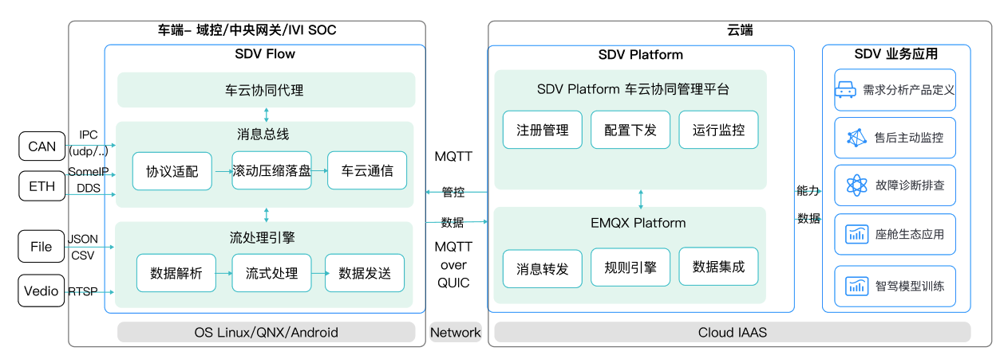
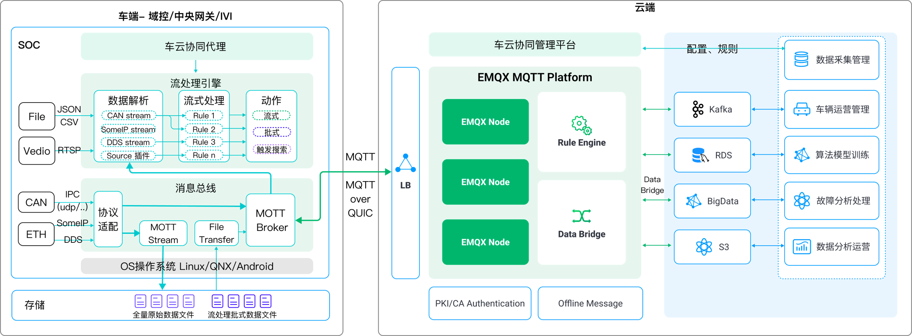

# SDV-Flow & Platform 功能架构

## 产品模块功能简介
 

### 轻量化车载消息队列和数据总线

车内多域数据跨域传输及汇聚

车端 CAN,DDS,SOME/IP 等多种协议数据高精度采集

车端全量数据无损高压缩滚动存储及回溯检索

### 轻量化车载 MQTT 消息服务器

超轻量 MQTT 服务可以低至 200Kb 的内存占用启动。

针对车内跨域通信的海量数据吞吐设计了全异步 I/O 和内建 Actor 编程模型，多核并行化计算负载。

高度跨平台和可移植性，可无缝移植到任何支持 POSIX API 的车载操作系统。

完整 IoT 生态连接支持，安全高效的外部数据接入，提供应用的互操作性

### 轻量化车内流式计算引擎

120+内置算子函数，云端自定义信号级别实时或时间窗口流式计算处理

支持过滤筛选、指标计算、异常监控、事件识别、模型推理等数据处理方式

支持全量数据落盘后回溯、流式解析处理上报、时间窗口打包压缩等上传方式

接入解析、计算处理、算法模型支持灵活插件式扩展

### 安全、可靠、高效的车云传输

支持 MQTT TLS 双向认证及应用层加密加签

断网自动重连、断点续传实现车联网复杂环境下可靠传输

基于 MQTT 订阅发布的灵活数据交互，支持高并发、高吞吐数据接入及集成

支持基于 MQTT 的大文件传输及 MQTT over QUIC下一代车云交互协议

### 车云协同管理

云端管理平台支持私有化部署，管理能力完整 API 开放，易于集成

基于 MQTT 代理云边通道，实现云端对车端软件的远程管理监控

支持云端大规模规则配置下发，车端软件实时解析生效

## 应用场景示例

