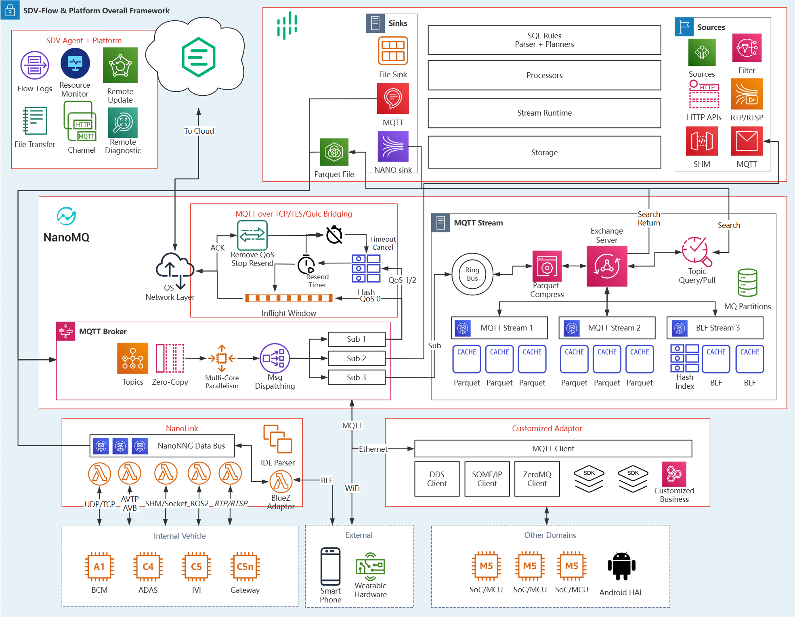

# SDV-Flow & Platform 功能架构

随着自动驾驶概念逐渐被市场和用户所接受，辅助驾驶功能装机量已经覆盖汽车10-20万的腰部市场，端到端技术，智驾开发模式从基于场景识别规则处理的分任务模块，进化到以数据驱动的多模型配合阶段，并继续向着应用通用人工智能大模型技术，认知驱动的端到端方案方向演进。同时，各类智能娱乐座舱运营服务也需要基于数据来分析用户反馈和开发后汽车生态。在这一趋势中，数据作为训练和优化模型，提供增值服务，提升驾驶体验和解决客诉的重要生产要素，其重要性逐步提升。各大OEM均针对各自产品定义进行了数据闭环能力的建设。
目前数据闭环的采集有多种方式，包括专用采集车、量产车数据采集回传、路侧数据采集融合、低空无人机采集交通数据、以及仿真合成数据等，实现覆盖范围最大化、场景最泛化、数据种类最齐全，最终配满数据的三个要素：海量性、完备性、准确性。其中量产车的数据采集是最主流的方式。SDV-Flow & Platform 是一套车云一体化的数据闭环套件，主要解决数据流转中量产车的采集，预处理和存储环节。帮助OEM和Tier1以低成本采集足够的海量数据，并结合边缘计算技术，通过在车端预埋逻辑，在特定场景触发后进行数据回溯和查询并预处理的模式，降低数据存储和传输成本，充分提取有效场景数据、挖掘出更高质量的有效数据。

## 产品模块功能简介

产品主要由车载和云服务两个部分组成，其中车端分成消息队列/总线，流处理引擎和车云协同代理三大部分。云端有EMQX和车云协同管理平台。车云之间通过 MQTT 协议进行协同。车端可能会根据需要适配的数据协议和客制化功能需求加入一个协议转换代理（Adaptor）。

### 轻量化车载消息总线

SDV-Flow 的车载消息总线负责提供车内多域数据的互操作性，兼具跨域多协议汇聚，数据传输和流存储功能。是SDV-Flow 的通信中枢，也负责其余各模块之间的交互。

如图所示，左侧是车内不同域的各种数据源，针对定制协议可以通过协议适配模块接入。数据流入消息总线后，会在内部进行零拷贝的复用，将数据通过内存共享方式安全的供消息队列和MQTT 服务共用，可以投递给订阅的其他应用或通过桥接功能发送给云端，也可以流入消息队列后进行存储。

其包含以下子模块：

#### 车载高性能 MQTT 消息服务器

内置的轻量化 MQTT 服务器是针对嵌入式系统环境开发的。完整支持 MQTT 3.1.1/5.0 协议，与所有标准 MQTT 开源 SDK 兼容。
并且为了满足车内跨域通信的海量数据吞吐要求，基于 Actor 编程模型实现了全异步 I/O ，能够将计算负载并行运行在现代多核处理器。
其使用纯 C 语言开发，具备高度跨平台和可移植性，可无缝移植到任何支持 POSIX 标准的车载操作系统和硬件。详细内容参见 [MQTT 服务器](/zh_CN/communication-databus/mqtt-broker/mqtt-broker.md)

#### 轻量消息队列

对于 ADAS 和高级智能座舱服务，经常需要进行多传感器的数据融合和历史数据的回溯查询。消息队列模块就提供了按照时序对消息进行流存储和查询的功能。基于在自动驾驶行业已经广泛使用的 Parquet 格式和 AutoSAR 标准 BLF 格式。通过对消息主题进行过滤将命中的的MQTT 按照设置的Schema进行存储。提供了车端全量数据无损高压缩滚动存储及回溯检索存储。详细内容参考 [消息队列和流存储](/zh_CN/communication-databus/mqtt-stream.md)

#### 协议转换模块

车内不同域不同传感器和 ECU 总线之间的数据协议都各不相同，AutoSAR CP 包含 CAN/CAN-FD，LIN 和 Flexray 等。AutoSAR AP 标准包含了 DDS,SOME/IP，还有许多各大OEM自己定义的私有数据协议。针对这一碎片化的情况，为了便利化数据处理和存储，加速软件定义汽车（SDV）的面向服务架构（SOA）的落地。消息总线的协议转换模块提供了基于接口描述语言的协议适配功能，可以通过 OMG IDL/FRANCA IDL 格式和代码生成工具来快速接入各类异构数据源。详情请参考 [协议转换模块](/zh_CN/communication-databus/multi-protocol-proxy.md)

### 轻量化车内流式计算引擎

车载流式计算引擎主要用于场景识别和计算卸载，提供了 120+内置算子函数，云端自定义信号级别实时或时间窗口流式计算处理功能。支持过滤筛选、指标计算、异常监控、事件识别、模型推理等数据处理方式。可以快速根据用户编写的规则识别出数据的上下文进行模式匹配，完成数据的挖掘，过滤，预处理。并将结果进行流式解析处理上报、时间窗口打包压缩上传等。结合消息队列模块可以进行全量数据落盘后回溯，1G Flash 空间能支持 50-80 小时的整车数据存储。

流计算引擎还可以通过插件扩展接入解析、计算处理、AI 算法模型支持等功能。

### 车云协同管理

云端管理平台支持私有化部署，管理能力完整 API 开放，易于集成

基于 MQTT 代理云边通道，实现云端对车端软件的远程管理监控

支持云端大规模规则配置下发，车端软件实时解析生效

### 数据管理和重放工具

（1）数据收集与存储。高阶辅助驾驶/自动驾驶车辆需要大量的传感器（包括激光雷达、毫米波雷达、摄像头、惯性测量单元等等）感知与采集周围环境的数据。车辆会实时采集这些数据并进行存储，通过网络上传至云端后，数据管理平台可以收集和存储这些数据并提供高效的数据存储和管理机制。
（2）数据处理与分析。在车端，高阶辅助驾驶/自动驾驶车辆通过对采集的数据进行实时处理与分析，识别周边环境中的障碍物、行人和车辆等，并决策适当的驾驶策略控制车辆。数据管理平台可以提供强大的数据处理和分析能力，包含数据清洗、特征提取、建模和预测等，为高阶辅助驾驶/自动驾驶车辆的性能优化和安全性提供帮助。
（3）数据回放和质量控制。为了让高阶辅助驾驶/自动驾驶车辆更好的理解周围的环境，需要对采集的数据（例如道路标志、车道线、交通灯等等）进行标注和质量控制，数据管理平台可以提供标注工具和标注流程帮助
（4）数据验证与共享协作。在车辆实际的驾驶场景中，需要对其高阶辅助驾驶/自动驾驶性能和安全性进行验证。数据管理平台可以与不同的数仓、数据湖和仿真平台对接，为高阶辅助驾驶/自动驾驶车辆进行数据验证。

## 应用场景示例

## 功能全景图

下图包含了SDV Flow & Platform 的重要功能模块。最下方的数据源接入负责将异构数据解码或反序列化后输入消息总线。这部分包含 标准的协议转换插件 NanoLink 和非标准的自定义协议适配器（如 Geely_api），这部分也负责完成一些 OEM 特殊要求的业务逻辑，以适配兼容不同的车型需求。
在数据总线部分则内部分成了 MQTT 消息服务器和消息队列和桥接模块。分辨负责消息的过滤分发，滚动落盘和搜索以及保证车云之间可靠稳定的传输。桥接模块只提供了选用 TCP 的示意图，若采用 QUIC 则有多个传输流并且可以进行优先级调度策略的客制化。所有的车云数据交互都统一通过桥接模块。
最上方的是流处理模块，订阅不同类型的数据源并根据用户设置的规则进行流水线处理，可以结合不同的函数算子和时间窗口完成细颗粒度的解码和过滤。如根据 DBC 进行信号级别的分析。产生结果或匹配到预置埋点的场景后，可以将解析的信号结果上传或搜索消息队列内的原始数据后上传。 
最后是 SDV Agent 和 Platform 模块。这部分负责完成车云协同的管理类工作，通过 MQTT-HTTP 的通道转换，提供了文件传输，系统资源监控还有组件内部的远程诊断和远程更新配置/规则等功能。

