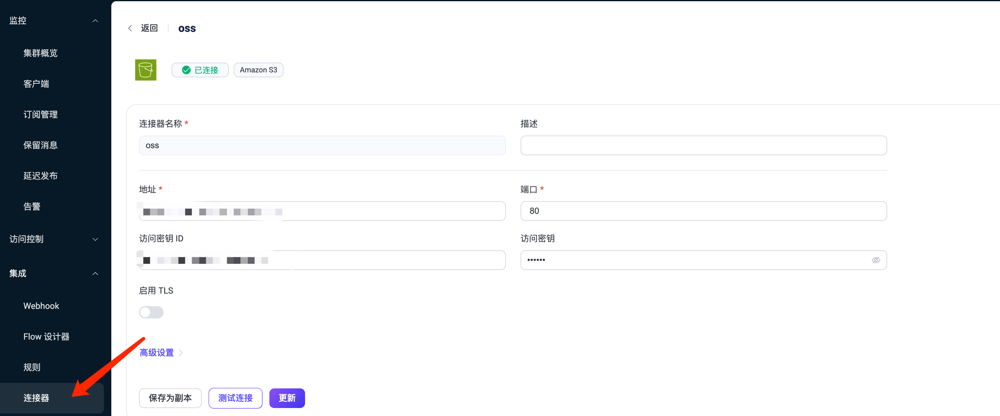
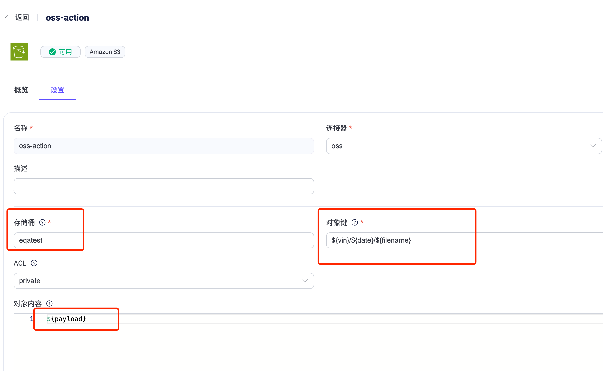
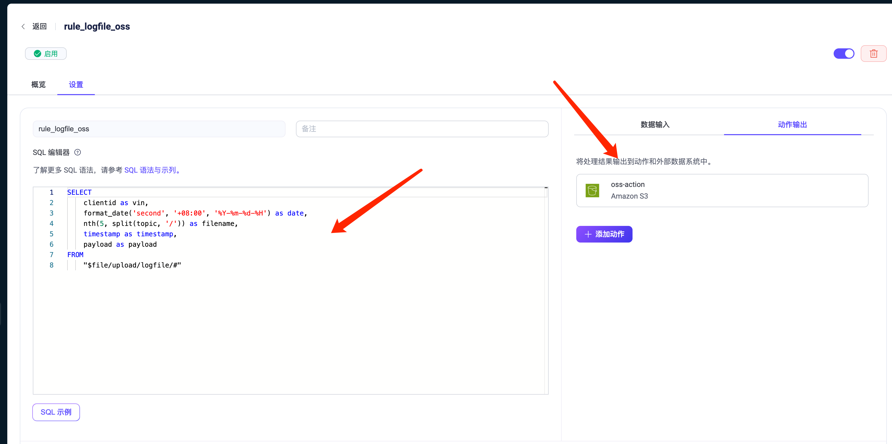

# 云边协同 + 无缝数据集成：利用 EMQX 规则引擎实现车端文件上传云端

随着车联网和边缘计算技术的不断进步，车端文件向云端的上传变得愈发重要。这一过程不仅涵盖了从云端向车辆发送上传指令，还包含了车辆数据的传输与云端存储，对于实现车辆的远程监控、数据分析及智能服务具有重要意义。

通过集中化的云端存储，可以更高效地管理与保护数据，从而降低对车载硬件的需求，同时提高服务响应速度和系统可靠性。云端强大的计算资源也能够支持实时和离线的数据分析，帮助提取关键信息，促进更加复杂的数据解析与决策流程。此外，云端存储还能有效降低运营成本，并通过增强数据处理能力来提升车辆的安全性和运行效率。这些功能对于加强车辆的安全管理以及维护来说至关重要。

本文将详细介绍，如何通过云边协同的 EMQX 规则引擎与数据集成，实现车端文件上传云端的全流程。

## 功能介绍

| 组件名称            | 描述                                                         |
| ------------------- | ------------------------------------------------------------ |
| sdv-platform        | 云端管理平台，可提供车辆注册，管理，云边通道，监控等服务。   |
| sdv-flow            | 集消息总线、流处理引擎、车云协同代理为一体的车端应用软件。   |
| EMQX                | 专为物联网和实时消息传输设计，高度可扩展且功能强大的 MQTT Broker 。 |
| Aliyun OSS 存储服务 | 基于 s3 实现的存储服务，能够快速部署和使用。                 |

通过上面组件的集成，企业可以实现云端下发文件上传指令，车端成功上传到云端存储服务，工作流程如下：

1、云端 sdv-platform API 下发文件上传指令。

2、车端收到指令后，将文件内容通过 MQTT 协议传输到 EMQX 的相应主题。

3、EMQX 规则引擎集成 Aliyun OSS ，将 MQTT 消息高效地存储至存储桶中。

4、最终文件可以在 Aliyun OSS 存储服务中完整下载。

## 功能演示

### 提前准备

- 搭建sdv-platform ，sdv-flow 环境，记录车端唯一标识 vin 码。
- 准备 oss 环境，并创建存储桶。
- EMQX 规则引擎配置。

**1、创建连接器**



**2、创建 action**



- 对象键：参考 ${vin}/${date}/${filename}
- 存储桶：在 oss 上创建存储桶名称。
- 对象内容：${payload}  

**3、创建规则**



```
SELECT 
 clientid as vin,
 format_date('second', '+08:00', '%Y-%m-%d-%H') as date,
 nth(6, split(topic, '/')) as filename,
 nth(4, split(topic, '/')) as requestId,
 timestamp as timestamp,
 payload as payload
FROM
 "$file/upload/logfile/#"
```

### 云端 sdv-platform API 下发文件上传指令

**1、指令下发**

```
POST /api/edgeagents/{vin}/fileupload
{
    "request_id": "1308295374",
    "files": [
        "/root/sdv-flow-1.1.0-beta.2.1-linux-arm64/log/sdv-flow-2024-09-11T12-26-16.183.log"
    ],
    "filenames": [
        "sdv-flow-2024-09-11T12-26-16.183.log"
    ],
    "delete": [
        -1
    ]
}
```

- vin ：车端唯一标识 vin 码
- request_id ：请求id，任意字符串，用于api查询下发结果
- files：待上传的文件列表，绝对路径，可以参考loglist api 的返回path +文件名
- filenames：文件名
- delete ：删除设置数组，// 默认值：-1
  - < 0：传输文件成功后不删除文件
  - = 0：传输文件成功后立即删除文件
  - \> 0：传输文件成功后n天（最多7天）后删除文件

**Response: 200**

```
{
    "requestId": "1308295374"
}
```

### 2、下发结果查询

```
GET /api/edgeagents/{VIN}/fileupload/result?requestId=1308295374
```

**Response: 200**

```
{
    "status": "Success", //Success,Processing,Timeout,Failed
    "error": "13" // if status is Failed
}
```

- error 为每个文件的结果，0 成功，其他是错误码

```
INPUT_ERROR             4096
FILE_NOT_EXIST          4097
ALLOC_ERROR             4098
FREAD_ERROR             4099 
other NNG ERROR
```

### 云端存储服务文件下载

1、车端收到指令后，将文件内容通过 MQTT 协议传输到 EMQX 的相应主题。

2、EMQX 按照规则引擎的规则，将 MQTT 消息高效地存储至 OSS 存储桶中。

3、最终在 OSS 存储服务中，可以看到上传成功的文件，可直接下载。

## 总结

利用 EMQX 规则引擎的无缝集成，由 sdv-platform 下发文件、上传指令，车端 sdv-flow 接收指令并通过 MQTT 协议将文件传输至 EMQX，再从 EMQX 规则引擎将数据存储至 Aliyun OSS 服务，实现了车端文件高效、安全地上传至云端的全流程。

通过这一流程，用户得以实现了云端下发指令、车端执行、数据传输、云端存储的闭环，不仅保障了车辆数据的集中管理和分析，还提升了车辆的远程监控、智能服务能力，提高了服务响应速度和系统可靠性，展现出车云协同技术在车联网数据管理和智能服务方面的强大潜力。