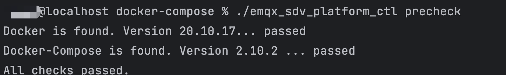
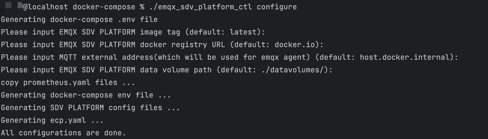
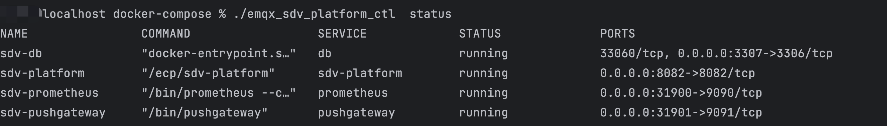
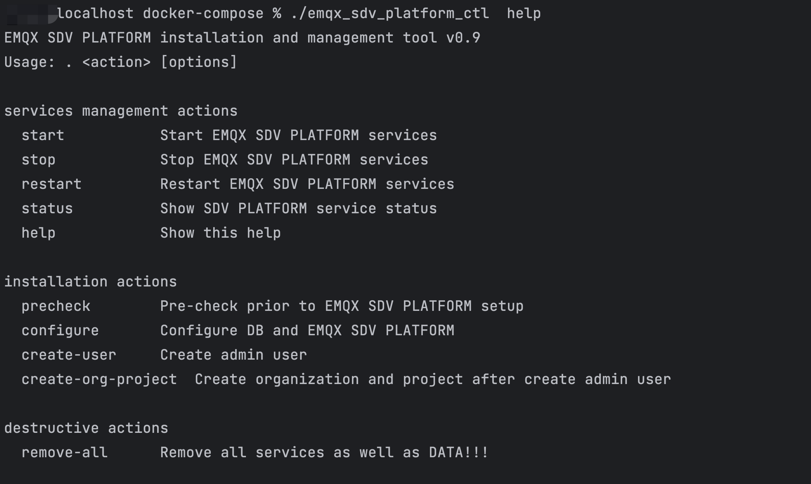

# 软件定义汽车的革命与挑战
 全球汽车行业正在经历前所未有的变革：电气化和软件定义汽车。几十年来，汽车工业一直是由内燃机和机械工程支配的世界，但消费者对智能辅助驾驶和更丰富的信息娱乐功能的强劲需求持续推动着行业发展。自从 1970 年代引入了电子控制单元 （ECU） 来管理不同的车辆功能开始，汽车电子电器架构一直向着软硬件解耦和灵活可配置的方向发展。如今，移动互联网和物联网革命的软件工程和计算机科学技术正逐步向汽车行业转移，对汽车行业这一一直以机械工程为主导的传统行业的产生了广泛的影响。以 ADAS 和 智能座舱为代表的一系列新功能标志着汽车生产出厂后的乘坐驾驶体验和功能属性不再仅仅由机械和电气系统固化，而是可以通过更新软件在整车生命周期中根据用户需求实时持续更新，成为了智能生活的新入口。

SDV的为汽车行业带来的产业革命可以总结为以下四个趋势：

## 从完全硬件主导到软件优先的软硬融合

To remain relevant in this new software-defined paradigm, incumbent original equipment manufacturers (OEMs) should deliver a compelling experience, offering upgradable vehicles with continuous onboard and off-board feature refreshes. This means moving from a hardware-centric vehicle design process to one that is centered on software and services. One emergent example is in-vehicle subscription models, where automakers can charge up to US$900 a year for services like enhanced vehicle acceleration.4 Expanding the mobility experience beyond the vehicle itself relies on a larger software ecosystem in which third-party services are offered via a digital marketplace.

为了在这种新的软件定义范式中保持领先地位，现有的原始设备制造商 (OEM) 应提供引人入胜的体验，提供具有持续车载和车外功能更新的可升级车辆。这意味着从以硬件为中心的车辆设计流程转变为以软件和服务为中心的车辆设计流程。一个新兴的例子是车载订阅模式，汽车制造商每年可以为增强车辆加速等服务收取高达 900 美元的费用。4 将移动体验扩展到车辆本身之外，依赖于提供第三方服务的更大的软件生态系统通过数字市场。

Designing and developing cars has long passed the hardware era. New structures, powerful software platforms, more efficient methodology, continuous operating models, and governance of R&D are required to keep pace with the shortened time-to-market.
汽车的设计和开发早已过了硬件主宰的时代。为了缩短新车型研发周期，需要新的结构、强大的软件平台、更高效的方法、持续的运营模式和研发治理。


Although hardware will remain an integral part of future vehicle development, the primary driver of differentiation will be software features and an electric and electronics (E/E) architecture that is both less complex and more powerful. The main objective of this approach is to entrench a feature-first mindset so OEMs and suppliers can drive efficient product development and operations through intentional design choices, acknowledging the need for continuous innovation. The major difference of an SDV architecture is that while hardware requires minimal maintenance, software often requires ongoing updates and fixes. So, an upgraded E/E architecture will be the foundation of an SDV that enables digital management of the design and manufacturing process, provides continuous operational control, and allows for feature enhancements and a reduced hardware component count (e.g., from 60–150 ECUs in a mid-tier car to less than five high-performance domain computers in an SDV)

尽管硬件仍将是未来车辆开发不可或缺的一部分，但差异化的主要驱动力将是软件功能以及更简单、更强大的电气和电子 (E/E) 架构。这种方法的主要目标是巩固功能优先的思维方式，以便 OEM 和供应商可以通过有意的设计选择来推动高效的产品开发和运营，并认识到持续创新的必要性。 SDV 架构的主要区别在于，虽然硬件需要最少的维护，但软件通常需要持续更新和修复。因此，升级的 E/E 架构将成为 SDV 的基础，实现设计和制造过程的数字化管理，提供持续的操作控制，并允许功能增强和减少硬件组件数量（例如，从 60-150 个 ECU）从一辆中型汽车到 SDV 中少于五台高性能域计算机）


## 从分布式架构到域集中式的多传感器融合
Digital Cockpit ADAS, Auto-Pilot all rely on data fusion. The huge amount of data is required to transferred among the vehicle. The Adaptive AUTOSAR platform offers more flexibility by addressing operability and communication mechanisms more suitable for high-performance computing devices called performance hosts. 

We observe a trend towards decoupling hardware from software and the centralization of functionality in vehicle computers. The functionality shift and centralization will lead to lesser ECUs. Centralization will also change how developers from different parties need to collaborate to bring functionality to a common vehicle computer platform. In parallel, the collaborative way will be supported with enhanced development processes and paradigms as available through DevOps.


我们观察到硬件与软件分离以及车辆计算机功能集中化的趋势。功能转移和集中化将导致 ECU 数量减少。集中化还将改变不同各方的开发人员需要协作的方式，将功能引入通用车辆计算机平台。与此同时，协作方式将得到通过 DevOps 提供的增强的开发流程和范例的支持。

## 从场景驱动到数据驱动

Automotive players increasingly value sources of data directly from consumers as a way of gaining a competitive advantage. The shift to data-driven business models enables the monetization of data in the future mobility ecosystem around the connected vehicle as the central hardware pillar.
汽车制造商越来越重视直接来自消费者的数据源，希望通过更了解自己的目标客户群体来持续改进产品力和设计，并以此作打造竞争壁垒获得核心优势。向数据驱动的商业模式的转变使得未来移动生态系统中的数据能够以互联车辆为核心硬件支柱实现货币化。

## 从智能网联汽车到车云协同数据闭环


Software not only defines the vehicle, but is also responsible for itsbehavior, e.g., when it comes to sudden obstacles or adangerous situation. To provide such functionalities, the next challenge must be tackled: the traditional way of software or functionality deployment is no longer suitable. The SDV no longer communicates solely with its manufacturer or service provider through error messages which are read out manually after a problem has occurred. The modern vehicle is connected over-the-air, not only to receive updates, but also to send useful telemetry and diagnostics information during its entire lifecycle up to the cloud.
软件不仅定义车辆，还负责其行为，例如，当涉及到突然的障碍物或危险情况时。为了提供这些功能，必须解决下一个挑战：传统的软件或功能部署方式不再适用。SDV 不再仅通过错误消息与其制造商或服务提供商进行通信，这些错误消息在问题发生后手动读出。现代车辆通过无线连接，不仅可以接收更新，还可以在其整个生命周期内将有用的遥测和诊断信息发送到云端。


## 挑战和机遇

 When software runs almost everything in the vehicle, a huge amount of data is created that needs to be managed across the ecosystem. In 2022, the amount of connected vehicle data totaled 20 exabytes, and it is estimated to reach 117 exabytes by 2027.6 The number  of software applications driving an enhanced mobility experience is also increasing at an accelerated rate. As a result, the rapidly expanding digital ecosystem is one reason for vehicle launch delays given the complexity involved in integrating software from a variety of stakeholders, including OEMs, suppliers, and technology collaborators. How do the various stakeholders make their software modules and interfaces work together? In fact, there is a need for common functional architecture to be revamped with central controls and simplified software to enable seamless communication. 
 
 当软件运行车辆中的几乎所有内容时，会产生大量数据，需要在整个生态系统中进行管理。 2022 年，联网车辆数据量总计为 20 艾字节，预计到 2027 年将达到 117 艾字节。6 推动增强移动体验的软件应用程序数量也在加速增长。因此，考虑到集成来自各种利益相关者（包括原始设备制造商、供应商和技术合作者）的软件的复杂性，快速扩张的数字生态系统是车辆发布延迟的原因之一。各个利益相关者如何使他们的软件模块和界面协同工作？事实上，需要通过中央控制和简化的软件来改进通用功能架构，以实现无缝通信。

 Software platforms enabled by cloud, artificial intelligence (AI), and agile development methodologies will affect the overall digital experience in vehicles going forward of software applications driving an enhanced mobility experience is also increasing at an accelerated rate. As a result, the rapidly expanding digital ecosystem is one reason for vehicle launch delays given the complexity involved in integrating software from a variety of stakeholders, including OEMs, suppliers, and technology collaborators. How do the various stakeholders make their software modules and interfaces work together? In fact, there is a need for common functional architecture to be revamped with central controls and simplified software to enable seamless communication. Software platforms enabled by cloud, artificial intelligence (AI), and agile development methodologies will affect the overall digital experience in vehicles going forward
由云、人工智能 (AI) 和敏捷开发方法支持的软件平台将影响车辆的整体数字体验，推动增强移动体验的软件应用程序也在加速增长。因此，考虑到集成来自各种利益相关者（包括原始设备制造商、供应商和技术合作者）的软件的复杂性，快速扩张的数字生态系统是车辆发布延迟的原因之一。各个利益相关者如何使他们的软件模块和界面协同工作？事实上，需要通过中央控制和简化的软件来改进通用功能架构，以实现无缝通信。由云、人工智能 (AI) 和敏捷开发方法支持的软件平台将影响未来车辆的整体数字体验


软件优先的设计方案带来了前所未有的产品灵活度的同时也伴随着新的挑战：
1. 车载软件在整车研发中所占比例显著超过硬件，AP 软件复杂度相比原有 CP 大大提高，导致整车研发时间延长，Time-To-Market 成本提高。
2. SDV 相关的的安全合规要求仍在剧烈变革中，需要横跨整个开发周期，且在不同地区有不同的数据安全法规。高复杂度的软件需要持续性的更新维护和补丁修复，这给 OEM 带来完全不同于以往硬件主导时代的高度不确定性。
3. 车内每日产生的数据量指数级别增长，达到700Mb-1Gb/Day。而 ADAS 等功能需要在车身、底盘等不同的域之间交换信息。背后海量数据交互需要更高性能的跨域通信能力以满足高吞吐和低延时的要求。
4. 多域集中式架构带来了复杂的网络拓扑。车载以太网，CAN，LIN 等不同的通信媒介和 SOME-IP/DDS 等碎片化协议共存，互操作性。


# EMQ 车云协同数据闭环

在构建数据闭环生态系统时，企业加快了构建“数字智能/数据库”能力的步伐。
数据、算法和算力是自动驾驶技术的三大基石。数据量和质量决定了算法能力的上限，算力是数据处理的载体。软硬件的融合意味着算法与域控制器/芯片之间的适应性的“平滑度”。目前行业内只有特斯拉这样的几家公司构建了“数据+算法+算力”的完整智能生态系统，并对数据进行100%掌控。为了控制数据，原始设备制造商和软件算法公司正在追逐它们。

## 优势

EMQX SDV Platform 部署前，请确认您的环境满足以下要求：

| OS             | 版本要求       |
| :------------- | :------------- |
| Ubuntu         | 20.04 或 22.04 |
| CentOS         | 7.0 或以上     |
| Docker-Compose | 1.27.1 或以上  |
| Docker         | 20.10.0 或以上 |


# 车云协同数据闭环

欢迎访问 EMQ 官网获取 SDV Platform 的安装包。

## 数据收集和跨域通信

将下载的安装包`emqx-sdv-platform-docker-compose-installer-*.tar.gz`上传到服务器上，解压缩后，进入解压缩后的目录，执行以下步骤完成 Platform 的安装。

## 实时流处理和数据标注回放

执行以下命令检查依赖组件及 docker 版本。

```bash
$ ./emqx_sdv_platform_ctl precheck
```

## 安全可靠的数据链路

输出如下内容表示检查通过：



## 

运行下列命令，进行安装前配置。

```bash
$ ./emqx_sdv_platform_ctl configure
```

全部回车跳过表示，使用默认的ECP版本，通过公共docker镜像仓库获取镜像，持久化数据保存路径为`[当前脚本路径]/datavolumes/`。



### 启动服务

- 如有必要， 可以修改配置文件 `sdv_platform.conf`
- 执行以下命令，启动 Platform 服务。

```bash
$ ./emqx_sdv_platform_ctl start
```

:::tip 注意 
在初次启动 Platform 服务时，需要拉取软件镜像，可能需要等待一段时间。您也可以[联系我们](https://www.emqx.com/zh/contact?product=emqx-ecp)，获取离线安装包。 
:::

### EMQ 的角色定位

只有制造商对更广泛的软件生态系统持开放态度，才有可能扩展 SDV。试图保持完整的价值链控制可能会严重限制任何软件定义平台的可能性。事实上，拥抱更广泛的软件生态系统以实现规模化并避免受限于较小的市场份额和/或开发人员群体至关重要。

Scaling SDVs is only possible if manufacturers are open to the broader software ecosystem. Trying to maintain completevalue chain control may severely limit the possibilities for any software-defined platform. In fact, it is crucial to embrace the broader software ecosystem to achieve scale and avoid being limited to a smaller market share and/or developer pool. 

```
$ ./emqx_sdv_platform_ctl  status
```




```
./emqx_sdv_platform_ctl  stop
```

### 更多命令介绍

通过以下命令查看更多命令介绍。

```
./emqx_sdv_platform_ctl  help
```



## 创建超级管理员

使用下列命令创建**超级管理员**账号，请妥善保存您的超级管理员账号和密码。

```bash
$ ./emqx_sdv_platform_ctl create-user
Please input username:          # 请设置您的用户名，需要为email格式
Please input password:          # 请设置您的账户密码
Please input password again:    # 请重复您的账户密码
```

## 创建组织和项目

使用下列命令创建**组织和项目**，请输入超级管理员账号和密码。

```bash
$ ./emqx_sdv_platform_ctl create-org-project
Please input username:          # 请输入超级管理员用户名，需要为email格式
Please input password:          # 请输入超级管理员密码
Please input password again:    # 请再次输入超级管理员密码
```

## 访问API

现在您已经成功部署 Platform，Platform 的默认访问地址为 `http://{您的机器IP}:8082`


2024年中国乘用车市场依然保持 3% 的增速发展，其中以 PHEV 为代表的 NEV 保持着 25% 的出口高速增长，东南亚和拉美地区的新能源渗透率持续提高，新能源汽车已然成为中国的出口主力和经济的新引擎，其中智能座舱和和智能辅助驾驶功能是核心竞争力之一。ADAS L2 已成为主要驾驶方案、2023 L2级以上的智能驾驶装机量已达到828万辆。渗透率接近40%。这背后