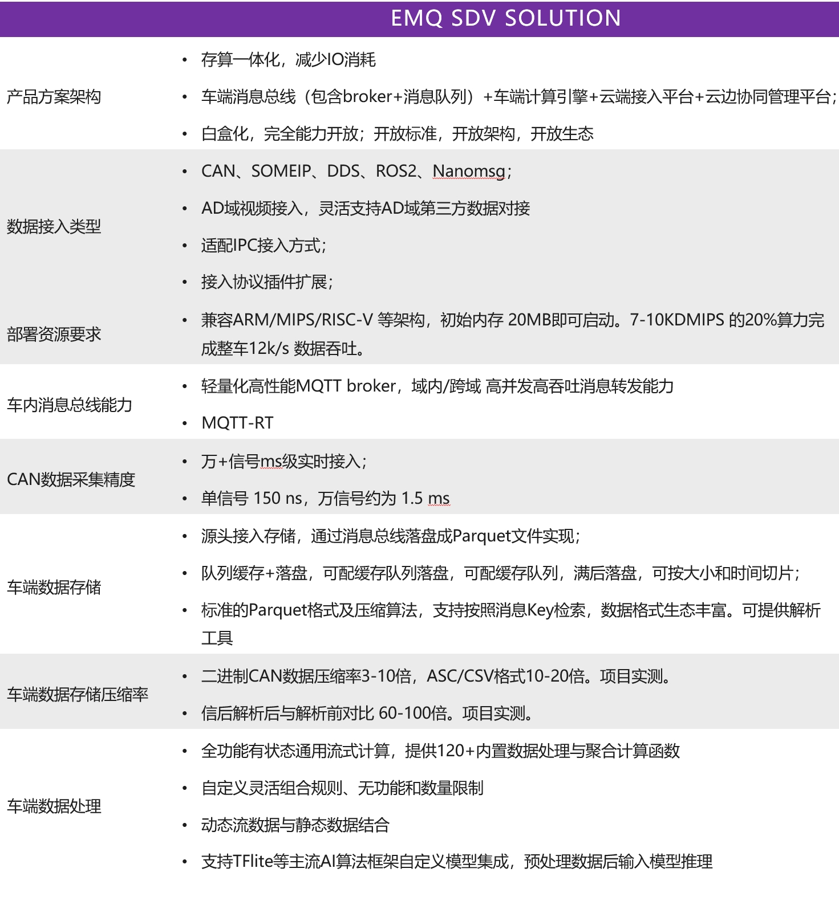
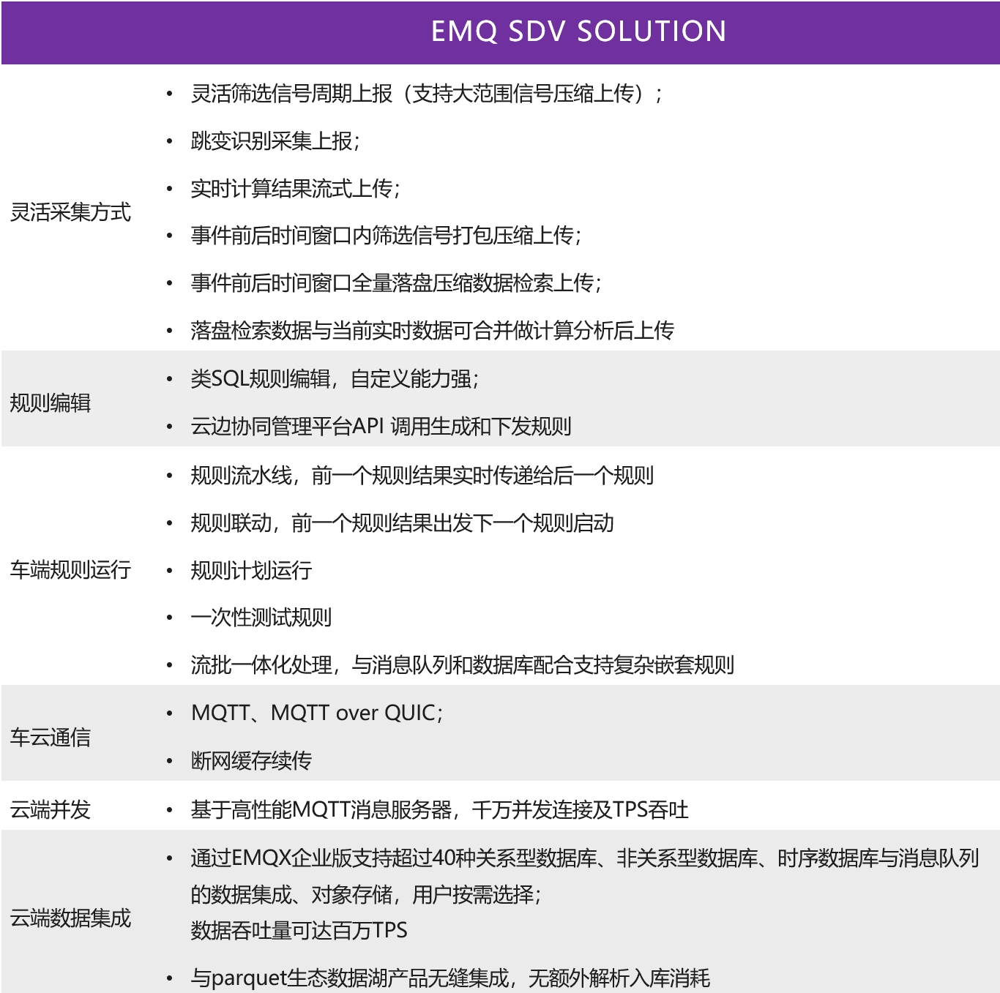

# 软件定义汽车的革命与挑战
 全球汽车行业正在经历前所未有的变革：电气化和软件定义汽车。几十年来，汽车工业一直是由内燃机和机械工程支配的世界，但消费者对智能辅助驾驶和更丰富的信息娱乐功能的强劲需求持续推动着行业发展。自从 1970 年代引入了电子控制单元 （ECU） 来管理不同的车辆功能开始，汽车电子电器架构一直向着软硬件解耦和灵活可配置的方向发展。如今，移动互联网和物联网革命的软件工程和计算机科学技术正逐步向汽车行业转移，对汽车行业这一一直以机械工程为主导的传统行业的产生了广泛的影响。以 ADAS 和 智能座舱为代表的一系列新功能标志着汽车生产出厂后的乘坐驾驶体验和功能属性不再仅仅由机械和电气系统固化，而是可以通过更新软件在整车生命周期中根据用户需求实时持续更新，成为了智能生活的新入口。

SDV的为汽车行业带来的产业革命可以总结为以下四个趋势：

## 从完全硬件主导到软件优先的软硬融合
 汽车的设计和开发早已过了硬件主宰的时代，主机厂为了给客户提供更引人入胜的驾驶乘车体验，需要打造能够具备持续更新车内车外功能的汽车产品。这意味着从以前以硬件为中心的车辆设计流程将转变为以软件为优先和服务为中心的车辆设计流程。一个新兴的例子是车载软件订阅模式，这将移动体验扩展到车辆本身之外，依赖于通过数字市场和第三方服务来打造更大更开放的软件生态系统。尽管硬件仍将是未来车辆开发不可或缺的一部分，但组成产品差异化和竞争壁垒的将主要是是软件功能，需要 OEM 具备通过软件使能硬件的能力，对车内软件进行持续更新和修复最终达到软硬融合一体化。

## 从分布式架构到域集中式的多传感器融合
 我们观察到硬件与软件分离以及车辆计算机功能集中化的趋势，在关键的域如智驾、车身和座舱域，算力和软件功能的集中度越来越高。功能转移和集中化将导致 ECU 数量减少和 SoC/MPU 的数量逐步增加。另外数字座舱和智能辅助驾驶等新兴功能都依赖于异构数据源的融合，需要在车辆的不同域控制器之间需要传输大量数据。更加集中的整车算力架构和网络拓扑和依赖跨域通信的功能需要更灵活的可互操作性和通信机制，例如AUTOSAR AP 平台。集中化还将改变不同各方的开发人员需要协作的方式，将通用中间件引入车内，并影响开发人员的协作模式。
 

## 从场景驱动到数据驱动
 与过去从上而下的通过设计师定义用车场景来设计功能 ECU 的方式不同，如今汽车制造商越来越重视从下至上自然生长的用户需求，通过手机直接来自消费者的数据源，来更了解自己的目标客户群体来持续改进产品力和设计，并以此作打造竞争壁垒获得核心优势。向数据驱动的商业模式的转变使得智能网联汽车变得至关重要，因为其收集数据的能力是辅助硬件完成数据变现的重要支柱。
 

## 从智能网联汽车到数据闭环
 向数据驱动型业务模式转变的重要性已经毋庸置疑。除了数据变现，收集和管理数据还可以推进高级智能驾驶辅助系统（ADAS）和自动驾驶功能的机器学习模型的迭代更新，通过影子模式和在线标注等方式，在车端智能匹配判断长尾场景和完成高质量的数据收集，低成本建立云端场景库，再使用真实世界数据进行模型的训练、仿真和验证，并最终反哺车端推理能力。通过车云协同的数据闭环在海量的数据中以经济高效的方式定位到高价值数据，这在快速发展的移动出行领域带来改变游戏规则的竞争优势。

# 挑战和机遇
 在即将到来的汽车工程革命中，数据驱动和互联汽车等创新使软件在这个以前以机械为主的行业中发挥着至关重要的作用。但要在乘用车的量产中完成 SDV 架构和新价值体系构建却并非易事。软件优先的设计方案带来了前所未有的产品灵活度的同时也伴随着新的挑战：
1. SDV 相关的的安全合规要求仍在剧烈变革中，需要横跨整个开发周期，且在不同地区有不同的数据安全法规。高复杂度的软件需要持续性的更新维护和补丁修复，这给 OEM 带来完全不同于以往硬件主导时代的高度不确定性。
2. 车内每日产生的数据量指数级别增长，达到700Mb-1Gb/Day。而 ADAS 等功能需要在车身、底盘等不同的域之间交换信息。背后海量数据交互需要更高性能的跨域通信能力以满足高吞吐和低延时的要求。

1. 车载软件在整车研发中所占比例显著超过硬件，AP 软件复杂度相比原有 CP 大大提高，导致整车研发时间延长，Time-To-Market 成本提高。同时，海量的数据吞吐和连接也对整个数据闭环生态提出了挑战，考虑到整车研发项目需要集成来自各个供应商的产品，背后沟通协调的成本也是车辆研发延期的主要原因之一。

1. 多域集中式架构带来了复杂的网络拓扑。车载以太网，CAN，LIN 等不同的通信媒介和 SOME-IP/DDS 等碎片化协议共存，需要一个业界认同的互操作性标准方便不同供应商之间的产品集成，例如正在快速演进中的 AutoSAR AP 标准。

# EMQ 车云协同数据闭环

我们发现，当谈论软件定义汽车时，其实是在谈论泛在连接和数据驱动。而 EMQ 一直深耕于数据和连接，为 ICT/IOT/IIOT 等行业提供高效稳定的数据基础设施，在丰富的基础软件研发经验的基础上，EMQ 为汽车行业提供了车云协同的数据闭环解决方案。基于车云协同的车内多源数据实时接入及灵活计算处理，打造”车内-车云-生态”数据闭环，助力智能网联汽车数据价值挖掘，加速软件定义汽车业务数智化升级。

方案覆盖了汽车从研发设计，生产制造，量产上路到维护更新迭代的全生命周期，产品有车载通信总线，通信队列，MQTT消息服务和实时流处理引擎，以及云端 TSP 平台和汽车云。旨在为行业提供一种灵活高效，可自由组合的开放软件方案。

## 产品简介

## 为什么选择 EMQ SDV-Flow & Platform

### 产品优势

#### 高兼容性灵活部署

轻量化设计，根据车型项目车内架构，灵活适配域控制器、中央网关、中央计算、车机各类硬件SOC与操作系统环境，支持跨域部署及跨域交互。

#### 多源数据高精度接入

CAN总线信号数据毫秒级实时接入，DDS、SOMEIP等AUTOSAR AP协议桥接接入，文件、视频等数据插件式扩展

#### 灵活的流式数据处理与集成

云端自定义的车端的流式计算，根据业务对数据需求灵活选择数据车端处理、车云上传及云端集成方案

#### 安全、可靠、高效的车云传输

支持 MQTT over TLS实现安全加密传输，弱网断点续传，并支持MQTT大文件传输及MQTT over QUIC下一代车云传输协议

#### 车云协同实时管控

针对海量车辆的连接和数据，云边协同管理通道提供云管边端一体化的能力，轻松实现从云端对车端数据接入采集、处理分析的实时管控，车端软件运行状态的实时监控

#### 一站式全链路协议覆盖
EMQ 是全球唯一一家开源数据基础设施提供商能够为汽车行业客户交付整车全生命周期的连接覆盖。打通柔性制造，工业4.0 和智能网联汽车形成全周期数据闭环。

### 软件定义汽车的开源先锋

与专有软件相比，开源技术因其高性能快速迭代、充满活力的社区生态，以及开源共测等诸多优势而被广泛认为是一种减少复杂软件开发时间的方法。SDV 面临新兴技术的复杂软件开发挑战，试图保持封闭私有可能会严重限制 SDV 的可能性并带来诸多不确定性风险。我们有幸看到越来越多的 OEM 对在车内引入开源软件持开放态度，并积极主动融合进入开源生态。EMQ 一直秉持着开放标准、开放系统、开放生态的准则，方案采用的车云通信协议、数据格式均采用开放技术标准，架构透明，易于能力集成、生态集成，没有任何供应商绑定风险，并跟随技术趋势持续演进创新，自我鞭策为行业不停提供领先的数据基础设施。
目前，EMQ 也已经加入 ELISA 组织（https://elisa.tech/announcement/2024/06/04/canonical-and-emq-join-the-enabling-linux-in-safety-applications-elisa-project-to-strengthen-their-commitment-to-safety-critical-applications-in-automobiles/），继续完成自己对开源汽车基础软件的安全承诺，与博世，华为，日产等老牌厂商一同为行业交付领先的 SDV 产品。