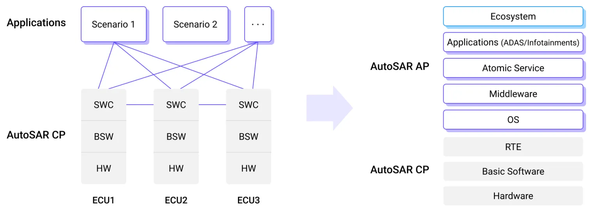
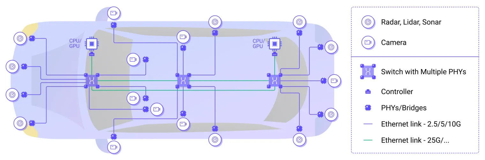

# 软件定义汽车的革命与挑战
 全球汽车行业正在经历前所未有的变革：电气化和软件定义汽车。几十年来，汽车工业一直是由内燃机和机械工程支配的世界，但消费者对智能辅助驾驶和更丰富的信息娱乐功能的强劲需求持续推动着行业发展。自从 1970 年代引入了电子控制单元 （ECU） 来管理不同的车辆功能开始，汽车电子电器架构一直向着软硬件解耦和灵活可配置的方向发展。如今，移动互联网和物联网革命的软件工程和计算机科学技术正逐步向汽车行业转移，对汽车行业这一一直以机械工程为主导的传统行业的产生了广泛的影响。以 ADAS 和 智能座舱为代表的一系列新功能标志着汽车生产出厂后的乘坐驾驶体验和功能属性不再仅仅由机械和电气系统固化，而是可以通过更新软件在整车生命周期中根据用户需求实时持续更新，成为了智能生活的新入口。
 

SDV 为汽车行业带来的产业革命可以总结为以下四个趋势：

## 从完全硬件主导到软件优先的软硬融合
 汽车的设计和开发早已过了硬件主宰的时代，主机厂为了给客户提供更引人入胜的驾驶乘车体验，需要打造能够具备持续更新车内车外功能的汽车产品。这意味着从以前以硬件为中心的车辆设计流程将转变为以软件为优先和服务为中心的车辆设计流程。一个新兴的例子是车载软件订阅模式，这将移动体验扩展到车辆本身之外，依赖于通过数字市场和第三方服务来打造更大更开放的软件生态系统。尽管硬件仍将是未来车辆开发不可或缺的一部分，但组成产品差异化和竞争壁垒的将主要是是软件功能，需要 OEM 具备通过软件使能硬件的能力，对车内软件进行持续更新和修复最终达到软硬融合一体化。

## 从分布式架构到域集中式的多传感器融合
 我们观察到硬件与软件分离以及车辆计算机功能集中化的趋势，在关键的域如智驾、车身和座舱域，算力和软件功能的集中度越来越高。功能转移和集中化将导致 ECU 数量减少和 SoC/MPU 的数量逐步增加。另外数字座舱和智能辅助驾驶等新兴功能都依赖于异构数据源的融合，需要在车辆的不同域控制器之间需要传输大量数据。更加集中的整车算力架构和网络拓扑和依赖跨域通信的功能需要更灵活的可互操作性和通信机制，例如AUTOSAR AP 平台。集中化还将改变不同各方的开发人员需要协作的方式，将通用中间件引入车内，并影响开发人员的协作模式。
 

## 从场景驱动到数据驱动
 与过去从上而下的通过设计师定义用车场景来设计功能 ECU 的方式不同，如今汽车制造商越来越重视从下至上自然生长的用户需求，通过手机直接来自消费者的数据源，来更了解自己的目标客户群体来持续改进产品力和设计，并以此作打造竞争壁垒获得核心优势。向数据驱动的商业模式的转变使得智能网联汽车变得至关重要，因为其收集数据的能力是辅助硬件完成数据变现的重要支柱。

 

## 从智能网联汽车到数据闭环
 向数据驱动型业务模式转变的重要性已经毋庸置疑。除了数据变现，收集和管理数据还可以推进高级智能驾驶辅助系统（ADAS）和自动驾驶功能的机器学习模型的迭代更新，通过影子模式和在线标注等方式，在车端智能匹配判断长尾场景和完成高质量的数据收集，低成本建立云端场景库，再使用真实世界数据进行模型的训练、仿真和验证，并最终反哺车端推理能力。通过车云协同的数据闭环在海量的数据中以经济高效的方式定位到高价值数据，这在快速发展的移动出行领域带来改变游戏规则的竞争优势。

# 挑战和机遇
 在即将到来的汽车工程革命中，数据驱动和互联汽车等创新使软件在这个以前以机械为主的行业中发挥着至关重要的作用。但要在乘用车的量产中完成 SDV 架构和新价值体系构建却并非易事。软件优先的设计方案带来了前所未有的产品灵活度的同时也伴随着新的挑战：
1. SDV 相关的的安全合规要求仍在剧烈变革中，需要横跨整个开发周期，且在不同地区有不同的数据安全法规。高复杂度的软件需要持续性的更新维护和补丁修复，这给 OEM 带来完全不同于以往硬件主导时代的高度不确定性。
2. 车内每日产生的数据量指数级别增长，达到700Mb-1Gb/Day。而 ADAS 等功能需要在车身、底盘等不同的域之间交换信息。背后海量数据交互需要更高性能的跨域通信能力以满足高吞吐和低延时的要求。

1. 车载软件在整车研发中所占比例显著超过硬件，AP 软件复杂度相比原有 CP 大大提高，导致整车研发时间延长，Time-To-Market 成本提高。同时，海量的数据吞吐和连接也对整个数据闭环生态提出了挑战，考虑到整车研发项目需要集成来自各个供应商的产品，背后沟通协调的成本也是车辆研发延期的主要原因之一。

1. 多域集中式架构带来了复杂的网络拓扑。车载以太网，CAN，LIN 等不同的通信媒介和 SOME-IP/DDS 等碎片化协议共存，需要一个业界认同的互操作性标准方便不同供应商之间的产品集成，例如正在快速演进中的 AutoSAR AP 标准。

# EMQ 车云协同数据闭环

当谈论软件定义汽车时，其实是在谈论泛在连接和数据驱动。而 EMQ 一直深耕于数据和连接，为 ICT/IOT/IIOT 等行业提供高效稳定的数据基础设施，在丰富的基础软件研发经验的基础上，EMQ 为汽车行业提供了车云协同的数据闭环解决方案。基于车云协同的车内多源数据实时接入及灵活计算处理，打造”车内-车云-生态”数据闭环，助力智能网联汽车数据价值挖掘，加速软件定义汽车业务数智化升级。

方案覆盖了汽车从研发设计，生产制造，量产上路到维护更新迭代的全生命周期，产品有车载通信总线，通信队列，MQTT 消息服务和实时流处理引擎，以及云端 TSP 平台和汽车云。旨在为行业提供一种灵活高效，可自由组合的开放软件方案。

## 产品简介

- 产品方案架构
  - 存算一体化
  - 减少 IO消耗车端消息总线（包含 Broker + 消息队列）+ 车端计算引擎＋云端接入平台＋云边协同管理平台
  - 白盒化，完全能力开放
  - 开放标准，开放架构，开放生态
- 数据接入类型
  - CAN, SOMEIP, DDS, ROS2, Nanomsg
  - AD 域视频接入，灵活支持 AD 域第三方数据对接
  - 适配 IPC 接入方式
  - 接入协议插件扩展
- 部署资源要求
  - 兼容 ARM/MIPS/RISC-V 等架构，初始 20MB 内存占用
  -  7-10KDMIPS 的 20%算力完成整车12k/s 数据吞吐
- 车内消息总线能力
  - 轻量化高性能 MQTT Broker，域内/跨域、高并发高吞吐消息转发能力
  - MQTT-RT
- CAN数据采集精度
  - 万+信号 ms 级实时接入
  - 单信号 150 ns，万信号约为 1.5 ms
- 车端数据存储
  - 源头接入存储，通过消息总线落盘成 Parquet 文件实现
  - 队列缓存＋落盘，可配缓存队列落盘，可配缓存队列，满后落盘，可按大小和时间切片
  - 标准的 Parquet 格式及压缩算法，支持按照消息 Key 检索，数据格式生态丰富。可提供解析工具
- 车端数据存储压缩率
  - 项目实测：二进制 CAN 数据压缩率3-10倍，ASC/CSV 格式10-20倍
  - 项目实测：信后解析后与解析前对比 60-100倍
- 车端数据处理
  - 全功能有状态通用流式计算，提供120+内置数据处理与聚合计算函数
  - 自定义灵活组合规则、无功能和数量限制
  - 动态流数据与静态数据结合
  - 支持 TFlite 等 AI 算法框架自定义模型集成，预处理数据后输入模型推理
- 灵活采集方式
  - 灵活筛选信号周期上报（支持大范围信号压缩上传）
  - 跳变识别采集上报
  - 实时计算结果流式上传
  - 事件前后时间窗口内筛选信号打包压缩上传
  - 事件前后时间窗口全量落盘压缩数据检索上传
  - 落盘检索数据与当前实时数据可合并做计算分析后上传
- 规则编辑
  - 类SQL规则编辑，自定义能力强
  - 云边协同管理平台API 调用生成和下发规则
  - 规则流水线，前一个规则结果实时传递给后一个规则
  - 规则联动，前一个规则结果出发下一个规则启动
- 车端规则运行
  - 规则计划运行
  - 一次性测试规则
  - 流批一体化处理，与消息队列和数据库配合支持复杂嵌套规则
- 车云通信
  - MQTT, MQTT over QUIC
  - 断网缓存续传
- 云端并发
  - 基于高性能 MQTT 消息服务器，千万并发连接及 TPS 吞吐
- 云端数据集成
  - 通过 EMQX 企业版支持超过40种关系型数据库、非关系型数据库、时序数据库与消息队列的数据集成对象存储，用户按需选择
  - 数据吞吐量可达百万 TPS
  - 与 Parquet 生态数据湖产品无缝集成，无额外解析入库消耗

## 为什么选择 EMQ SDV-Flow & Platform

### 产品优势

市场上的数据闭环技术提供商，一般提供整套数据闭环解决方案或分离式数据闭环产品（即模块化的工具服务，如标注平台、回灌工具、仿真工具等等）给主机厂和Tier1。对于数据治理能力较强的车企通常会外采自身能力不足的工具模块，集成到自己的数据处理平台体系；而对数据治理能力偏弱的主机厂则会考虑紧耦合式数据闭环产品或定制化服务。EMQ SDV-Flow & Platform 主要专精于车云数据的采集，传输，处理和存储，是一款可以针对不同客户需求来灵活组合，通过流处理规则引擎和消息中间件完成不同域控数据的灵活接入，快速裁剪适配各类硬件资源平台，横向和纵向为OEM提供不同阶梯产品的针对性解决方案。具有如下优势：

#### 高兼容性灵活部署

轻量化设计，根据车型项目车内架构，灵活适配域控制器、中央网关、中央计算、车机各类硬件SOC与操作系统环境，支持跨域部署及跨域交互。

#### 多源数据高精度接入

CAN总线信号数据毫秒级实时接入，DDS、SOMEIP 等 AUTOSAR AP 协议桥接接入，文件、视频等数据插件式扩展

#### 灵活的流式数据处理与集成

云端自定义的车端的流式计算，根据业务对数据需求灵活选择数据车端处理、车云上传及云端集成方案

#### 安全、可靠、高效的车云传输

支持 MQTT over TLS 实现安全加密传输，弱网断点续传，并支持 MQTT 大文件传输及 MQTT over QUIC 下一代车云传输协议

#### 车云协同实时管控

针对海量车辆的连接和数据，云边协同管理通道提供云管边端一体化的能力，轻松实现从云端对车端数据接入采集、处理分析的实时管控，车端软件运行状态的实时监控

#### 一站式全链路协议覆盖
EMQ 是全球唯一一家开源数据基础设施提供商能够为汽车行业客户交付整车全生命周期的连接覆盖。打通柔性制造，工业4.0 和智能网联汽车形成全周期数据闭环。

### 软件定义汽车的开源先锋

与专有软件相比，开源技术因其高性能快速迭代、充满活力的社区生态，以及开源共测等诸多优势而被广泛认为是一种减少复杂软件开发时间的方法。SDV 面临新兴技术的复杂软件开发挑战，试图保持封闭私有可能会严重限制 SDV 的可能性并带来诸多不确定性风险。我们有幸看到越来越多的 OEM 对在车内引入开源软件持开放态度，并积极主动融合进入开源生态。EMQ 一直秉持着开放标准、开放系统、开放生态的准则，方案采用的车云通信协议、数据格式均采用开放技术标准，架构透明，易于能力集成、生态集成，没有任何供应商绑定风险，并跟随技术趋势持续演进创新，自我鞭策为行业不停提供领先的数据基础设施。
目前，EMQ 也已经加入 [ELISA 组织](https://elisa.tech/announcement/2024/06/04/canonical-and-emq-join-the-enabling-linux-in-safety-applications-elisa-project-to-strengthen-their-commitment-to-safety-critical-applications-in-automobiles/)，继续完成自己对开源汽车基础软件的安全承诺，与博世，华为，日产等老牌厂商一同为行业交付领先的 SDV 产品。