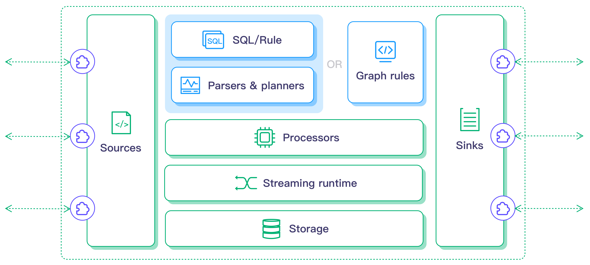

# 流处理引擎

流处理引擎基于开源项目 LF Edge eKuiper 实现。eKuiper 是 Golang 实现的轻量级物联网边缘分析、流式处理开源软件，可以运行在各类资源受限的边缘设备上。eKuiper 的主要目标是在边缘端提供一个流媒体软件框架（类似于 [Apache Flink](https://flink.apache.org)）。eKuiper 的**规则引擎**允许用户提供基于 SQL 或基于图形（类似于 Node-RED）的规则，在几分钟内创建物联网边缘分析应用。

## 功能

- 超轻量

  - 核心服务安装包约 4.5MB，首次运行内存使用约 10MB

- 跨平台

  - CPU 架构：X86 AMD 32/64; ARM 32/64; PPC
  - 常见 Linux 发行版、OpenWrt 嵌入式系统、MacOS、Docker
  - 常见车机系统

- 完整的数据分析

  - 数据抽取、转换和过滤
  - 数据排序、分组、聚合、连接
  - 60+ 各类函数，覆盖数学运算、字符串处理、聚合运算和哈希运算等
  - 4 类时间窗口，以及计数窗口

- 高可扩展性

  可支持通过 Golang 或者 Python 在``源 (Source)``，``SQL 函数``, ``目标 (Sink)`` 三个方面的扩展

  - 源 (Source) ：允许用户接入更多的数据源用于数据分析
  - 目标 (Sink)：允许用户将分析结果发送到不同的扩展系统中
  - SQL 函数：允许用户增加自定义函数用于数据分析（比如，AI/ML 的函数调用）

- 管理能力
  - 通过命令行、REST API 和 config map 对流、规则和插件进行管理
  - 与 [KubeEdge](https://github.com/kubeedge/kubeedge)、[OpenYurt](https://openyurt.io/)、[K3s](https://github.com/rancher/k3s)、[Baetyl](https://github.com/baetyl/baetyl) 等基于边缘 Kubernetes 框架的集成能力