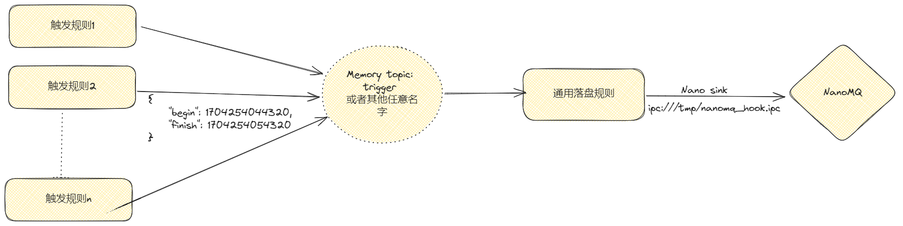

# Nano 动作

该动作用于同 NanoMQ 的交互，目前主要用于触发 NanoMQ 全量文件落盘。

## 使用建议

考虑到去重的问题，建议使用通用的规则进行落盘触发。使用步骤如下：

1. 创建通用落盘规则（仅需创建一次）。
2. 创建落盘内存流，用于接收落盘触发信号。
3. 根据需要创建不同的落盘规则，通过内存 sink 发送落盘信号到步骤 2 的内存流中，从而触发通用落盘规则统一进行落盘。

整体数据流如下图所示：


### 通用落盘规则

- 创建通用落盘流，为内存流，监听 `trigger` topic，用于接收触发落盘的消息。接收的消息格式为 `{"begin": 1704254044320, "finish": 1704254054320}`，其中 `begin` 为开始的时间戳，`finish` 为结束的时间戳。

```json
{
"sql": "CREATE STREAM triggerStream() WITH (TYPE=\"memory\",FORMAT=\"json\",DATASOURCE=\"trigger\");"
}
```

- 通用落盘规则，操作 `triggerStream` 流，用于接收触发落盘的消息，去重并转为 NanoMQ 需要的格式。

```json
{
  "id": "ruleTrigger",
  "sql": "SELECT \"EX2NANO\" as id, \"search\" as cmd, dedup_trigger(begin, finish, ts, 999999) as ranges, ruleid FROM mqttDemo WHERE isNull(ruleid) = false",
  "actions": [
    {
      "nano": {
        "url": "ipc:///tmp/nanomq_hook.ipc",
        "sendSingle": true
      },
      "mqtt": {
        "server": "tcp://syno.home:1883",
        "topic": "result/trigger",
        "sendSingle": true
      }
    }
  ]
}
```

此示例规则中：

1. 接收到数据后，去重并计算出每个落盘区间的开始时间戳 `key` ，结束时间戳 `end_key` 和 `offset`。
2. 落盘算法采用自定义函数 `dedup_trigger`，去除重复落盘区间。详情请看[函数定义](../sqls/functions/other_functions.md#dedup_trigger)。
3. 将去重后的数据通过 SQL 语句转为 NanoMQ 需要的格式，发送到 NanoMQ。接受到数据 `{"begin": 1704254044320, "finish": 1704254054320}` 会转为 `{"cmd":"search","id":"EX2NANO","ruleid":"rule1","ranges":[{"end_key":"1704254054320","start_key":"1704254044320"}]}`。其中，ranges 区间可能有多个。
4. 落盘采用 nano sink。示例中的 mqtt sink 仅用于调试，实际使用可去除。是否触发成功可查看规则状态中的 nano sink records out 的指标。若指标正常，则表示触发成功，是否上传文件成功需要通过 NANO MQ 进行查看。

### 触发落盘规则

用户通过 sink 到 memory topic `trigger` 可触发通用落盘规则。多条规则可以同时触发落盘，通用落盘规则可进行去重。以下为落盘规则示例。

```json
{
  "id": "ruleNano",
  "name": "满足条件时，落盘前后10秒数据",
   "sql": "SELECT ts - 10000 as begin, ts as finish, ts, rule_id() as ruleid FROM mqttDemo WHERE temperature > 30 and humidity > 60",
  "actions": [
    {
      "memory": {
        "topic": "trigger",
        "sendSingle": true
      },
      "mqtt": {
        "server": "tcp://127.0.0.1:1883",
        "topic": "result/trigger",
        "sendSingle": true
      }
    }
  ]
}
```

- 落盘规则需要包含 `begin`, `finish`, `ts` 和 `rule_id` 四个字段，分别为落盘区间的开始时间戳和结束时间戳，当前时间戳和规则 id。
- 落盘规则中的 `memory` sink 需要 sink 到 `trigger` topic，用于触发通用落盘规则。

本实例规则实现了当温度大于 30，湿度大于 60 时，将发生时的时间戳的前后 10 秒的数据落盘。

### 触发落盘调试

1. 确认通用落盘规则，落盘内存流和触发落盘规则都已创建并运行。若创建过多次多个不同规则，一定要确认名字对上了！
2. 获取触发落盘规则的状态，查看是否触发成功。若触发成功，状态中的 memory sink records out
   指标会有增加。其他状态指标可用于查看触发的时间戳等等，提供了规则运行的详细信息。
3. 获取**通用**落盘规则的状态，查看是否上传文件成功。若触发成功，状态中的 nano sink records out 指标会有增加。**注意**
   ：若触发的时间范围包含未来时间，则触发会延迟到未来时间。此时，nano sink records in 会增加，但 nano sink records out
   会在延迟触发后才增加。
4. 订阅通用落盘规则中的 MQTT sink
   topic，查看触发报文，应当形如 `{"cmd":"search","id":"EX2NANO","ruleid":"rule1","ranges":[{"end_key":"1704254054320","start_key":"1704254044320"}]}`
   。到此为止，说明规则部分运行都正常。
5. 若触发成功，可通过 NanoMQ 查看是否上传文件成功。
6. 若以上步骤仍不能调试成功，可以截图**两个规则状态**(方便了解规则的大部分运行时信息)，**导出所有规则**(
   容易发现配置中的typo等错误)，必要时导出 log 并提供给开发人员进行调试。